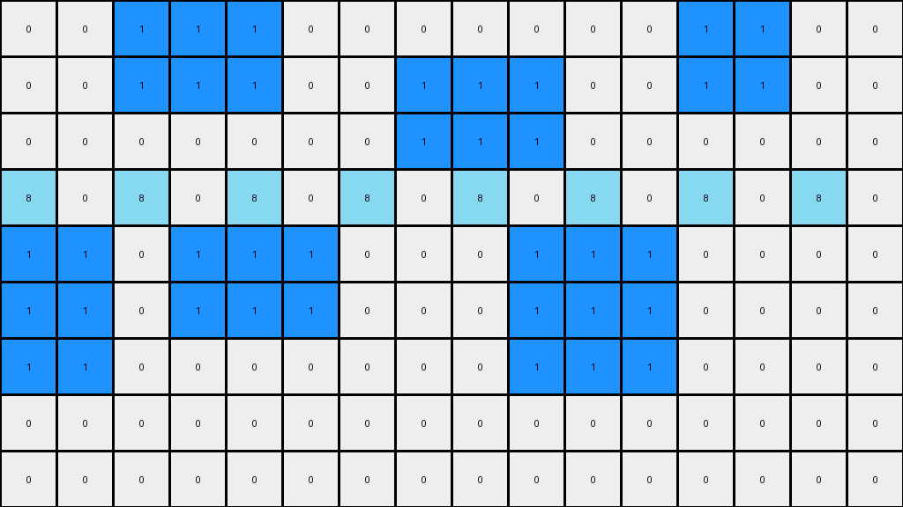

# AboveBelow1 • 003 • refine_dreamer

---


Previous Code:
```python
"""
Identify and delete all contiguous rectangular regions of yellow (4) pixels, while retaining the red (2) regions.
"""

import numpy as np

def find_objects(grid, color):
    objects = []
    visited = np.zeros_like(grid, dtype=bool)
    rows, cols = grid.shape

    def is_valid(r, c):
        return 0 <= r < rows and 0 <= c < cols

    def dfs(r, c, current_object):
        if not is_valid(r, c) or visited[r, c] or grid[r, c] != color:
            return
        visited[r, c] = True
        current_object.append((r, c))
        dfs(r + 1, c, current_object)
        dfs(r - 1, c, current_object)
        dfs(r, c + 1, current_object)
        dfs(r, c - 1, current_object)

    for r in range(rows):
        for c in range(cols):
            if grid[r, c] == color and not visited[r, c]:
                current_object = []
                dfs(r, c, current_object)
                if current_object:
                    objects.append(current_object)
    return objects

def is_rectangle(object_coords):
    rows = [r for r, _ in object_coords]
    cols = [c for _, c in object_coords]
    min_row, max_row = min(rows), max(rows)
    min_col, max_col = min(cols), max(cols)

    expected_size = (max_row - min_row + 1) * (max_col - min_col + 1)
    return len(object_coords) == expected_size

def transform(input_grid):
    # initialize output_grid
    output_grid = np.copy(input_grid)
    rows, cols = output_grid.shape

    # Find yellow objects
    yellow_objects = find_objects(output_grid, 4)
    
    # Delete yellow rectangular objects
    for obj in yellow_objects:
      if is_rectangle(obj):
        for r, c in obj:
            output_grid[r, c] = 0

    return output_grid
```

Train Set Results:

## Example 1:

Input:
```
0 0 0 0 0 0 0 0 0 0 0 0
0 0 0 4 4 4 4 0 0 0 0 0
0 0 0 4 4 4 4 0 0 0 0 0
0 0 0 4 4 4 4 0 0 0 0 0
0 0 0 0 0 0 0 0 0 0 0 0
0 0 0 0 0 0 0 0 0 0 0 0
2 2 2 2 2 2 2 2 2 2 2 2
0 0 0 0 0 0 0 0 0 0 0 0
0 0 0 4 4 4 4 0 0 4 4 4
0 0 0 4 4 4 4 0 0 4 4 4
0 0 0 4 4 4 4 0 0 4 4 4
```
Expected Output:
```
0 0 0 0 0 0 0 0 0 0 0 0
0 0 0 4 4 4 4 0 0 0 0 0
0 0 0 4 4 4 4 0 0 0 0 0
0 0 0 4 4 4 4 0 0 0 0 0
0 0 0 0 0 0 0 0 0 0 0 0
0 0 0 0 0 0 0 0 0 0 0 0
2 2 2 2 2 2 2 2 2 2 2 2
0 0 0 0 0 0 0 0 0 0 0 0
0 0 0 0 0 0 0 0 0 0 0 0
0 0 0 0 0 0 0 0 0 0 0 0
0 0 0 0 0 0 0 0 0 0 0 0
```
Transformed Output:
```
0 0 0 0 0 0 0 0 0 0 0 0
0 0 0 0 0 0 0 0 0 0 0 0
0 0 0 0 0 0 0 0 0 0 0 0
0 0 0 0 0 0 0 0 0 0 0 0
0 0 0 0 0 0 0 0 0 0 0 0
0 0 0 0 0 0 0 0 0 0 0 0
2 2 2 2 2 2 2 2 2 2 2 2
0 0 0 0 0 0 0 0 0 0 0 0
0 0 0 0 0 0 0 0 0 0 0 0
0 0 0 0 0 0 0 0 0 0 0 0
0 0 0 0 0 0 0 0 0 0 0 0
```

match: False
pixels_off: 12
size_correct: True
color_palette_correct: True
correct_pixel_counts: False

## Example 2:

Input:
```
0 0 0 6 6 6 0 0 0 6 6 6 6 0 6 6
0 0 0 6 6 6 0 0 0 6 6 6 6 0 6 6
3 3 3 3 3 3 3 3 3 3 3 3 3 3 3 3
0 0 6 6 6 0 0 0 0 0 6 6 6 6 0 0
0 0 6 6 6 0 0 0 0 0 6 6 6 6 0 0
0 0 0 0 0 0 0 0 0 0 6 6 6 6 0 0
0 0 0 0 0 0 0 0 0 0 6 6 6 6 0 0
0 0 6 6 0 0 6 6 0 0 6 6 6 6 0 0
0 0 6 6 0 0 6 6 0 0 0 0 0 0 0 0
0 0 6 6 0 0 6 6 0 0 0 0 0 0 0 0
```
Expected Output:
```
0 0 0 6 6 6 0 0 0 6 6 6 6 0 6 6
0 0 0 6 6 6 0 0 0 6 6 6 6 0 6 6
3 3 3 3 3 3 3 3 3 3 3 3 3 3 3 3
0 0 0 0 0 0 0 0 0 0 0 0 0 0 0 0
0 0 0 0 0 0 0 0 0 0 0 0 0 0 0 0
0 0 0 0 0 0 0 0 0 0 0 0 0 0 0 0
0 0 0 0 0 0 0 0 0 0 0 0 0 0 0 0
0 0 0 0 0 0 0 0 0 0 0 0 0 0 0 0
0 0 0 0 0 0 0 0 0 0 0 0 0 0 0 0
0 0 0 0 0 0 0 0 0 0 0 0 0 0 0 0
```
Transformed Output:
```
0 0 0 6 6 6 0 0 0 6 6 6 6 0 6 6
0 0 0 6 6 6 0 0 0 6 6 6 6 0 6 6
3 3 3 3 3 3 3 3 3 3 3 3 3 3 3 3
0 0 6 6 6 0 0 0 0 0 6 6 6 6 0 0
0 0 6 6 6 0 0 0 0 0 6 6 6 6 0 0
0 0 0 0 0 0 0 0 0 0 6 6 6 6 0 0
0 0 0 0 0 0 0 0 0 0 6 6 6 6 0 0
0 0 6 6 0 0 6 6 0 0 6 6 6 6 0 0
0 0 6 6 0 0 6 6 0 0 0 0 0 0 0 0
0 0 6 6 0 0 6 6 0 0 0 0 0 0 0 0
```

match: False
pixels_off: 38
size_correct: True
color_palette_correct: True
correct_pixel_counts: False

## Example 3:

Input:
```
0 0 1 1 1 0 0 0 0 0 0 0 1 1 0 0
0 0 1 1 1 0 0 1 1 1 0 0 1 1 0 0
0 0 0 0 0 0 0 1 1 1 0 0 0 0 0 0
8 0 8 0 8 0 8 0 8 0 8 0 8 0 8 0
1 1 0 1 1 1 0 0 0 1 1 1 0 0 0 0
1 1 0 1 1 1 0 0 0 1 1 1 0 0 0 0
1 1 0 0 0 0 0 0 0 1 1 1 0 0 0 0
0 0 0 0 0 0 0 0 0 0 0 0 0 0 0 0
0 0 0 0 0 0 0 0 0 0 0 0 0 0 0 0
```
Expected Output:
```
0 0 1 1 1 0 0 0 0 0 0 0 1 1 0 0
0 0 1 1 1 0 0 1 1 1 0 0 1 1 0 0
0 0 0 0 0 0 0 1 1 1 0 0 0 0 0 0
8 0 8 0 8 0 8 0 8 0 8 0 8 0 8 0
0 0 0 0 0 0 0 0 0 0 0 0 0 0 0 0
0 0 0 0 0 0 0 0 0 0 0 0 0 0 0 0
0 0 0 0 0 0 0 0 0 0 0 0 0 0 0 0
0 0 0 0 0 0 0 0 0 0 0 0 0 0 0 0
0 0 0 0 0 0 0 0 0 0 0 0 0 0 0 0
```
Transformed Output:
```
0 0 1 1 1 0 0 0 0 0 0 0 1 1 0 0
0 0 1 1 1 0 0 1 1 1 0 0 1 1 0 0
0 0 0 0 0 0 0 1 1 1 0 0 0 0 0 0
8 0 8 0 8 0 8 0 8 0 8 0 8 0 8 0
1 1 0 1 1 1 0 0 0 1 1 1 0 0 0 0
1 1 0 1 1 1 0 0 0 1 1 1 0 0 0 0
1 1 0 0 0 0 0 0 0 1 1 1 0 0 0 0
0 0 0 0 0 0 0 0 0 0 0 0 0 0 0 0
0 0 0 0 0 0 0 0 0 0 0 0 0 0 0 0
```

match: False
pixels_off: 21
size_correct: True
color_palette_correct: True
correct_pixel_counts: False

**INSTRUCTIONS**

The code above was generated based on observations from the first training
example

we have tested the transform function on each of the task example inputs and
compared with the expected output

review each of the examples provided and the results and consider how the
natural language program should be updated to accommodate this new knowledge

respond with the following deliverables:

- general assessment of the information provided and strategy for resolving the
  errors
- gather metrics about each of the examples and results - use code_execution to
  develop accurate reports on your assumptions
- a YAML block documenting facts - Focus on identifying objects, their properties, and the actions performed on them.
- a natural language program - Be as clear and concise as possible, providing a complete description of the transformation rule.


your responses should be considered as information in a report - not a
conversation
