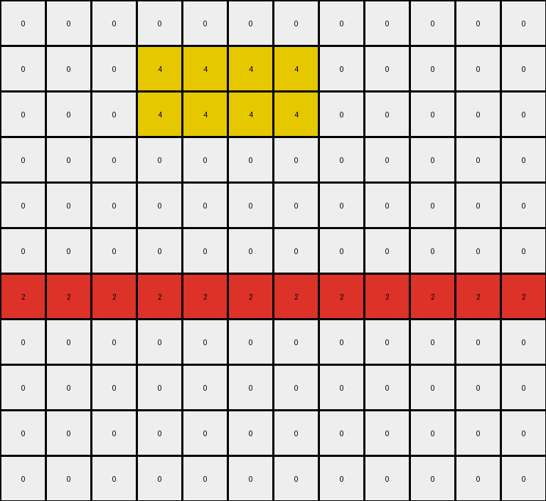
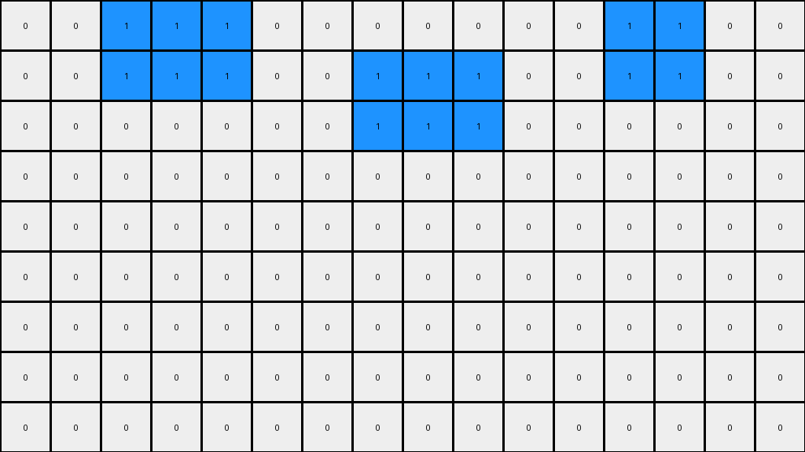

# AboveBelow1 • 011 • refine_dreamer

---

Previous Code:
```python
"""
1.  **Preserve Top Rows:** Copy the first three rows (rows 0, 1, and 2) of the input grid directly to the output grid without changes.
2.  **Blanking Subsequent Rows:** For all rows below the top three (starting from row 3), change all pixel values to 0 (white).
3.  **Exception:** If a horizontal line exists below the first three rows, preserve the first horizontal line, changing all rows below this horizontal line to 0 (white).
"""

import numpy as np

def is_horizontal_line(grid, row):
    """Checks if a given row in the grid forms a horizontal line (all pixels have the same non-zero color)."""
    if row < 0 or row >= grid.shape[0]:
        return False
    first_color = grid[row, 0]
    if first_color == 0:  # Consider 0 as background, not a line
       return False
    for col in range(1, grid.shape[1]):
        if grid[row, col] != first_color:
            return False
    return True

def transform(input_grid):
    """Transforms the input grid according to the described rule."""
    output_grid = np.zeros_like(input_grid)

    # 1. Preserve Top Rows
    for row in range(min(3, input_grid.shape[0])):
        output_grid[row, :] = input_grid[row, :]

    # 2 & 3. Blanking Subsequent Rows with Exception
    found_horizontal_line = False
    for row in range(3, input_grid.shape[0]):
        if not found_horizontal_line and is_horizontal_line(input_grid, row):
            output_grid[row, :] = input_grid[row, :]
            found_horizontal_line = True
        #else all 0, which is already set during initialization

    return output_grid
```

Train Set Results:

## Example 1:

Input:
```
0 0 0 0 0 0 0 0 0 0 0 0
0 0 0 4 4 4 4 0 0 0 0 0
0 0 0 4 4 4 4 0 0 0 0 0
0 0 0 4 4 4 4 0 0 0 0 0
0 0 0 0 0 0 0 0 0 0 0 0
0 0 0 0 0 0 0 0 0 0 0 0
2 2 2 2 2 2 2 2 2 2 2 2
0 0 0 0 0 0 0 0 0 0 0 0
0 0 0 4 4 4 4 0 0 4 4 4
0 0 0 4 4 4 4 0 0 4 4 4
0 0 0 4 4 4 4 0 0 4 4 4
```
Expected Output:
```
0 0 0 0 0 0 0 0 0 0 0 0
0 0 0 4 4 4 4 0 0 0 0 0
0 0 0 4 4 4 4 0 0 0 0 0
0 0 0 4 4 4 4 0 0 0 0 0
0 0 0 0 0 0 0 0 0 0 0 0
0 0 0 0 0 0 0 0 0 0 0 0
2 2 2 2 2 2 2 2 2 2 2 2
0 0 0 0 0 0 0 0 0 0 0 0
0 0 0 0 0 0 0 0 0 0 0 0
0 0 0 0 0 0 0 0 0 0 0 0
0 0 0 0 0 0 0 0 0 0 0 0
```
Transformed Output:
```
0 0 0 0 0 0 0 0 0 0 0 0
0 0 0 4 4 4 4 0 0 0 0 0
0 0 0 4 4 4 4 0 0 0 0 0
0 0 0 0 0 0 0 0 0 0 0 0
0 0 0 0 0 0 0 0 0 0 0 0
0 0 0 0 0 0 0 0 0 0 0 0
2 2 2 2 2 2 2 2 2 2 2 2
0 0 0 0 0 0 0 0 0 0 0 0
0 0 0 0 0 0 0 0 0 0 0 0
0 0 0 0 0 0 0 0 0 0 0 0
0 0 0 0 0 0 0 0 0 0 0 0
```

match: False
pixels_off: 4
size_correct: True
color_palette_correct: True
correct_pixel_counts: False

## Example 2:

Input:
```
0 0 0 6 6 6 0 0 0 6 6 6 6 0 6 6
0 0 0 6 6 6 0 0 0 6 6 6 6 0 6 6
3 3 3 3 3 3 3 3 3 3 3 3 3 3 3 3
0 0 6 6 6 0 0 0 0 0 6 6 6 6 0 0
0 0 6 6 6 0 0 0 0 0 6 6 6 6 0 0
0 0 0 0 0 0 0 0 0 0 6 6 6 6 0 0
0 0 0 0 0 0 0 0 0 0 6 6 6 6 0 0
0 0 6 6 0 0 6 6 0 0 6 6 6 6 0 0
0 0 6 6 0 0 6 6 0 0 0 0 0 0 0 0
0 0 6 6 0 0 6 6 0 0 0 0 0 0 0 0
```
Expected Output:
```
0 0 0 6 6 6 0 0 0 6 6 6 6 0 6 6
0 0 0 6 6 6 0 0 0 6 6 6 6 0 6 6
3 3 3 3 3 3 3 3 3 3 3 3 3 3 3 3
0 0 0 0 0 0 0 0 0 0 0 0 0 0 0 0
0 0 0 0 0 0 0 0 0 0 0 0 0 0 0 0
0 0 0 0 0 0 0 0 0 0 0 0 0 0 0 0
0 0 0 0 0 0 0 0 0 0 0 0 0 0 0 0
0 0 0 0 0 0 0 0 0 0 0 0 0 0 0 0
0 0 0 0 0 0 0 0 0 0 0 0 0 0 0 0
0 0 0 0 0 0 0 0 0 0 0 0 0 0 0 0
```
Transformed Output:
```
0 0 0 6 6 6 0 0 0 6 6 6 6 0 6 6
0 0 0 6 6 6 0 0 0 6 6 6 6 0 6 6
3 3 3 3 3 3 3 3 3 3 3 3 3 3 3 3
0 0 0 0 0 0 0 0 0 0 0 0 0 0 0 0
0 0 0 0 0 0 0 0 0 0 0 0 0 0 0 0
0 0 0 0 0 0 0 0 0 0 0 0 0 0 0 0
0 0 0 0 0 0 0 0 0 0 0 0 0 0 0 0
0 0 0 0 0 0 0 0 0 0 0 0 0 0 0 0
0 0 0 0 0 0 0 0 0 0 0 0 0 0 0 0
0 0 0 0 0 0 0 0 0 0 0 0 0 0 0 0
```

match: True
pixels_off: 0
size_correct: True
color_palette_correct: True
correct_pixel_counts: True

## Example 3:

Input:
```
0 0 1 1 1 0 0 0 0 0 0 0 1 1 0 0
0 0 1 1 1 0 0 1 1 1 0 0 1 1 0 0
0 0 0 0 0 0 0 1 1 1 0 0 0 0 0 0
8 0 8 0 8 0 8 0 8 0 8 0 8 0 8 0
1 1 0 1 1 1 0 0 0 1 1 1 0 0 0 0
1 1 0 1 1 1 0 0 0 1 1 1 0 0 0 0
1 1 0 0 0 0 0 0 0 1 1 1 0 0 0 0
0 0 0 0 0 0 0 0 0 0 0 0 0 0 0 0
0 0 0 0 0 0 0 0 0 0 0 0 0 0 0 0
```
Expected Output:
```
0 0 1 1 1 0 0 0 0 0 0 0 1 1 0 0
0 0 1 1 1 0 0 1 1 1 0 0 1 1 0 0
0 0 0 0 0 0 0 1 1 1 0 0 0 0 0 0
8 0 8 0 8 0 8 0 8 0 8 0 8 0 8 0
0 0 0 0 0 0 0 0 0 0 0 0 0 0 0 0
0 0 0 0 0 0 0 0 0 0 0 0 0 0 0 0
0 0 0 0 0 0 0 0 0 0 0 0 0 0 0 0
0 0 0 0 0 0 0 0 0 0 0 0 0 0 0 0
0 0 0 0 0 0 0 0 0 0 0 0 0 0 0 0
```
Transformed Output:
```
0 0 1 1 1 0 0 0 0 0 0 0 1 1 0 0
0 0 1 1 1 0 0 1 1 1 0 0 1 1 0 0
0 0 0 0 0 0 0 1 1 1 0 0 0 0 0 0
0 0 0 0 0 0 0 0 0 0 0 0 0 0 0 0
0 0 0 0 0 0 0 0 0 0 0 0 0 0 0 0
0 0 0 0 0 0 0 0 0 0 0 0 0 0 0 0
0 0 0 0 0 0 0 0 0 0 0 0 0 0 0 0
0 0 0 0 0 0 0 0 0 0 0 0 0 0 0 0
0 0 0 0 0 0 0 0 0 0 0 0 0 0 0 0
```

match: False
pixels_off: 8
size_correct: True
color_palette_correct: True
correct_pixel_counts: False
**INSTRUCTIONS**

The code above was generated based on observations from the first training
example

we have tested the transform function on each of the task example inputs and
compared with the expected output

review each of the examples provided and the results and consider how the
natural language program should be updated to accommodate this new knowledge

respond with the following deliverables:

- general assessment of the information provided and strategy for resolving the
  errors
- gather metrics about each of the examples and results - use code_execution to
  develop accurate reports on your assumptions
- a YAML block documenting facts - Focus on identifying objects, their properties, and the actions performed on them.
- a natural language program - Be as clear and concise as possible, providing a complete description of the transformation rule.


your responses should be considered as information in a report - not a
conversation
