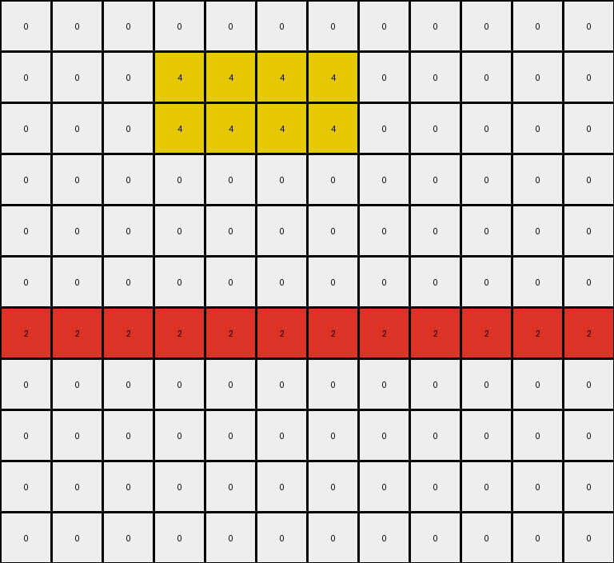
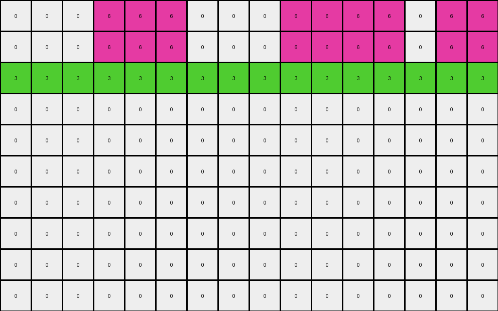

# AboveBelow1 • 012 • refine_coder

---

Previous Code:
```python
"""
1.  **Preserve Top Rows:** Copy the first three rows (rows 0, 1, and 2) of the input grid directly to the output grid without changes.
2.  **Blanking Subsequent Rows:** For all rows below the top three (starting from row 3), change all pixel values to 0 (white).
3.  **Exception:** If a horizontal line exists below the first three rows, preserve the first horizontal line, changing all rows below this horizontal line to 0 (white).
"""

import numpy as np

def is_horizontal_line(grid, row):
    """Checks if a given row in the grid forms a horizontal line (all pixels have the same non-zero color)."""
    if row < 0 or row >= grid.shape[0]:
        return False
    first_color = grid[row, 0]
    if first_color == 0:  # Consider 0 as background, not a line
       return False
    for col in range(1, grid.shape[1]):
        if grid[row, col] != first_color:
            return False
    return True

def transform(input_grid):
    """Transforms the input grid according to the described rule."""
    output_grid = np.zeros_like(input_grid)

    # 1. Preserve Top Rows
    for row in range(min(3, input_grid.shape[0])):
        output_grid[row, :] = input_grid[row, :]

    # 2 & 3. Blanking Subsequent Rows with Exception
    found_horizontal_line = False
    for row in range(3, input_grid.shape[0]):
        if not found_horizontal_line and is_horizontal_line(input_grid, row):
            output_grid[row, :] = input_grid[row, :]
            found_horizontal_line = True
        #else all 0, which is already set during initialization

    return output_grid
```

Train Set Results:

## Example 1:

Input:
```
0 0 0 0 0 0 0 0 0 0 0 0
0 0 0 4 4 4 4 0 0 0 0 0
0 0 0 4 4 4 4 0 0 0 0 0
0 0 0 4 4 4 4 0 0 0 0 0
0 0 0 0 0 0 0 0 0 0 0 0
0 0 0 0 0 0 0 0 0 0 0 0
2 2 2 2 2 2 2 2 2 2 2 2
0 0 0 0 0 0 0 0 0 0 0 0
0 0 0 4 4 4 4 0 0 4 4 4
0 0 0 4 4 4 4 0 0 4 4 4
0 0 0 4 4 4 4 0 0 4 4 4
```
Expected Output:
```
0 0 0 0 0 0 0 0 0 0 0 0
0 0 0 4 4 4 4 0 0 0 0 0
0 0 0 4 4 4 4 0 0 0 0 0
0 0 0 4 4 4 4 0 0 0 0 0
0 0 0 0 0 0 0 0 0 0 0 0
0 0 0 0 0 0 0 0 0 0 0 0
2 2 2 2 2 2 2 2 2 2 2 2
0 0 0 0 0 0 0 0 0 0 0 0
0 0 0 0 0 0 0 0 0 0 0 0
0 0 0 0 0 0 0 0 0 0 0 0
0 0 0 0 0 0 0 0 0 0 0 0
```
Transformed Output:
```
0 0 0 0 0 0 0 0 0 0 0 0
0 0 0 4 4 4 4 0 0 0 0 0
0 0 0 4 4 4 4 0 0 0 0 0
0 0 0 0 0 0 0 0 0 0 0 0
0 0 0 0 0 0 0 0 0 0 0 0
0 0 0 0 0 0 0 0 0 0 0 0
2 2 2 2 2 2 2 2 2 2 2 2
0 0 0 0 0 0 0 0 0 0 0 0
0 0 0 0 0 0 0 0 0 0 0 0
0 0 0 0 0 0 0 0 0 0 0 0
0 0 0 0 0 0 0 0 0 0 0 0
```

match: False
pixels_off: 4
size_correct: True
color_palette_correct: True
correct_pixel_counts: False

## Example 2:

Input:
```
0 0 0 6 6 6 0 0 0 6 6 6 6 0 6 6
0 0 0 6 6 6 0 0 0 6 6 6 6 0 6 6
3 3 3 3 3 3 3 3 3 3 3 3 3 3 3 3
0 0 6 6 6 0 0 0 0 0 6 6 6 6 0 0
0 0 6 6 6 0 0 0 0 0 6 6 6 6 0 0
0 0 0 0 0 0 0 0 0 0 6 6 6 6 0 0
0 0 0 0 0 0 0 0 0 0 6 6 6 6 0 0
0 0 6 6 0 0 6 6 0 0 6 6 6 6 0 0
0 0 6 6 0 0 6 6 0 0 0 0 0 0 0 0
0 0 6 6 0 0 6 6 0 0 0 0 0 0 0 0
```
Expected Output:
```
0 0 0 6 6 6 0 0 0 6 6 6 6 0 6 6
0 0 0 6 6 6 0 0 0 6 6 6 6 0 6 6
3 3 3 3 3 3 3 3 3 3 3 3 3 3 3 3
0 0 0 0 0 0 0 0 0 0 0 0 0 0 0 0
0 0 0 0 0 0 0 0 0 0 0 0 0 0 0 0
0 0 0 0 0 0 0 0 0 0 0 0 0 0 0 0
0 0 0 0 0 0 0 0 0 0 0 0 0 0 0 0
0 0 0 0 0 0 0 0 0 0 0 0 0 0 0 0
0 0 0 0 0 0 0 0 0 0 0 0 0 0 0 0
0 0 0 0 0 0 0 0 0 0 0 0 0 0 0 0
```
Transformed Output:
```
0 0 0 6 6 6 0 0 0 6 6 6 6 0 6 6
0 0 0 6 6 6 0 0 0 6 6 6 6 0 6 6
3 3 3 3 3 3 3 3 3 3 3 3 3 3 3 3
0 0 0 0 0 0 0 0 0 0 0 0 0 0 0 0
0 0 0 0 0 0 0 0 0 0 0 0 0 0 0 0
0 0 0 0 0 0 0 0 0 0 0 0 0 0 0 0
0 0 0 0 0 0 0 0 0 0 0 0 0 0 0 0
0 0 0 0 0 0 0 0 0 0 0 0 0 0 0 0
0 0 0 0 0 0 0 0 0 0 0 0 0 0 0 0
0 0 0 0 0 0 0 0 0 0 0 0 0 0 0 0
```

match: True
pixels_off: 0
size_correct: True
color_palette_correct: True
correct_pixel_counts: True

## Example 3:

Input:
```
0 0 1 1 1 0 0 0 0 0 0 0 1 1 0 0
0 0 1 1 1 0 0 1 1 1 0 0 1 1 0 0
0 0 0 0 0 0 0 1 1 1 0 0 0 0 0 0
8 0 8 0 8 0 8 0 8 0 8 0 8 0 8 0
1 1 0 1 1 1 0 0 0 1 1 1 0 0 0 0
1 1 0 1 1 1 0 0 0 1 1 1 0 0 0 0
1 1 0 0 0 0 0 0 0 1 1 1 0 0 0 0
0 0 0 0 0 0 0 0 0 0 0 0 0 0 0 0
0 0 0 0 0 0 0 0 0 0 0 0 0 0 0 0
```
Expected Output:
```
0 0 1 1 1 0 0 0 0 0 0 0 1 1 0 0
0 0 1 1 1 0 0 1 1 1 0 0 1 1 0 0
0 0 0 0 0 0 0 1 1 1 0 0 0 0 0 0
8 0 8 0 8 0 8 0 8 0 8 0 8 0 8 0
0 0 0 0 0 0 0 0 0 0 0 0 0 0 0 0
0 0 0 0 0 0 0 0 0 0 0 0 0 0 0 0
0 0 0 0 0 0 0 0 0 0 0 0 0 0 0 0
0 0 0 0 0 0 0 0 0 0 0 0 0 0 0 0
0 0 0 0 0 0 0 0 0 0 0 0 0 0 0 0
```
Transformed Output:
```
0 0 1 1 1 0 0 0 0 0 0 0 1 1 0 0
0 0 1 1 1 0 0 1 1 1 0 0 1 1 0 0
0 0 0 0 0 0 0 1 1 1 0 0 0 0 0 0
0 0 0 0 0 0 0 0 0 0 0 0 0 0 0 0
0 0 0 0 0 0 0 0 0 0 0 0 0 0 0 0
0 0 0 0 0 0 0 0 0 0 0 0 0 0 0 0
0 0 0 0 0 0 0 0 0 0 0 0 0 0 0 0
0 0 0 0 0 0 0 0 0 0 0 0 0 0 0 0
0 0 0 0 0 0 0 0 0 0 0 0 0 0 0 0
```

match: False
pixels_off: 8
size_correct: True
color_palette_correct: True
correct_pixel_counts: False
Here's an analysis of the provided information and a plan to refine the solution:

**General Assessment:**

The initial code correctly identifies the need to preserve the top three rows and blank subsequent rows. It also introduces a crucial exception: preserving the first horizontal line encountered below the top three rows.  However, the code fails in Example 1 and Example 3 because it stops processing further rows *after* encountering the first horizontal line. It needs to blank all rows *below* that preserved horizontal line. Example 2 works correctly only because there are no other rows below the identified horizontal line. The core issue is the premature termination of the blanking process after finding a horizontal line. We need to blank all rows *after* the horizontal line is copied.

**Strategy:**

1.  **Refine Horizontal Line Detection:** The `is_horizontal_line` function is correct and should be kept.
2.  **Modify Blanking Logic:** Instead of stopping the loop after copying the horizontal line, the loop should continue, but *all* subsequent rows should be set to 0. The `found_horizontal_line` flag controls when the blanking starts.

**Metrics and Observations (YAML):**

```yaml
examples:
  - id: 1
    input_shape: [11, 12]
    output_shape: [11, 12]
    match: False
    pixels_off: 4
    notes: >
      The code failed to blank the rows *after* the horizontal line. The 4
      pixels that don't match are due to keeping rows that should be blanked
      (specifically, the yellow and black pixels in rows 8-10. Row 3 is
      correctly kept, and all subsequent rows are incorrectly kept)
    objects:
      - type: horizontal_line
        color: yellow
        row_index: 2
      - type: horizontal_line
        color: red
        row_index: 6
      - type: horizontal_line_like
        color: yellow
        row_index: 8
      - type: horizontal_line_like
        color: yellow
        row_index: 9
      - type: horizontal_line_like
        color: yellow
        row_index: 10

  - id: 2
    input_shape: [10, 16]
    output_shape: [10, 16]
    match: True
    pixels_off: 0
    notes: >
      The code works correctly because the horizontal line is followed only by
      rows that are already blank (or should remain blank).
    objects:
      - type: horizontal_line
        color: green
        row_index: 2

  - id: 3
    input_shape: [9, 16]
    output_shape: [9, 16]
    match: False
    pixels_off: 8
    notes: >
      The horizontal line at row 3 is preserved correctly, but rows after it are not blanked.
      The pixels on row 4 that should be blanked are not.
    objects:
      - type: horizontal_line
        color: grey
        row_index: 3

```

**Natural Language Program:**

1.  **Copy Top Rows:** Copy the first three rows (rows 0, 1, and 2) of the input grid to the output grid without modification.
2.  **Find Horizontal Line:** Starting from row 3, search for the first horizontal line. A horizontal line is defined as a row where all pixels have the same non-zero color.
3.  **Preserve Horizontal Line (if found):** If a horizontal line is found, copy that entire row from the input grid to the corresponding row in the output grid.
4.  **Blank Subsequent Rows:**  All rows *below* the first three rows, are set to 0 (white).
5. **Blank Rows After Horizontal Line (if present)**: All rows below the copied horizontal line are set to all 0 (white).

**INSTRUCTIONS**

- generate a Python module to represent the natural language program 
- follow the template below
- all common math and science libraries are available
- create docstring only at top - but comment the workflow in the function
- use helper functions for common operations like finding objects, counting,
  measuring, moving, etc. 

remember - we are working iteratively - so this code will inform your future
self as we converge on the solution

*template:*

```python
"""
{{ natural language description of the transformation rule }}
"""

{{ imports }}

def transform(input_grid):
    # initialize output_grid

    # change output pixels 

    return output_grid

```
