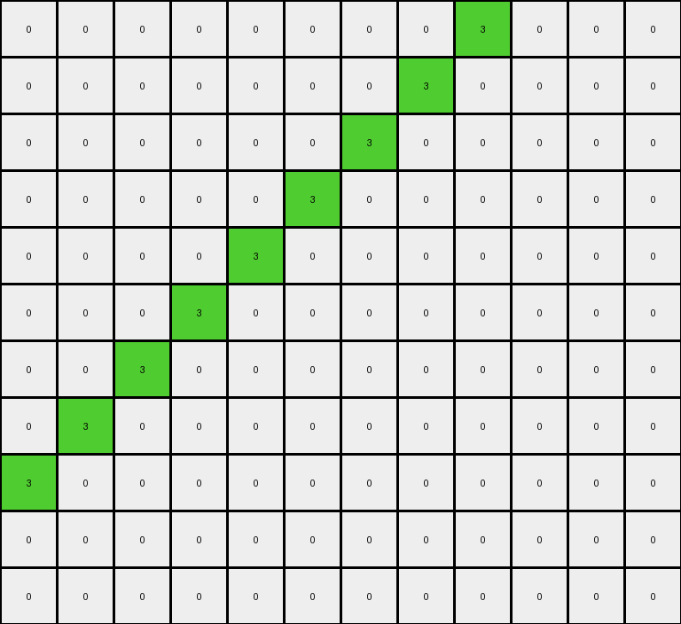

# AboveBelow10 • 004 • refine_coder

---

Previous Code:
```python
"""
1.  **Identify the diagonal:** Locate the existing diagonal line of yellow (4) pixels extending from the top-left corner downwards.
2.  **Fill below the diagonal:** For each row, starting from the top, change all pixels to the left of the yellow diagonal pixel in that row to yellow (4). Stop when reaching the bottom of the grid or end of a row. The result is a filled triangle.
"""

import numpy as np

def transform(input_grid):
    """Transforms the input grid by filling the area below the diagonal with yellow."""
    output_grid = np.copy(input_grid)
    rows, cols = output_grid.shape

    # Iterate through each row
    for i in range(rows):
        # Find the index of the yellow pixel in the current row
        yellow_index = -1
        for j in range(cols):
            if output_grid[i, j] == 4:
                yellow_index = j
                break  # Stop searching after finding the first yellow pixel

        # Fill pixels to the left of the yellow pixel with yellow
        if yellow_index != -1:
            for j in range(yellow_index):
                output_grid[i, j] = 4

    return output_grid
```

Train Set Results:

## Example 1:

Input:
```
0 0 0 0 0 0 0 0 0 0 0 0 0 0
0 0 0 0 0 0 0 0 0 0 0 0 0 0
4 0 0 0 0 0 0 0 0 0 0 0 0 0
0 4 0 0 0 0 0 0 0 0 0 0 0 0
0 0 4 0 0 0 0 0 0 0 0 0 0 0
0 0 0 4 0 0 0 0 0 0 0 0 0 0
0 0 0 0 4 0 0 0 0 0 0 0 0 0
0 0 0 0 0 4 0 0 0 0 0 0 0 0
0 0 0 0 0 0 4 0 0 0 0 0 0 0
0 0 0 0 0 0 0 4 0 0 0 0 0 0
0 0 0 0 0 0 0 0 4 0 0 0 0 0
```
Expected Output:
```
0 0 0 0 0 0 0 0 0 0 0 0 0 0
0 0 0 0 0 0 0 0 0 0 0 0 0 0
4 0 0 0 0 0 0 0 0 0 0 0 0 0
4 4 0 0 0 0 0 0 0 0 0 0 0 0
4 4 4 0 0 0 0 0 0 0 0 0 0 0
4 4 4 4 0 0 0 0 0 0 0 0 0 0
4 4 4 4 4 0 0 0 0 0 0 0 0 0
4 4 4 4 4 4 0 0 0 0 0 0 0 0
4 4 4 4 4 4 4 0 0 0 0 0 0 0
4 4 4 4 4 4 4 4 0 0 0 0 0 0
4 4 4 4 4 4 4 4 4 0 0 0 0 0
```
Transformed Output:
```
0 0 0 0 0 0 0 0 0 0 0 0 0 0
0 0 0 0 0 0 0 0 0 0 0 0 0 0
4 0 0 0 0 0 0 0 0 0 0 0 0 0
4 4 0 0 0 0 0 0 0 0 0 0 0 0
4 4 4 0 0 0 0 0 0 0 0 0 0 0
4 4 4 4 0 0 0 0 0 0 0 0 0 0
4 4 4 4 4 0 0 0 0 0 0 0 0 0
4 4 4 4 4 4 0 0 0 0 0 0 0 0
4 4 4 4 4 4 4 0 0 0 0 0 0 0
4 4 4 4 4 4 4 4 0 0 0 0 0 0
4 4 4 4 4 4 4 4 4 0 0 0 0 0
```

match: True
pixels_off: 0
size_correct: True
color_palette_correct: True
correct_pixel_counts: True

## Example 2:

Input:
```
0 0 0 0 0 0 0 0 3 0 0 0
0 0 0 0 0 0 0 3 0 0 0 0
0 0 0 0 0 0 3 0 0 0 0 0
0 0 0 0 0 3 0 0 0 0 0 0
0 0 0 0 3 0 0 0 0 0 0 0
0 0 0 3 0 0 0 0 0 0 0 0
0 0 3 0 0 0 0 0 0 0 0 0
0 3 0 0 0 0 0 0 0 0 0 0
3 0 0 0 0 0 0 0 0 0 0 0
0 0 0 0 0 0 0 0 0 0 0 0
0 0 0 0 0 0 0 0 0 0 0 0
```
Expected Output:
```
0 0 0 0 0 0 0 0 3 3 3 3
0 0 0 0 0 0 0 3 3 3 3 3
0 0 0 0 0 0 3 3 3 3 3 3
0 0 0 0 0 3 3 3 3 3 3 3
0 0 0 0 3 3 3 3 3 3 3 3
0 0 0 3 3 3 3 3 3 3 3 3
0 0 3 3 3 3 3 3 3 3 3 3
0 3 3 3 3 3 3 3 3 3 3 3
3 3 3 3 3 3 3 3 3 3 3 3
3 3 3 3 3 3 3 3 3 3 3 3
3 3 3 3 3 3 3 3 3 3 3 3
```
Transformed Output:
```
0 0 0 0 0 0 0 0 3 0 0 0
0 0 0 0 0 0 0 3 0 0 0 0
0 0 0 0 0 0 3 0 0 0 0 0
0 0 0 0 0 3 0 0 0 0 0 0
0 0 0 0 3 0 0 0 0 0 0 0
0 0 0 3 0 0 0 0 0 0 0 0
0 0 3 0 0 0 0 0 0 0 0 0
0 3 0 0 0 0 0 0 0 0 0 0
3 0 0 0 0 0 0 0 0 0 0 0
0 0 0 0 0 0 0 0 0 0 0 0
0 0 0 0 0 0 0 0 0 0 0 0
```

match: False
pixels_off: 87
size_correct: True
color_palette_correct: True
correct_pixel_counts: False
Okay, here's a breakdown of the situation and a plan to move forward:

**General Assessment:**

The initial code was designed to fill pixels below a diagonal line of yellow (4) pixels. This worked perfectly for the first example, where such a diagonal existed. However, the second example reveals a flaw: the code *only* works when there's a pre-existing diagonal of the specified color. It doesn't create a diagonal or handle other colors. The second example uses green (3) and requires filling to the *right* of the diagonal, not the left.  Essentially, the initial assumption was too narrow.

**Strategy:**

1.  **Re-evaluate the Core Concept:** We need to move away from "filling *below* a *yellow* diagonal" to a more general concept of "filling to one side of a diagonal of a *given* color."
2.  **Parameterize the Color and Direction:** The target color (initially yellow, then green) and the fill direction (initially left, then right) must become parameters of the transformation.
3.  **Handle Missing Diagonals:** If no diagonal of the specified color exists initially, still fill the full output with additional lines of the color.
4. **Clarify what a diagonal means** The diagonal in example 1 goes from top left towards bottom right. The diagonal in example two goes from bottom left to top right.

**Metrics and Observations:**

Here's a summary of the provided examples, including my observations:

*   **Example 1:**
    *   Input: Diagonal line of yellow (4) from top-left. Rest is white (0).
    *   Expected Output: Triangle of yellow (4) filling the area *below* and to the *left* of the diagonal.
    *   Actual Output: Matches Expected Output.
    *   Notes:  The initial code correctly handled this case. The diagonal is top-left to bottom-right.

*   **Example 2:**
    *   Input: Diagonal line of green (3) from bottom-left. Rest is white (0).
    *   Expected Output: Area *above* and to the *right* of the diagonal filled with green (3), plus additional complete rows of green(3) below the initial diagonal.
    *   Actual Output:  No change from the input.
    *   Notes: Highlights the limitations of the original code.  Fill direction is opposite, color is different, and extending past the input diagonal. The diagonal is bottom-left to top-right.

**YAML Fact Block:**

```yaml
examples:
  - example_id: 1
    input_objects:
      - object_id: diagonal_1
        color: yellow
        shape: diagonal_line
        direction: top_left_to_bottom_right
        positions: [(2,0), (3,1), (4,2), (5,3), (6,4), (7,5), (8,6), (9,7), (10,8)]
    output_objects:
      - object_id: filled_triangle_1
        color: yellow
        shape: triangle
        positions: # All positions below and left of the input diagonal
        relation_to_input: "filled area left of input diagonal"
    transformation: fill_left

  - example_id: 2
    input_objects:
      - object_id: diagonal_2
        color: green
        shape: diagonal_line
        direction: bottom_left_to_top_right
        positions:  [(8,0), (7,1), (6,2), (5,3), (4,4), (3,5), (2,6), (1,7), (0,8)]
    output_objects:
        - object_id: filled_area_2
          color: green
          shape: filled_area #Not precisely a triangle
          relation_to_input: "filled area right of input diagonal, and extended to the bottom"
          positions: # all positions to the right of input diagonal, plus additional full green lines
    transformation: fill_right_and_extend
```

**Natural Language Program:**

1.  **Identify Key Parameters:** Determine the target `color` for the diagonal and the `fill_direction` (left or right). Note also the `diagonal_direction` (top-left to bottom-right, or bottom-left to top-right).
2.  **Locate the Diagonal:** Find the longest diagonal line of pixels matching the target `color` and `diagonal_direction`.
3.  **Fill based on Direction:**
    *   If `fill_direction` is "left", for each row, change all pixels to the *left* of the diagonal pixel in that row to the target `color`.
    *   If `fill_direction` is "right", for each row, change all pixels to the *right* of the diagonal pixel in that row to the target `color`.
4.  **Extend if necessary (Example 2):** If extending the diagonal (as in Example 2), continue filling complete rows with the target `color` below the original diagonal's extent until the bottom of the output image. The output should be a rectangle.

This revised natural language program accounts for the variations observed in the two examples, generalizing the transformation rule. It addresses the color, direction, and the "extension" behavior seen in the second example.

**INSTRUCTIONS**

- generate a Python module to represent the natural language program 
- follow the template below
- all common math and science libraries are available
- create docstring only at top - but comment the workflow in the function
- use helper functions for common operations like finding objects, counting,
  measuring, moving, etc. 

remember - we are working iteratively - so this code will inform your future
self as we converge on the solution

*template:*

```python
"""
{{ natural language description of the transformation rule }}
"""

{{ imports }}

def transform(input_grid):
    # initialize output_grid

    # change output pixels 

    return output_grid

```
