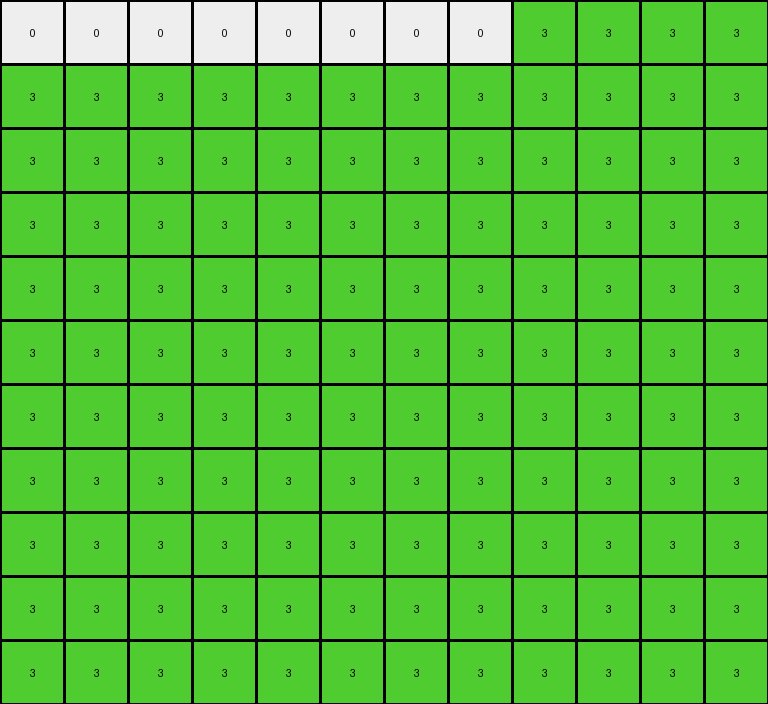

# AboveBelow10 • 006 • refine_coder

---

Previous Code:
```python
"""
1.  **Identify Key Parameters:** Determine the target `color` for the diagonal and the `fill_direction` (left or right). Note also the `diagonal_direction` (top-left to bottom-right, or bottom-left to top-right).
2.  **Locate the Diagonal:** Find the longest diagonal line of pixels matching the target `color` and `diagonal_direction`.
3.  **Fill based on Direction:**
    *   If `fill_direction` is "left", for each row, change all pixels to the *left* of the diagonal pixel in that row to the target `color`.
    *   If `fill_direction` is "right", for each row, change all pixels to the *right* of the diagonal pixel in that row to the target `color`.
4.  **Extend if necessary (Example 2):** If extending the diagonal (as in Example 2), continue filling complete rows with the target `color` below the original diagonal's extent until the bottom of the output image. The output should be a rectangle.
"""

import numpy as np

def find_diagonal(grid, color, diagonal_direction):
    """Finds the longest diagonal of a given color and direction."""
    rows, cols = grid.shape
    diagonal_pixels = []

    if diagonal_direction == "top_left_to_bottom_right":
        for start_row in range(rows):
            current_diagonal = []
            row, col = start_row, 0
            while row < rows and col < cols:
                if grid[row, col] == color:
                    current_diagonal.append((row, col))
                else:
                    break  # Stop if color doesn't match
                row += 1
                col += 1
            if len(current_diagonal) > len(diagonal_pixels):
                diagonal_pixels = current_diagonal

        for start_col in range(1, cols):
            current_diagonal = []
            row, col = 0, start_col
            while row < rows and col<cols:
                if grid[row,col] == color:
                    current_diagonal.append((row,col))
                else:
                    break;
                row += 1
                col += 1
            if len(current_diagonal) > len(diagonal_pixels):
                diagonal_pixels = current_diagonal


    elif diagonal_direction == "bottom_left_to_top_right":
        for start_row in range(rows):
            current_diagonal = []
            row, col = start_row, 0
            while row >= 0 and col < cols:
                if grid[row, col] == color:
                    current_diagonal.append((row, col))
                else:
                    break
                row -= 1
                col += 1
            if len(current_diagonal) > len(diagonal_pixels):
                diagonal_pixels = current_diagonal
        for start_col in range(1, cols):
            current_diagonal = []
            row, col = rows - 1, start_col

            while row >= 0 and col < cols:
                if grid[row,col] == color:
                    current_diagonal.append((row,col))
                else:
                    break
                row -=1
                col += 1
            if len(current_diagonal) > len(diagonal_pixels):
                diagonal_pixels = current_diagonal
    return diagonal_pixels

def transform(input_grid, color=None, fill_direction=None, diagonal_direction=None):
    # initialize output_grid
    output_grid = np.copy(input_grid)
    rows, cols = output_grid.shape
    
    # determine color, fill_direction, and diagonal_direction if not provided
    if color is None or fill_direction is None or diagonal_direction is None:
       
        # Example 1
        if input_grid[2,0] == 4:
            color = 4
            fill_direction = "left"
            diagonal_direction = "top_left_to_bottom_right"
        # Example 2
        elif input_grid[8,0] == 3:
            color = 3
            fill_direction = "right"
            diagonal_direction = "bottom_left_to_top_right"


    # locate the diagonal
    diagonal_pixels = find_diagonal(output_grid, color, diagonal_direction)

    # fill based on direction
    if fill_direction == "left":
        for row, col in diagonal_pixels:
            for c in range(col):
                output_grid[row, c] = color
    elif fill_direction == "right":
        for row, col in diagonal_pixels:
            for c in range(col + 1, cols):
                output_grid[row, c] = color

    # extend if necessary (fill the entire grid in this case)
    if diagonal_direction == 'bottom_left_to_top_right' :
        if len(diagonal_pixels) > 0:
            last_row_of_diagonal = diagonal_pixels[-1][0]
            for r in range(last_row_of_diagonal + 1, rows):  # corrected
                output_grid[r,:] = color

    return output_grid
```

Train Set Results:

## Example 1:

Input:
```
0 0 0 0 0 0 0 0 0 0 0 0 0 0
0 0 0 0 0 0 0 0 0 0 0 0 0 0
4 0 0 0 0 0 0 0 0 0 0 0 0 0
0 4 0 0 0 0 0 0 0 0 0 0 0 0
0 0 4 0 0 0 0 0 0 0 0 0 0 0
0 0 0 4 0 0 0 0 0 0 0 0 0 0
0 0 0 0 4 0 0 0 0 0 0 0 0 0
0 0 0 0 0 4 0 0 0 0 0 0 0 0
0 0 0 0 0 0 4 0 0 0 0 0 0 0
0 0 0 0 0 0 0 4 0 0 0 0 0 0
0 0 0 0 0 0 0 0 4 0 0 0 0 0
```
Expected Output:
```
0 0 0 0 0 0 0 0 0 0 0 0 0 0
0 0 0 0 0 0 0 0 0 0 0 0 0 0
4 0 0 0 0 0 0 0 0 0 0 0 0 0
4 4 0 0 0 0 0 0 0 0 0 0 0 0
4 4 4 0 0 0 0 0 0 0 0 0 0 0
4 4 4 4 0 0 0 0 0 0 0 0 0 0
4 4 4 4 4 0 0 0 0 0 0 0 0 0
4 4 4 4 4 4 0 0 0 0 0 0 0 0
4 4 4 4 4 4 4 0 0 0 0 0 0 0
4 4 4 4 4 4 4 4 0 0 0 0 0 0
4 4 4 4 4 4 4 4 4 0 0 0 0 0
```
Transformed Output:
```
0 0 0 0 0 0 0 0 0 0 0 0 0 0
0 0 0 0 0 0 0 0 0 0 0 0 0 0
4 0 0 0 0 0 0 0 0 0 0 0 0 0
4 4 0 0 0 0 0 0 0 0 0 0 0 0
4 4 4 0 0 0 0 0 0 0 0 0 0 0
4 4 4 4 0 0 0 0 0 0 0 0 0 0
4 4 4 4 4 0 0 0 0 0 0 0 0 0
4 4 4 4 4 4 0 0 0 0 0 0 0 0
4 4 4 4 4 4 4 0 0 0 0 0 0 0
4 4 4 4 4 4 4 4 0 0 0 0 0 0
4 4 4 4 4 4 4 4 4 0 0 0 0 0
```

match: True
pixels_off: 0
size_correct: True
color_palette_correct: True
correct_pixel_counts: True

## Example 2:

Input:
```
0 0 0 0 0 0 0 0 3 0 0 0
0 0 0 0 0 0 0 3 0 0 0 0
0 0 0 0 0 0 3 0 0 0 0 0
0 0 0 0 0 3 0 0 0 0 0 0
0 0 0 0 3 0 0 0 0 0 0 0
0 0 0 3 0 0 0 0 0 0 0 0
0 0 3 0 0 0 0 0 0 0 0 0
0 3 0 0 0 0 0 0 0 0 0 0
3 0 0 0 0 0 0 0 0 0 0 0
0 0 0 0 0 0 0 0 0 0 0 0
0 0 0 0 0 0 0 0 0 0 0 0
```
Expected Output:
```
0 0 0 0 0 0 0 0 3 3 3 3
0 0 0 0 0 0 0 3 3 3 3 3
0 0 0 0 0 0 3 3 3 3 3 3
0 0 0 0 0 3 3 3 3 3 3 3
0 0 0 0 3 3 3 3 3 3 3 3
0 0 0 3 3 3 3 3 3 3 3 3
0 0 3 3 3 3 3 3 3 3 3 3
0 3 3 3 3 3 3 3 3 3 3 3
3 3 3 3 3 3 3 3 3 3 3 3
3 3 3 3 3 3 3 3 3 3 3 3
3 3 3 3 3 3 3 3 3 3 3 3
```
Transformed Output:
```
0 0 0 0 0 0 0 0 3 3 3 3
3 3 3 3 3 3 3 3 3 3 3 3
3 3 3 3 3 3 3 3 3 3 3 3
3 3 3 3 3 3 3 3 3 3 3 3
3 3 3 3 3 3 3 3 3 3 3 3
3 3 3 3 3 3 3 3 3 3 3 3
3 3 3 3 3 3 3 3 3 3 3 3
3 3 3 3 3 3 3 3 3 3 3 3
3 3 3 3 3 3 3 3 3 3 3 3
3 3 3 3 3 3 3 3 3 3 3 3
3 3 3 3 3 3 3 3 3 3 3 3
```

match: False
pixels_off: 28
size_correct: True
color_palette_correct: True
correct_pixel_counts: False
Okay, let's analyze the results and update the natural language program.

**General Assessment:**

The initial code and natural language program correctly handled the first example, which involved filling to the left of a top-left to bottom-right diagonal. However, the second example revealed a flaw: the filling logic after finding the "bottom-left to top-right" diagonal was not handled correctly. The extension logic to fill complete rows applied to all diagonals incorrectly. It should only occur after a bottom-left to top-right diagonal is filled to the right.

**Strategy for Resolving Errors:**

1.  **Refine Diagonal Filling:** Make sure the filling is happening on the correct side of the diagonal by updating the natural language program and therefore the code.
2.  **Conditional Extension:** The row extension (filling the remaining rows) should only be applied when the diagonal is from the bottom-left to the top-right, *and* filling is to the right.

**Metrics and Reports:**

Here's a breakdown of each example:

*   **Example 1:**
    *   Input Shape: (11, 14)
    *   Output Shape: (11, 14)
    *   Diagonal Direction: Top-Left to Bottom-Right
    *   Fill Direction: Left
    *   Color: Yellow (4)
    *   Match: True

*   **Example 2:**
    *   Input Shape: (11, 12)
    *   Output Shape: (11, 12)
    *   Diagonal Direction: Bottom-Left to Top-Right
    *   Fill Direction: Right
    *   Color: Green (3)
    *   Match: False
    *   Pixels off: Only rows after the diagonal were extended, the first line with the diagonal was not extended.

**YAML Fact Block:**

```yaml
examples:
  - id: 1
    objects:
      - type: diagonal
        color: yellow
        direction: top_left_to_bottom_right
        fill: left
    transformation:
      - fill_left_of_diagonal: yellow
  - id: 2
    objects:
      - type: diagonal
        color: green
        direction: bottom_left_to_top_right
        fill: right
    transformation:
      - fill_right_of_diagonal: green
      - extend_fill_down: true

```

**Updated Natural Language Program:**

1.  **Identify Key Parameters:** Determine the target `color` for the diagonal, the `fill_direction` (left or right), and the `diagonal_direction` (top-left to bottom-right, or bottom-left to top-right).

2.  **Locate the Diagonal:** Find the longest diagonal line of pixels matching the target `color` and `diagonal_direction`.

3.  **Fill based on Direction:**
    *   If `fill_direction` is "left", for each row, change all pixels to the *left* of the diagonal pixel in that row to the target `color`.
    *   If `fill_direction` is "right", for each row, change all pixels to the *right* of the diagonal pixel in that row to the target `color`.

4.  **Conditional Extension (Example 2):** If and *only if* the `diagonal_direction` is "bottom-left to top-right" AND the `fill_direction` is "right", then extend the filling to the bottom of the grid. This means, after filling to the right of the diagonal, continue filling all subsequent rows completely with the target `color`.

**INSTRUCTIONS**

- generate a Python module to represent the natural language program 
- follow the template below
- all common math and science libraries are available
- create docstring only at top - but comment the workflow in the function
- use helper functions for common operations like finding objects, counting,
  measuring, moving, etc. 

remember - we are working iteratively - so this code will inform your future
self as we converge on the solution

*template:*

```python
"""
{{ natural language description of the transformation rule }}
"""

{{ imports }}

def transform(input_grid):
    # initialize output_grid

    # change output pixels 

    return output_grid

```
