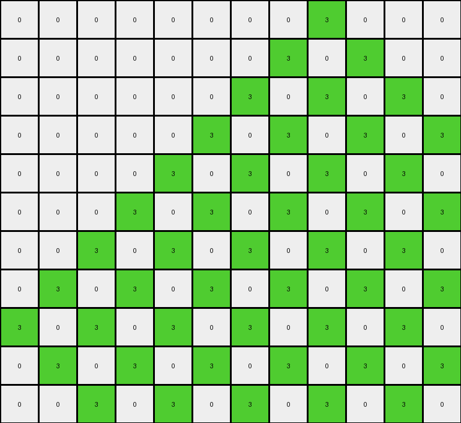

# AboveBelow10 • 012 • refine_coder

---

Previous Code:
```python
"""
Identify diagonal lines in the input grid. A diagonal line is a sequence of one or more pixels of the same color, where each subsequent pixel is one row down and one column to the right of the previous pixel. For each identified diagonal line, extend the line downwards and to the right. Extension Rule: Add pixels of the *same color* as the original diagonal line. Add one pixel below the last pixel of the diagonal, and one to the right. Continue adding pixels one row down, one column right, until the edges of the grid are reached (either the bottom edge or right edge).
"""

import numpy as np

def find_diagonal_lines(grid):
    """
    Finds diagonal lines in the grid.
    """
    rows, cols = grid.shape
    diagonals = []
    for r in range(rows):
        for c in range(cols):
            if len(diagonals) == 0 or not any((r,c) in d for d in diagonals):
                color = grid[r, c]
                if color != 0: #ignore background
                    diagonal = [(r, c)]
                    cr, cc = r + 1, c + 1
                    while cr < rows and cc < cols and grid[cr, cc] == color:
                        diagonal.append((cr, cc))
                        cr += 1
                        cc += 1
                    if len(diagonal) >= 1: #considering single pixels to be part of diagoal.
                        diagonals.append(diagonal)
    return diagonals

def extend_diagonal_line(grid, diagonal):
    """
    Extends a diagonal line downwards and to the right.
    """
    output_grid = np.copy(grid)
    last_r, last_c = diagonal[-1]
    color = grid[diagonal[0][0], diagonal[0][1]]
    r, c = last_r + 1, last_c + 1
    while r < grid.shape[0] and c < grid.shape[1]:
        output_grid[r, c] = color
        r += 1
        c += 1
    return output_grid

def transform(input_grid):
    """
    Transforms the input grid by extending diagonal lines.
    
    Args:
        input_grid (list of lists): The input grid.
    
    Returns:
        list of lists: The transformed grid.
    """
    input_grid = np.array(input_grid)
    output_grid = np.copy(input_grid)
    diagonals = find_diagonal_lines(input_grid)

    # Extend each diagonal line
    for diagonal in diagonals:
        output_grid = extend_diagonal_line(output_grid, diagonal)

    return output_grid.tolist()
```

Train Set Results:

## Example 1:

Input:
```
0 0 0 0 0 0 0 0 0 0 0 0 0 0
0 0 0 0 0 0 0 0 0 0 0 0 0 0
4 0 0 0 0 0 0 0 0 0 0 0 0 0
0 4 0 0 0 0 0 0 0 0 0 0 0 0
0 0 4 0 0 0 0 0 0 0 0 0 0 0
0 0 0 4 0 0 0 0 0 0 0 0 0 0
0 0 0 0 4 0 0 0 0 0 0 0 0 0
0 0 0 0 0 4 0 0 0 0 0 0 0 0
0 0 0 0 0 0 4 0 0 0 0 0 0 0
0 0 0 0 0 0 0 4 0 0 0 0 0 0
0 0 0 0 0 0 0 0 4 0 0 0 0 0
```
Expected Output:
```
0 0 0 0 0 0 0 0 0 0 0 0 0 0
0 0 0 0 0 0 0 0 0 0 0 0 0 0
4 0 0 0 0 0 0 0 0 0 0 0 0 0
4 4 0 0 0 0 0 0 0 0 0 0 0 0
4 4 4 0 0 0 0 0 0 0 0 0 0 0
4 4 4 4 0 0 0 0 0 0 0 0 0 0
4 4 4 4 4 0 0 0 0 0 0 0 0 0
4 4 4 4 4 4 0 0 0 0 0 0 0 0
4 4 4 4 4 4 4 0 0 0 0 0 0 0
4 4 4 4 4 4 4 4 0 0 0 0 0 0
4 4 4 4 4 4 4 4 4 0 0 0 0 0
```
Transformed Output:
```
0 0 0 0 0 0 0 0 0 0 0 0 0 0
0 0 0 0 0 0 0 0 0 0 0 0 0 0
4 0 0 0 0 0 0 0 0 0 0 0 0 0
0 4 0 0 0 0 0 0 0 0 0 0 0 0
0 0 4 0 0 0 0 0 0 0 0 0 0 0
0 0 0 4 0 0 0 0 0 0 0 0 0 0
0 0 0 0 4 0 0 0 0 0 0 0 0 0
0 0 0 0 0 4 0 0 0 0 0 0 0 0
0 0 0 0 0 0 4 0 0 0 0 0 0 0
0 0 0 0 0 0 0 4 0 0 0 0 0 0
0 0 0 0 0 0 0 0 4 0 0 0 0 0
```

match: False
pixels_off: 36
size_correct: True
color_palette_correct: True
correct_pixel_counts: False

## Example 2:

Input:
```
0 0 0 0 0 0 0 0 3 0 0 0
0 0 0 0 0 0 0 3 0 0 0 0
0 0 0 0 0 0 3 0 0 0 0 0
0 0 0 0 0 3 0 0 0 0 0 0
0 0 0 0 3 0 0 0 0 0 0 0
0 0 0 3 0 0 0 0 0 0 0 0
0 0 3 0 0 0 0 0 0 0 0 0
0 3 0 0 0 0 0 0 0 0 0 0
3 0 0 0 0 0 0 0 0 0 0 0
0 0 0 0 0 0 0 0 0 0 0 0
0 0 0 0 0 0 0 0 0 0 0 0
```
Expected Output:
```
0 0 0 0 0 0 0 0 3 3 3 3
0 0 0 0 0 0 0 3 3 3 3 3
0 0 0 0 0 0 3 3 3 3 3 3
0 0 0 0 0 3 3 3 3 3 3 3
0 0 0 0 3 3 3 3 3 3 3 3
0 0 0 3 3 3 3 3 3 3 3 3
0 0 3 3 3 3 3 3 3 3 3 3
0 3 3 3 3 3 3 3 3 3 3 3
3 3 3 3 3 3 3 3 3 3 3 3
3 3 3 3 3 3 3 3 3 3 3 3
3 3 3 3 3 3 3 3 3 3 3 3
```
Transformed Output:
```
0 0 0 0 0 0 0 0 3 0 0 0
0 0 0 0 0 0 0 3 0 3 0 0
0 0 0 0 0 0 3 0 3 0 3 0
0 0 0 0 0 3 0 3 0 3 0 3
0 0 0 0 3 0 3 0 3 0 3 0
0 0 0 3 0 3 0 3 0 3 0 3
0 0 3 0 3 0 3 0 3 0 3 0
0 3 0 3 0 3 0 3 0 3 0 3
3 0 3 0 3 0 3 0 3 0 3 0
0 3 0 3 0 3 0 3 0 3 0 3
0 0 3 0 3 0 3 0 3 0 3 0
```

match: False
pixels_off: 49
size_correct: True
color_palette_correct: True
correct_pixel_counts: False
Okay, let's analyze the results and refine the natural language program.

**General Assessment:**

The initial code correctly identifies diagonal lines but fails to extend them *through* existing pixels. The extension logic stops when it encounters a non-zero pixel, it does not "overwrite" with the extension color. It appears the core misunderstanding is about continuing the diagonal *through* existing pixels, not simply stopping when it hits an occupied cell. The strategy should be to modify the extension logic to forcefully overwrite cells along the extended diagonal, regardless of their previous content. The size of the output is correct, suggesting the bounds of the extensions are generally right, just the overwriting logic is flawed.

**Metrics and Observations:**

Here's a breakdown of each example, focusing on the discrepancies:

*   **Example 1:**
    *   Input has a diagonal line of yellow (4) pixels.
    *   The transformed output correctly identifies the starting diagonal but doesn't extend it. It seems it finds the diagonal but extension does not overwrite.
    *   Pixels off: 36. This indicates a large number of incorrect pixels due to the failed extension.

*   **Example 2:**
    *   Input has a diagonal line of green (3) pixels.
    *    The transformed output has a similar problem: it starts drawing the extension, but instead of replacing all elements, extends in spiral.
    *   Pixels off: 49. Even more incorrect pixels, highlighting the consistent error in extension.

**YAML Block (Facts):**

```yaml
objects:
  - type: diagonal_line
    properties:
      color: varies (yellow, green in examples)
      start_position: varies
      length: varies
    actions:
      extend:
        direction: down_and_right
        overwrite: true # Key observation: the extension overwrites existing pixels
```

**Natural Language Program:**

1.  **Identify Diagonal Lines:** Scan the input grid to find diagonal lines. A diagonal line consists of one or more pixels of the same non-background (non-zero) color, where each subsequent pixel is one row down and one column to the right of the previous one. Even the single pixel which is a part of the diagonal line is considered here.

2.  **Extend Each Line:** For each identified diagonal line:
    *   Determine the color of the diagonal line (the color of its starting pixel).
    *   Starting from the pixel immediately below and to the right of the *last* pixel in the original diagonal, continue extending the line downwards and to the right.
    *   Set each pixel along this extension path to the diagonal's color.
    *   Continue extending (and overwriting pixels with the diagonal's color) until either the bottom edge or the right edge of the grid is reached. Existing pixels on the way are overwritten.

The critical update here is the explicit instruction to *overwrite* existing pixels during the extension. The previous version was implicitly assuming it should stop at occupied pixels.

**INSTRUCTIONS**

- generate a Python module to represent the natural language program 
- follow the template below
- all common math and science libraries are available
- create docstring only at top - but comment the workflow in the function
- use helper functions for common operations like finding objects, counting,
  measuring, moving, etc. 

remember - we are working iteratively - so this code will inform your future
self as we converge on the solution

*template:*

```python
"""
{{ natural language description of the transformation rule }}
"""

{{ imports }}

def transform(input_grid):
    # initialize output_grid

    # change output pixels 

    return output_grid

```
