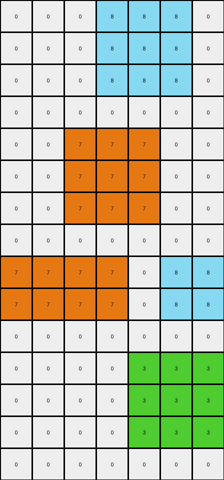

# AboveBelow2 • 009 • refine_dreamer

---

Previous Code:
```python
"""
1.  **Identify Colored Regions:** Locate all contiguous regions of red (2), green (3), and yellow (4) pixels in the input grid.

2.  **Check for Red/Green Adjacency :** Examine whether or not any red(2) regions and green(3) regions touch.

3.  **Conditional Removal (Red and Green):** If there are no touching red and green regions, the input equals the output, and no further action must be taken.

4. **Conditional Removal(Yellow):** If there is yellow(4) region near either the red or green, remove it.

5.  **Output:** The output grid is the result of applying these removal rules to the input grid.
"""

import numpy as np
from scipy.ndimage import label, find_objects

def find_regions(grid, color):
    """Finds contiguous regions of a specific color in the grid."""
    mask = (grid == color)
    labeled_array, num_features = label(mask)
    return labeled_array, num_features

def are_adjacent(grid, labeled_array1, region_index1, labeled_array2, region_index2):
    """Checks if two regions in labeled arrays are adjacent."""
    # Expand the first region by one pixel in all directions
    region1_mask = (labeled_array1 == region_index1)
    expanded_region1 = np.zeros_like(region1_mask)
    rows, cols = grid.shape
    for r in range(rows):
        for c in range(cols):
            if region1_mask[r, c]:
                for dr in [-1, 0, 1]:
                    for dc in [-1, 0, 1]:
                        if 0 <= r + dr < rows and 0 <= c + dc < cols:
                            expanded_region1[r + dr, c + dc] = True

    # Check for overlap with the second region
    region2_mask = (labeled_array2 == region_index2)
    return np.any(expanded_region1 & region2_mask)


def transform(input_grid):
    """Transforms the input grid according to the described rules."""
    output_grid = np.copy(input_grid)
    grid = np.array(input_grid)  # work with numpy array

    # Find red, green and yellow regions
    red_labeled_array, red_num = find_regions(grid, 2)
    green_labeled_array, green_num = find_regions(grid, 3)
    yellow_labeled_array, yellow_num = find_regions(grid, 4)

    red_green_adjacent = False

    if red_num > 0 and green_num > 0:
        for i in range(1, red_num+1):
            for j in range(1, green_num+1):
                if are_adjacent(grid, red_labeled_array, i, green_labeled_array, j):
                    red_green_adjacent = True
                    break
            if red_green_adjacent:
               break

    if red_green_adjacent:
       #remove red
        for i in range(1, red_num + 1):
          output_grid[red_labeled_array == i] = 0

       #remove green
        for j in range(1, green_num + 1):
           output_grid[green_labeled_array == j] = 0

       #remove yellow
        for k in range(1, yellow_num + 1):
           output_grid[yellow_labeled_array == k] = 0

    return output_grid.tolist()
```

Train Set Results:

## Example 1:

Input:
```
0 0 4 4 4 0 0 0 0 0 0 0 0 0 0 0 0 1 1 1
0 0 4 4 4 0 0 0 0 0 0 0 0 0 0 0 0 1 1 1
0 0 0 0 0 0 0 0 0 0 0 0 0 0 0 0 0 1 1 1
0 2 2 2 0 0 2 2 2 0 0 0 0 2 2 2 0 0 0 0
0 2 2 2 0 0 2 2 2 0 0 0 0 2 2 2 0 0 0 0
0 2 2 2 0 0 2 2 2 0 0 0 0 2 2 2 0 0 0 0
0 2 2 2 0 0 0 0 0 0 0 0 0 2 2 2 0 0 0 0
0 0 0 0 0 0 0 0 0 0 0 0 0 0 0 0 0 0 0 0
0 0 0 0 0 0 0 0 0 0 0 0 0 0 0 0 0 0 0 0
0 0 0 0 3 3 3 3 3 0 0 0 0 0 0 0 0 0 0 0
0 0 0 0 3 3 3 3 3 0 0 0 0 0 0 0 0 0 0 0
0 0 0 0 3 3 3 3 3 0 0 0 0 0 0 0 0 0 0 0
0 0 0 0 3 3 3 3 3 0 0 0 0 0 0 0 0 0 0 0
0 0 0 0 3 3 3 3 3 0 0 0 0 0 0 0 0 0 0 0
0 0 0 0 0 0 0 0 0 0 0 0 0 0 0 0 0 0 0 0
0 0 0 4 4 4 0 0 0 4 4 4 0 0 0 0 0 0 0 0
0 0 0 4 4 4 0 0 0 4 4 4 0 0 0 0 0 0 0 0
0 0 0 4 4 4 0 0 0 4 4 4 0 0 0 0 0 0 0 0
```
Expected Output:
```
0 0 0 0 0 0 0 0 0 0 0 0 0 0 0 0 0 0 0 0
0 0 0 0 0 0 0 0 0 0 0 0 0 0 0 0 0 0 0 0
0 0 0 0 0 0 0 0 0 0 0 0 0 0 0 0 0 0 0 0
0 0 0 0 0 0 0 0 0 0 0 0 0 0 0 0 0 0 0 0
0 0 0 0 0 0 0 0 0 0 0 0 0 0 0 0 0 0 0 0
0 0 0 0 0 0 0 0 0 0 0 0 0 0 0 0 0 0 0 0
0 0 0 0 0 0 0 0 0 0 0 0 0 0 0 0 0 0 0 0
0 0 0 0 0 0 0 0 0 0 0 0 0 0 0 0 0 0 0 0
0 0 0 0 0 0 0 0 0 0 0 0 0 0 0 0 0 0 0 0
0 0 0 0 3 3 3 3 3 0 0 0 0 0 0 0 0 0 0 0
0 0 0 0 3 3 3 3 3 0 0 0 0 0 0 0 0 0 0 0
0 0 0 0 3 3 3 3 3 0 0 0 0 0 0 0 0 0 0 0
0 0 0 0 3 3 3 3 3 0 0 0 0 0 0 0 0 0 0 0
0 0 0 0 3 3 3 3 3 0 0 0 0 0 0 0 0 0 0 0
0 0 0 0 0 0 0 0 0 0 0 0 0 0 0 0 0 0 0 0
0 0 0 4 4 4 0 0 0 4 4 4 0 0 0 0 0 0 0 0
0 0 0 4 4 4 0 0 0 4 4 4 0 0 0 0 0 0 0 0
0 0 0 4 4 4 0 0 0 4 4 4 0 0 0 0 0 0 0 0
```
Transformed Output:
```
0 0 4 4 4 0 0 0 0 0 0 0 0 0 0 0 0 1 1 1
0 0 4 4 4 0 0 0 0 0 0 0 0 0 0 0 0 1 1 1
0 0 0 0 0 0 0 0 0 0 0 0 0 0 0 0 0 1 1 1
0 2 2 2 0 0 2 2 2 0 0 0 0 2 2 2 0 0 0 0
0 2 2 2 0 0 2 2 2 0 0 0 0 2 2 2 0 0 0 0
0 2 2 2 0 0 2 2 2 0 0 0 0 2 2 2 0 0 0 0
0 2 2 2 0 0 0 0 0 0 0 0 0 2 2 2 0 0 0 0
0 0 0 0 0 0 0 0 0 0 0 0 0 0 0 0 0 0 0 0
0 0 0 0 0 0 0 0 0 0 0 0 0 0 0 0 0 0 0 0
0 0 0 0 3 3 3 3 3 0 0 0 0 0 0 0 0 0 0 0
0 0 0 0 3 3 3 3 3 0 0 0 0 0 0 0 0 0 0 0
0 0 0 0 3 3 3 3 3 0 0 0 0 0 0 0 0 0 0 0
0 0 0 0 3 3 3 3 3 0 0 0 0 0 0 0 0 0 0 0
0 0 0 0 3 3 3 3 3 0 0 0 0 0 0 0 0 0 0 0
0 0 0 0 0 0 0 0 0 0 0 0 0 0 0 0 0 0 0 0
0 0 0 4 4 4 0 0 0 4 4 4 0 0 0 0 0 0 0 0
0 0 0 4 4 4 0 0 0 4 4 4 0 0 0 0 0 0 0 0
0 0 0 4 4 4 0 0 0 4 4 4 0 0 0 0 0 0 0 0
```

match: False
pixels_off: 48
size_correct: True
color_palette_correct: False
correct_pixel_counts: False

## Example 2:

Input:
```
0 0 0 0 0 0 0 0 0 0 0 2 2 2 0 0
0 0 0 4 4 4 0 0 0 0 0 2 2 2 0 0
0 0 0 4 4 4 0 0 0 0 0 0 0 0 0 0
0 0 0 0 0 0 0 0 0 0 0 0 3 3 3 0
0 0 0 0 0 0 0 0 0 0 0 0 3 3 3 0
0 0 0 0 0 0 0 0 0 0 0 0 3 3 3 0
0 2 2 2 0 0 0 0 0 0 0 0 0 0 0 0
0 2 2 2 0 0 0 0 0 0 0 0 0 0 0 0
0 0 0 0 0 0 0 0 0 0 0 0 0 0 0 0
0 0 0 0 0 0 0 0 0 0 0 0 2 2 2 2
0 0 0 0 0 0 2 2 2 0 0 0 2 2 2 2
0 0 0 0 0 0 2 2 2 0 0 0 2 2 2 2
0 0 0 0 0 0 2 2 2 0 0 0 2 2 2 2
2 2 2 0 0 0 0 0 0 0 0 0 2 2 2 2
2 2 2 0 0 0 0 0 0 0 0 0 2 2 2 2
2 2 2 0 0 0 0 0 0 0 0 0 0 0 0 0
0 0 0 0 0 0 0 0 0 0 0 0 0 0 0 0
0 0 0 0 0 0 0 0 0 0 0 0 0 0 0 0
0 0 0 0 0 0 0 0 0 0 0 0 0 0 0 0
0 0 0 0 0 0 0 0 0 0 0 0 0 0 0 0
```
Expected Output:
```
0 0 0 0 0 0 0 0 0 0 0 0 0 0 0 0
0 0 0 0 0 0 0 0 0 0 0 0 0 0 0 0
0 0 0 0 0 0 0 0 0 0 0 0 0 0 0 0
0 0 0 0 0 0 0 0 0 0 0 0 3 3 3 0
0 0 0 0 0 0 0 0 0 0 0 0 3 3 3 0
0 0 0 0 0 0 0 0 0 0 0 0 3 3 3 0
0 2 2 2 0 0 0 0 0 0 0 0 0 0 0 0
0 2 2 2 0 0 0 0 0 0 0 0 0 0 0 0
0 0 0 0 0 0 0 0 0 0 0 0 0 0 0 0
0 0 0 0 0 0 0 0 0 0 0 0 2 2 2 2
0 0 0 0 0 0 2 2 2 0 0 0 2 2 2 2
0 0 0 0 0 0 2 2 2 0 0 0 2 2 2 2
0 0 0 0 0 0 2 2 2 0 0 0 2 2 2 2
2 2 2 0 0 0 0 0 0 0 0 0 2 2 2 2
2 2 2 0 0 0 0 0 0 0 0 0 2 2 2 2
2 2 2 0 0 0 0 0 0 0 0 0 0 0 0 0
0 0 0 0 0 0 0 0 0 0 0 0 0 0 0 0
0 0 0 0 0 0 0 0 0 0 0 0 0 0 0 0
0 0 0 0 0 0 0 0 0 0 0 0 0 0 0 0
0 0 0 0 0 0 0 0 0 0 0 0 0 0 0 0
```
Transformed Output:
```
0 0 0 0 0 0 0 0 0 0 0 2 2 2 0 0
0 0 0 4 4 4 0 0 0 0 0 2 2 2 0 0
0 0 0 4 4 4 0 0 0 0 0 0 0 0 0 0
0 0 0 0 0 0 0 0 0 0 0 0 3 3 3 0
0 0 0 0 0 0 0 0 0 0 0 0 3 3 3 0
0 0 0 0 0 0 0 0 0 0 0 0 3 3 3 0
0 2 2 2 0 0 0 0 0 0 0 0 0 0 0 0
0 2 2 2 0 0 0 0 0 0 0 0 0 0 0 0
0 0 0 0 0 0 0 0 0 0 0 0 0 0 0 0
0 0 0 0 0 0 0 0 0 0 0 0 2 2 2 2
0 0 0 0 0 0 2 2 2 0 0 0 2 2 2 2
0 0 0 0 0 0 2 2 2 0 0 0 2 2 2 2
0 0 0 0 0 0 2 2 2 0 0 0 2 2 2 2
2 2 2 0 0 0 0 0 0 0 0 0 2 2 2 2
2 2 2 0 0 0 0 0 0 0 0 0 2 2 2 2
2 2 2 0 0 0 0 0 0 0 0 0 0 0 0 0
0 0 0 0 0 0 0 0 0 0 0 0 0 0 0 0
0 0 0 0 0 0 0 0 0 0 0 0 0 0 0 0
0 0 0 0 0 0 0 0 0 0 0 0 0 0 0 0
0 0 0 0 0 0 0 0 0 0 0 0 0 0 0 0
```

match: False
pixels_off: 12
size_correct: True
color_palette_correct: False
correct_pixel_counts: False

## Example 3:

Input:
```
0 0 0 8 8 8 0
0 0 0 8 8 8 0
0 0 0 8 8 8 0
0 0 0 0 0 0 0
0 0 7 7 7 0 0
0 0 7 7 7 0 0
0 0 7 7 7 0 0
0 0 0 0 0 0 0
7 7 7 7 0 8 8
7 7 7 7 0 8 8
0 0 0 0 0 0 0
0 0 0 0 3 3 3
0 0 0 0 3 3 3
0 0 0 0 3 3 3
0 0 0 0 0 0 0
```
Expected Output:
```
0 0 0 0 0 0 0
0 0 0 0 0 0 0
0 0 0 0 0 0 0
0 0 0 0 0 0 0
0 0 0 0 0 0 0
0 0 0 0 0 0 0
0 0 0 0 0 0 0
0 0 0 0 0 0 0
0 0 0 0 0 0 0
0 0 0 0 0 0 0
0 0 0 0 0 0 0
0 0 0 0 3 3 3
0 0 0 0 3 3 3
0 0 0 0 3 3 3
0 0 0 0 0 0 0
```
Transformed Output:
```
0 0 0 8 8 8 0
0 0 0 8 8 8 0
0 0 0 8 8 8 0
0 0 0 0 0 0 0
0 0 7 7 7 0 0
0 0 7 7 7 0 0
0 0 7 7 7 0 0
0 0 0 0 0 0 0
7 7 7 7 0 8 8
7 7 7 7 0 8 8
0 0 0 0 0 0 0
0 0 0 0 3 3 3
0 0 0 0 3 3 3
0 0 0 0 3 3 3
0 0 0 0 0 0 0
```

match: False
pixels_off: 30
size_correct: True
color_palette_correct: False
correct_pixel_counts: False
**INSTRUCTIONS**

The code above was generated based on observations from the first training
example

we have tested the transform function on each of the task example inputs and
compared with the expected output

review each of the examples provided and the results and consider how the
natural language program should be updated to accommodate this new knowledge

respond with the following deliverables:

- general assessment of the information provided and strategy for resolving the
  errors
- gather metrics about each of the examples and results - use code_execution to
  develop accurate reports on your assumptions
- a YAML block documenting facts - Focus on identifying objects, their properties, and the actions performed on them.
- a natural language program - Be as clear and concise as possible, providing a complete description of the transformation rule.


your responses should be considered as information in a report - not a
conversation
