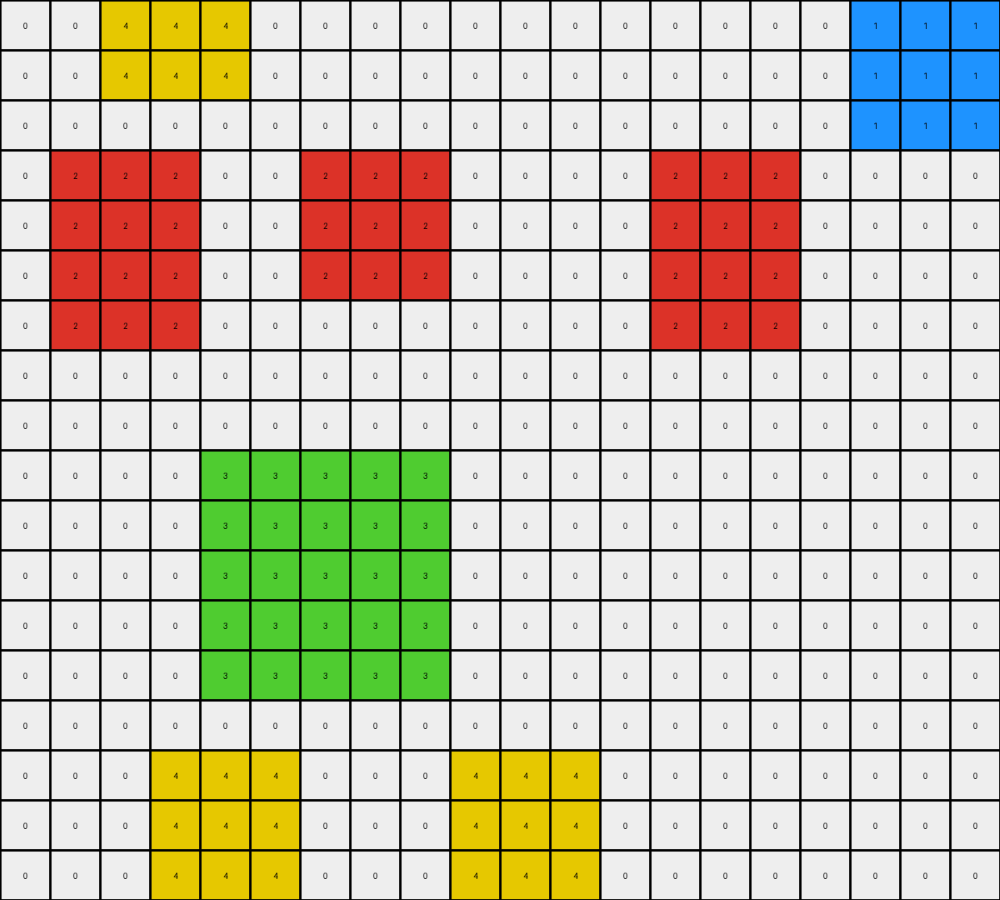
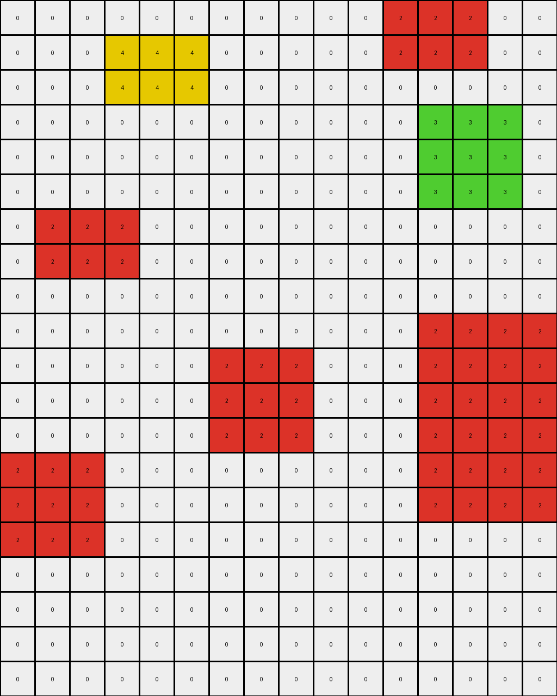

# AboveBelow2 • 012 • refine_coder

---

Previous Code:
```python
"""
1.  **Identify Regions:** Locate all contiguous regions of red (2), green (3), and yellow (4) pixels, and any other color present in the grid.

2.  **Check for Red and Green Adjacency:** Determine if any red regions are directly adjacent (not diagonally) to any green regions.

3.  **Conditional Removal (Red and Green):** If a red region and a green region are directly adjacent, remove *both* the red and green regions. Do *not* remove the yellow region, if it is near the green or red.

4. **Conditional Removal (Yellow):** If all of the above regions have been remove, any other color different to black(0), keep.

5.  **Output:** The output grid is the input grid with the specified removals. If no red and green regions are adjacent, the output is the same as the input.
"""

import numpy as np
from scipy.ndimage import label, find_objects

def find_regions(grid, color):
    """Finds contiguous regions of a specific color in the grid."""
    mask = (grid == color)
    labeled_array, num_features = label(mask)
    return labeled_array, num_features

def are_adjacent_directly(grid, labeled_array1, region_index1, labeled_array2, region_index2):
    """Checks if two regions in labeled arrays are adjacent (not diagonally)."""
    # Expand the first region by one pixel in the cardinal directions
    region1_mask = (labeled_array1 == region_index1)
    expanded_region1 = np.zeros_like(region1_mask)
    rows, cols = grid.shape
    for r in range(rows):
        for c in range(cols):
            if region1_mask[r, c]:
                for dr, dc in [(-1, 0), (1, 0), (0, -1), (0, 1)]:  # Only cardinal directions
                    if 0 <= r + dr < rows and 0 <= c + dc < cols:
                        expanded_region1[r + dr, c + dc] = True

    # Check for overlap with the second region
    region2_mask = (labeled_array2 == region_index2)
    return np.any(expanded_region1 & region2_mask)

def transform(input_grid):
    """Transforms the input grid according to the described rules."""
    output_grid = np.copy(input_grid)
    grid = np.array(input_grid)  # work with numpy array

    # Find red, green and yellow regions
    red_labeled_array, red_num = find_regions(grid, 2)
    green_labeled_array, green_num = find_regions(grid, 3)

    red_green_adjacent = False

    if red_num > 0 and green_num > 0:
        for i in range(1, red_num+1):
            for j in range(1, green_num+1):
                if are_adjacent_directly(grid, red_labeled_array, i, green_labeled_array, j):
                    red_green_adjacent = True
                    break
            if red_green_adjacent:
               break

    if red_green_adjacent:
       #remove red
        for i in range(1, red_num + 1):
          output_grid[red_labeled_array == i] = 0

       #remove green
        for j in range(1, green_num + 1):
           output_grid[green_labeled_array == j] = 0

    return output_grid.tolist()
```

Train Set Results:

## Example 1:

Input:
```
0 0 4 4 4 0 0 0 0 0 0 0 0 0 0 0 0 1 1 1
0 0 4 4 4 0 0 0 0 0 0 0 0 0 0 0 0 1 1 1
0 0 0 0 0 0 0 0 0 0 0 0 0 0 0 0 0 1 1 1
0 2 2 2 0 0 2 2 2 0 0 0 0 2 2 2 0 0 0 0
0 2 2 2 0 0 2 2 2 0 0 0 0 2 2 2 0 0 0 0
0 2 2 2 0 0 2 2 2 0 0 0 0 2 2 2 0 0 0 0
0 2 2 2 0 0 0 0 0 0 0 0 0 2 2 2 0 0 0 0
0 0 0 0 0 0 0 0 0 0 0 0 0 0 0 0 0 0 0 0
0 0 0 0 0 0 0 0 0 0 0 0 0 0 0 0 0 0 0 0
0 0 0 0 3 3 3 3 3 0 0 0 0 0 0 0 0 0 0 0
0 0 0 0 3 3 3 3 3 0 0 0 0 0 0 0 0 0 0 0
0 0 0 0 3 3 3 3 3 0 0 0 0 0 0 0 0 0 0 0
0 0 0 0 3 3 3 3 3 0 0 0 0 0 0 0 0 0 0 0
0 0 0 0 3 3 3 3 3 0 0 0 0 0 0 0 0 0 0 0
0 0 0 0 0 0 0 0 0 0 0 0 0 0 0 0 0 0 0 0
0 0 0 4 4 4 0 0 0 4 4 4 0 0 0 0 0 0 0 0
0 0 0 4 4 4 0 0 0 4 4 4 0 0 0 0 0 0 0 0
0 0 0 4 4 4 0 0 0 4 4 4 0 0 0 0 0 0 0 0
```
Expected Output:
```
0 0 0 0 0 0 0 0 0 0 0 0 0 0 0 0 0 0 0 0
0 0 0 0 0 0 0 0 0 0 0 0 0 0 0 0 0 0 0 0
0 0 0 0 0 0 0 0 0 0 0 0 0 0 0 0 0 0 0 0
0 0 0 0 0 0 0 0 0 0 0 0 0 0 0 0 0 0 0 0
0 0 0 0 0 0 0 0 0 0 0 0 0 0 0 0 0 0 0 0
0 0 0 0 0 0 0 0 0 0 0 0 0 0 0 0 0 0 0 0
0 0 0 0 0 0 0 0 0 0 0 0 0 0 0 0 0 0 0 0
0 0 0 0 0 0 0 0 0 0 0 0 0 0 0 0 0 0 0 0
0 0 0 0 0 0 0 0 0 0 0 0 0 0 0 0 0 0 0 0
0 0 0 0 3 3 3 3 3 0 0 0 0 0 0 0 0 0 0 0
0 0 0 0 3 3 3 3 3 0 0 0 0 0 0 0 0 0 0 0
0 0 0 0 3 3 3 3 3 0 0 0 0 0 0 0 0 0 0 0
0 0 0 0 3 3 3 3 3 0 0 0 0 0 0 0 0 0 0 0
0 0 0 0 3 3 3 3 3 0 0 0 0 0 0 0 0 0 0 0
0 0 0 0 0 0 0 0 0 0 0 0 0 0 0 0 0 0 0 0
0 0 0 4 4 4 0 0 0 4 4 4 0 0 0 0 0 0 0 0
0 0 0 4 4 4 0 0 0 4 4 4 0 0 0 0 0 0 0 0
0 0 0 4 4 4 0 0 0 4 4 4 0 0 0 0 0 0 0 0
```
Transformed Output:
```
0 0 4 4 4 0 0 0 0 0 0 0 0 0 0 0 0 1 1 1
0 0 4 4 4 0 0 0 0 0 0 0 0 0 0 0 0 1 1 1
0 0 0 0 0 0 0 0 0 0 0 0 0 0 0 0 0 1 1 1
0 2 2 2 0 0 2 2 2 0 0 0 0 2 2 2 0 0 0 0
0 2 2 2 0 0 2 2 2 0 0 0 0 2 2 2 0 0 0 0
0 2 2 2 0 0 2 2 2 0 0 0 0 2 2 2 0 0 0 0
0 2 2 2 0 0 0 0 0 0 0 0 0 2 2 2 0 0 0 0
0 0 0 0 0 0 0 0 0 0 0 0 0 0 0 0 0 0 0 0
0 0 0 0 0 0 0 0 0 0 0 0 0 0 0 0 0 0 0 0
0 0 0 0 3 3 3 3 3 0 0 0 0 0 0 0 0 0 0 0
0 0 0 0 3 3 3 3 3 0 0 0 0 0 0 0 0 0 0 0
0 0 0 0 3 3 3 3 3 0 0 0 0 0 0 0 0 0 0 0
0 0 0 0 3 3 3 3 3 0 0 0 0 0 0 0 0 0 0 0
0 0 0 0 3 3 3 3 3 0 0 0 0 0 0 0 0 0 0 0
0 0 0 0 0 0 0 0 0 0 0 0 0 0 0 0 0 0 0 0
0 0 0 4 4 4 0 0 0 4 4 4 0 0 0 0 0 0 0 0
0 0 0 4 4 4 0 0 0 4 4 4 0 0 0 0 0 0 0 0
0 0 0 4 4 4 0 0 0 4 4 4 0 0 0 0 0 0 0 0
```

match: False
pixels_off: 48
size_correct: True
color_palette_correct: False
correct_pixel_counts: False

## Example 2:

Input:
```
0 0 0 0 0 0 0 0 0 0 0 2 2 2 0 0
0 0 0 4 4 4 0 0 0 0 0 2 2 2 0 0
0 0 0 4 4 4 0 0 0 0 0 0 0 0 0 0
0 0 0 0 0 0 0 0 0 0 0 0 3 3 3 0
0 0 0 0 0 0 0 0 0 0 0 0 3 3 3 0
0 0 0 0 0 0 0 0 0 0 0 0 3 3 3 0
0 2 2 2 0 0 0 0 0 0 0 0 0 0 0 0
0 2 2 2 0 0 0 0 0 0 0 0 0 0 0 0
0 0 0 0 0 0 0 0 0 0 0 0 0 0 0 0
0 0 0 0 0 0 0 0 0 0 0 0 2 2 2 2
0 0 0 0 0 0 2 2 2 0 0 0 2 2 2 2
0 0 0 0 0 0 2 2 2 0 0 0 2 2 2 2
0 0 0 0 0 0 2 2 2 0 0 0 2 2 2 2
2 2 2 0 0 0 0 0 0 0 0 0 2 2 2 2
2 2 2 0 0 0 0 0 0 0 0 0 2 2 2 2
2 2 2 0 0 0 0 0 0 0 0 0 0 0 0 0
0 0 0 0 0 0 0 0 0 0 0 0 0 0 0 0
0 0 0 0 0 0 0 0 0 0 0 0 0 0 0 0
0 0 0 0 0 0 0 0 0 0 0 0 0 0 0 0
0 0 0 0 0 0 0 0 0 0 0 0 0 0 0 0
```
Expected Output:
```
0 0 0 0 0 0 0 0 0 0 0 0 0 0 0 0
0 0 0 0 0 0 0 0 0 0 0 0 0 0 0 0
0 0 0 0 0 0 0 0 0 0 0 0 0 0 0 0
0 0 0 0 0 0 0 0 0 0 0 0 3 3 3 0
0 0 0 0 0 0 0 0 0 0 0 0 3 3 3 0
0 0 0 0 0 0 0 0 0 0 0 0 3 3 3 0
0 2 2 2 0 0 0 0 0 0 0 0 0 0 0 0
0 2 2 2 0 0 0 0 0 0 0 0 0 0 0 0
0 0 0 0 0 0 0 0 0 0 0 0 0 0 0 0
0 0 0 0 0 0 0 0 0 0 0 0 2 2 2 2
0 0 0 0 0 0 2 2 2 0 0 0 2 2 2 2
0 0 0 0 0 0 2 2 2 0 0 0 2 2 2 2
0 0 0 0 0 0 2 2 2 0 0 0 2 2 2 2
2 2 2 0 0 0 0 0 0 0 0 0 2 2 2 2
2 2 2 0 0 0 0 0 0 0 0 0 2 2 2 2
2 2 2 0 0 0 0 0 0 0 0 0 0 0 0 0
0 0 0 0 0 0 0 0 0 0 0 0 0 0 0 0
0 0 0 0 0 0 0 0 0 0 0 0 0 0 0 0
0 0 0 0 0 0 0 0 0 0 0 0 0 0 0 0
0 0 0 0 0 0 0 0 0 0 0 0 0 0 0 0
```
Transformed Output:
```
0 0 0 0 0 0 0 0 0 0 0 2 2 2 0 0
0 0 0 4 4 4 0 0 0 0 0 2 2 2 0 0
0 0 0 4 4 4 0 0 0 0 0 0 0 0 0 0
0 0 0 0 0 0 0 0 0 0 0 0 3 3 3 0
0 0 0 0 0 0 0 0 0 0 0 0 3 3 3 0
0 0 0 0 0 0 0 0 0 0 0 0 3 3 3 0
0 2 2 2 0 0 0 0 0 0 0 0 0 0 0 0
0 2 2 2 0 0 0 0 0 0 0 0 0 0 0 0
0 0 0 0 0 0 0 0 0 0 0 0 0 0 0 0
0 0 0 0 0 0 0 0 0 0 0 0 2 2 2 2
0 0 0 0 0 0 2 2 2 0 0 0 2 2 2 2
0 0 0 0 0 0 2 2 2 0 0 0 2 2 2 2
0 0 0 0 0 0 2 2 2 0 0 0 2 2 2 2
2 2 2 0 0 0 0 0 0 0 0 0 2 2 2 2
2 2 2 0 0 0 0 0 0 0 0 0 2 2 2 2
2 2 2 0 0 0 0 0 0 0 0 0 0 0 0 0
0 0 0 0 0 0 0 0 0 0 0 0 0 0 0 0
0 0 0 0 0 0 0 0 0 0 0 0 0 0 0 0
0 0 0 0 0 0 0 0 0 0 0 0 0 0 0 0
0 0 0 0 0 0 0 0 0 0 0 0 0 0 0 0
```

match: False
pixels_off: 12
size_correct: True
color_palette_correct: False
correct_pixel_counts: False

## Example 3:

Input:
```
0 0 0 8 8 8 0
0 0 0 8 8 8 0
0 0 0 8 8 8 0
0 0 0 0 0 0 0
0 0 7 7 7 0 0
0 0 7 7 7 0 0
0 0 7 7 7 0 0
0 0 0 0 0 0 0
7 7 7 7 0 8 8
7 7 7 7 0 8 8
0 0 0 0 0 0 0
0 0 0 0 3 3 3
0 0 0 0 3 3 3
0 0 0 0 3 3 3
0 0 0 0 0 0 0
```
Expected Output:
```
0 0 0 0 0 0 0
0 0 0 0 0 0 0
0 0 0 0 0 0 0
0 0 0 0 0 0 0
0 0 0 0 0 0 0
0 0 0 0 0 0 0
0 0 0 0 0 0 0
0 0 0 0 0 0 0
0 0 0 0 0 0 0
0 0 0 0 0 0 0
0 0 0 0 0 0 0
0 0 0 0 3 3 3
0 0 0 0 3 3 3
0 0 0 0 3 3 3
0 0 0 0 0 0 0
```
Transformed Output:
```
0 0 0 8 8 8 0
0 0 0 8 8 8 0
0 0 0 8 8 8 0
0 0 0 0 0 0 0
0 0 7 7 7 0 0
0 0 7 7 7 0 0
0 0 7 7 7 0 0
0 0 0 0 0 0 0
7 7 7 7 0 8 8
7 7 7 7 0 8 8
0 0 0 0 0 0 0
0 0 0 0 3 3 3
0 0 0 0 3 3 3
0 0 0 0 3 3 3
0 0 0 0 0 0 0
```

match: False
pixels_off: 30
size_correct: True
color_palette_correct: False
correct_pixel_counts: False
Okay, let's analyze the results and update the natural language program.

**General Assessment:**

The current code focuses on removing adjacent red (2) and green (3) regions. However, the examples show more complex behavior:

1.  **Example 1:** The initial description almost worked, but, it failed to remove the red and green regions correctly. It also include other colors not mentioned (yellow, blue).
2.  **Example 2:** Shows that only red regions are removed.
3.  **Example 3:** Illustrates that isolated green objects are kept, and non-green and non-red objects, are removed if no green and red are adjacent, like in this case.

The core issue is that the adjacency rule is too simplistic. It needs to account for the fact that only red are removed, and other colors will only be erased if no red and green adjacent regions exist.

**Strategy:**

1.  **Refine Adjacency:** Improve the description of the adjacency.
2.  **Prioritize Removal:** Clarify that only red and green are removed.
3. **Output**: If no red and green regions are adjacent, only then other colors different to black should be removed.

**Metrics and Observations:**

Here's a summary of each example, focusing on relevant details:

*   **Example 1:**
    *   Objects: Red (2), Green (3), Yellow (4), Blue (1) regions.
    *   Red and green are adjacents.
    *   Expected: Only Green(3), Yellow(4) and Black(0) remain.
    *   Observed: Failed to remove Red and Green. Kept Yellow(4) and also Blue(1).
*   **Example 2:**
    *   Objects: Red (2), Green (3), Yellow (4) regions.
    *   Red and Green regions are adjacents.
    *    Expected: Keep only Green(3), Red(2) and Black (0).
    *   Observed: Failed to remove Red(2). Kept Green(3), Yellow (4) and Black(0).
*   **Example 3:**
    *   Objects: Green (3), Azure (8), and Maroon(7).
    *   No red and green adjacency.
    *   Expected: Keep only the Green(3) regions.
    *   Observed: Failed to remove other colors (Azure and Maroon)

**YAML Facts:**

```yaml
example_1:
  objects:
    - color: 2  # Red
      adjacent_to: 3  # Green
    - color: 3  # Green
      adjacent_to: 2  # Red
    - color: 4 #yellow
    - color: 1 #blue
  action: remove_adjacent

example_2:
  objects:
    - color: 2  # Red
      adjacent_to: 3  # Green
    - color: 3  # Green
      adjacent_to: 2 #red
    - color: 4 #yellow
  action: remove_adjacent

example_3:
  objects:
    - color: 3  # Green
      adjacent_to: null
    - color: 7 #maroon
    - color: 8 #azure
  action: remove_non_green_if_no_red_green_adjacent
```

**Natural Language Program:**

1.  **Identify Regions:** Find all contiguous regions of red (2), green (3), and any other colors present in the grid.

2.  **Check Red and Green Adjacency:** Determine if any red regions are directly adjacent (not diagonally) to any green regions.

3.  **Conditional Removal (Red and Green):** If any red region is directly adjacent to any green region, remove *both* the red and green regions entirely.

4.  **Conditional Removal (Other Colors):** If *no* red regions are directly adjacent to any green regions, remove all regions of colors other than green(3) and black(0).

5.  **Output:** The output grid contains: black (0), the green regions if no red and green are adjacent, and the other regions if red and green are adjacent.

**INSTRUCTIONS**

- generate a Python module to represent the natural language program 
- follow the template below
- all common math and science libraries are available
- create docstring only at top - but comment the workflow in the function
- use helper functions for common operations like finding objects, counting,
  measuring, moving, etc. 

remember - we are working iteratively - so this code will inform your future
self as we converge on the solution

*template:*

```python
"""
{{ natural language description of the transformation rule }}
"""

{{ imports }}

def transform(input_grid):
    # initialize output_grid

    # change output pixels 

    return output_grid

```
