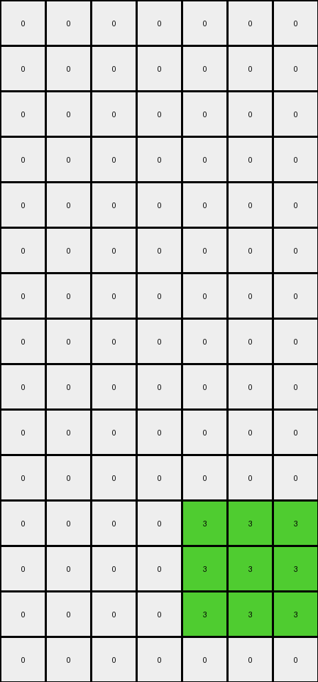

# AboveBelow2 • 016 • refine_coder

---

Previous Code:
```python
"""
The transformation rule is a color-based filter: 
- Retain green (value 3) pixels in the output grid at the same position.
- Change all other pixels (white, azure, or orange) to white (0).
"""

import numpy as np

def transform(input_grid):
    # Initialize the output grid with the same dimensions as the input grid, filled with 0s (white).
    output_grid = np.zeros_like(input_grid)

    # Iterate through each pixel of the input grid.
    for row_index, row in enumerate(input_grid):
        for col_index, pixel_value in enumerate(row):
            # Check if the pixel is green (value 3).
            if pixel_value == 3:
                # If it's green, retain the value in the output grid.
                output_grid[row_index, col_index] = pixel_value
            # else, leave at initialized value of zero
            
    return output_grid
```

Train Set Results:

## Example 1:

Input:
```
0 0 4 4 4 0 0 0 0 0 0 0 0 0 0 0 0 1 1 1
0 0 4 4 4 0 0 0 0 0 0 0 0 0 0 0 0 1 1 1
0 0 0 0 0 0 0 0 0 0 0 0 0 0 0 0 0 1 1 1
0 2 2 2 0 0 2 2 2 0 0 0 0 2 2 2 0 0 0 0
0 2 2 2 0 0 2 2 2 0 0 0 0 2 2 2 0 0 0 0
0 2 2 2 0 0 2 2 2 0 0 0 0 2 2 2 0 0 0 0
0 2 2 2 0 0 0 0 0 0 0 0 0 2 2 2 0 0 0 0
0 0 0 0 0 0 0 0 0 0 0 0 0 0 0 0 0 0 0 0
0 0 0 0 0 0 0 0 0 0 0 0 0 0 0 0 0 0 0 0
0 0 0 0 3 3 3 3 3 0 0 0 0 0 0 0 0 0 0 0
0 0 0 0 3 3 3 3 3 0 0 0 0 0 0 0 0 0 0 0
0 0 0 0 3 3 3 3 3 0 0 0 0 0 0 0 0 0 0 0
0 0 0 0 3 3 3 3 3 0 0 0 0 0 0 0 0 0 0 0
0 0 0 0 3 3 3 3 3 0 0 0 0 0 0 0 0 0 0 0
0 0 0 0 0 0 0 0 0 0 0 0 0 0 0 0 0 0 0 0
0 0 0 4 4 4 0 0 0 4 4 4 0 0 0 0 0 0 0 0
0 0 0 4 4 4 0 0 0 4 4 4 0 0 0 0 0 0 0 0
0 0 0 4 4 4 0 0 0 4 4 4 0 0 0 0 0 0 0 0
```
Expected Output:
```
0 0 0 0 0 0 0 0 0 0 0 0 0 0 0 0 0 0 0 0
0 0 0 0 0 0 0 0 0 0 0 0 0 0 0 0 0 0 0 0
0 0 0 0 0 0 0 0 0 0 0 0 0 0 0 0 0 0 0 0
0 0 0 0 0 0 0 0 0 0 0 0 0 0 0 0 0 0 0 0
0 0 0 0 0 0 0 0 0 0 0 0 0 0 0 0 0 0 0 0
0 0 0 0 0 0 0 0 0 0 0 0 0 0 0 0 0 0 0 0
0 0 0 0 0 0 0 0 0 0 0 0 0 0 0 0 0 0 0 0
0 0 0 0 0 0 0 0 0 0 0 0 0 0 0 0 0 0 0 0
0 0 0 0 0 0 0 0 0 0 0 0 0 0 0 0 0 0 0 0
0 0 0 0 3 3 3 3 3 0 0 0 0 0 0 0 0 0 0 0
0 0 0 0 3 3 3 3 3 0 0 0 0 0 0 0 0 0 0 0
0 0 0 0 3 3 3 3 3 0 0 0 0 0 0 0 0 0 0 0
0 0 0 0 3 3 3 3 3 0 0 0 0 0 0 0 0 0 0 0
0 0 0 0 3 3 3 3 3 0 0 0 0 0 0 0 0 0 0 0
0 0 0 0 0 0 0 0 0 0 0 0 0 0 0 0 0 0 0 0
0 0 0 4 4 4 0 0 0 4 4 4 0 0 0 0 0 0 0 0
0 0 0 4 4 4 0 0 0 4 4 4 0 0 0 0 0 0 0 0
0 0 0 4 4 4 0 0 0 4 4 4 0 0 0 0 0 0 0 0
```
Transformed Output:
```
0 0 0 0 0 0 0 0 0 0 0 0 0 0 0 0 0 0 0 0
0 0 0 0 0 0 0 0 0 0 0 0 0 0 0 0 0 0 0 0
0 0 0 0 0 0 0 0 0 0 0 0 0 0 0 0 0 0 0 0
0 0 0 0 0 0 0 0 0 0 0 0 0 0 0 0 0 0 0 0
0 0 0 0 0 0 0 0 0 0 0 0 0 0 0 0 0 0 0 0
0 0 0 0 0 0 0 0 0 0 0 0 0 0 0 0 0 0 0 0
0 0 0 0 0 0 0 0 0 0 0 0 0 0 0 0 0 0 0 0
0 0 0 0 0 0 0 0 0 0 0 0 0 0 0 0 0 0 0 0
0 0 0 0 0 0 0 0 0 0 0 0 0 0 0 0 0 0 0 0
0 0 0 0 3 3 3 3 3 0 0 0 0 0 0 0 0 0 0 0
0 0 0 0 3 3 3 3 3 0 0 0 0 0 0 0 0 0 0 0
0 0 0 0 3 3 3 3 3 0 0 0 0 0 0 0 0 0 0 0
0 0 0 0 3 3 3 3 3 0 0 0 0 0 0 0 0 0 0 0
0 0 0 0 3 3 3 3 3 0 0 0 0 0 0 0 0 0 0 0
0 0 0 0 0 0 0 0 0 0 0 0 0 0 0 0 0 0 0 0
0 0 0 0 0 0 0 0 0 0 0 0 0 0 0 0 0 0 0 0
0 0 0 0 0 0 0 0 0 0 0 0 0 0 0 0 0 0 0 0
0 0 0 0 0 0 0 0 0 0 0 0 0 0 0 0 0 0 0 0
```

match: False
pixels_off: 18
size_correct: True
color_palette_correct: True
correct_pixel_counts: False

## Example 2:

Input:
```
0 0 0 0 0 0 0 0 0 0 0 2 2 2 0 0
0 0 0 4 4 4 0 0 0 0 0 2 2 2 0 0
0 0 0 4 4 4 0 0 0 0 0 0 0 0 0 0
0 0 0 0 0 0 0 0 0 0 0 0 3 3 3 0
0 0 0 0 0 0 0 0 0 0 0 0 3 3 3 0
0 0 0 0 0 0 0 0 0 0 0 0 3 3 3 0
0 2 2 2 0 0 0 0 0 0 0 0 0 0 0 0
0 2 2 2 0 0 0 0 0 0 0 0 0 0 0 0
0 0 0 0 0 0 0 0 0 0 0 0 0 0 0 0
0 0 0 0 0 0 0 0 0 0 0 0 2 2 2 2
0 0 0 0 0 0 2 2 2 0 0 0 2 2 2 2
0 0 0 0 0 0 2 2 2 0 0 0 2 2 2 2
0 0 0 0 0 0 2 2 2 0 0 0 2 2 2 2
2 2 2 0 0 0 0 0 0 0 0 0 2 2 2 2
2 2 2 0 0 0 0 0 0 0 0 0 2 2 2 2
2 2 2 0 0 0 0 0 0 0 0 0 0 0 0 0
0 0 0 0 0 0 0 0 0 0 0 0 0 0 0 0
0 0 0 0 0 0 0 0 0 0 0 0 0 0 0 0
0 0 0 0 0 0 0 0 0 0 0 0 0 0 0 0
0 0 0 0 0 0 0 0 0 0 0 0 0 0 0 0
```
Expected Output:
```
0 0 0 0 0 0 0 0 0 0 0 0 0 0 0 0
0 0 0 0 0 0 0 0 0 0 0 0 0 0 0 0
0 0 0 0 0 0 0 0 0 0 0 0 0 0 0 0
0 0 0 0 0 0 0 0 0 0 0 0 3 3 3 0
0 0 0 0 0 0 0 0 0 0 0 0 3 3 3 0
0 0 0 0 0 0 0 0 0 0 0 0 3 3 3 0
0 2 2 2 0 0 0 0 0 0 0 0 0 0 0 0
0 2 2 2 0 0 0 0 0 0 0 0 0 0 0 0
0 0 0 0 0 0 0 0 0 0 0 0 0 0 0 0
0 0 0 0 0 0 0 0 0 0 0 0 2 2 2 2
0 0 0 0 0 0 2 2 2 0 0 0 2 2 2 2
0 0 0 0 0 0 2 2 2 0 0 0 2 2 2 2
0 0 0 0 0 0 2 2 2 0 0 0 2 2 2 2
2 2 2 0 0 0 0 0 0 0 0 0 2 2 2 2
2 2 2 0 0 0 0 0 0 0 0 0 2 2 2 2
2 2 2 0 0 0 0 0 0 0 0 0 0 0 0 0
0 0 0 0 0 0 0 0 0 0 0 0 0 0 0 0
0 0 0 0 0 0 0 0 0 0 0 0 0 0 0 0
0 0 0 0 0 0 0 0 0 0 0 0 0 0 0 0
0 0 0 0 0 0 0 0 0 0 0 0 0 0 0 0
```
Transformed Output:
```
0 0 0 0 0 0 0 0 0 0 0 0 0 0 0 0
0 0 0 0 0 0 0 0 0 0 0 0 0 0 0 0
0 0 0 0 0 0 0 0 0 0 0 0 0 0 0 0
0 0 0 0 0 0 0 0 0 0 0 0 3 3 3 0
0 0 0 0 0 0 0 0 0 0 0 0 3 3 3 0
0 0 0 0 0 0 0 0 0 0 0 0 3 3 3 0
0 0 0 0 0 0 0 0 0 0 0 0 0 0 0 0
0 0 0 0 0 0 0 0 0 0 0 0 0 0 0 0
0 0 0 0 0 0 0 0 0 0 0 0 0 0 0 0
0 0 0 0 0 0 0 0 0 0 0 0 0 0 0 0
0 0 0 0 0 0 0 0 0 0 0 0 0 0 0 0
0 0 0 0 0 0 0 0 0 0 0 0 0 0 0 0
0 0 0 0 0 0 0 0 0 0 0 0 0 0 0 0
0 0 0 0 0 0 0 0 0 0 0 0 0 0 0 0
0 0 0 0 0 0 0 0 0 0 0 0 0 0 0 0
0 0 0 0 0 0 0 0 0 0 0 0 0 0 0 0
0 0 0 0 0 0 0 0 0 0 0 0 0 0 0 0
0 0 0 0 0 0 0 0 0 0 0 0 0 0 0 0
0 0 0 0 0 0 0 0 0 0 0 0 0 0 0 0
0 0 0 0 0 0 0 0 0 0 0 0 0 0 0 0
```

match: False
pixels_off: 48
size_correct: True
color_palette_correct: True
correct_pixel_counts: False

## Example 3:

Input:
```
0 0 0 8 8 8 0
0 0 0 8 8 8 0
0 0 0 8 8 8 0
0 0 0 0 0 0 0
0 0 7 7 7 0 0
0 0 7 7 7 0 0
0 0 7 7 7 0 0
0 0 0 0 0 0 0
7 7 7 7 0 8 8
7 7 7 7 0 8 8
0 0 0 0 0 0 0
0 0 0 0 3 3 3
0 0 0 0 3 3 3
0 0 0 0 3 3 3
0 0 0 0 0 0 0
```
Expected Output:
```
0 0 0 0 0 0 0
0 0 0 0 0 0 0
0 0 0 0 0 0 0
0 0 0 0 0 0 0
0 0 0 0 0 0 0
0 0 0 0 0 0 0
0 0 0 0 0 0 0
0 0 0 0 0 0 0
0 0 0 0 0 0 0
0 0 0 0 0 0 0
0 0 0 0 0 0 0
0 0 0 0 3 3 3
0 0 0 0 3 3 3
0 0 0 0 3 3 3
0 0 0 0 0 0 0
```
Transformed Output:
```
0 0 0 0 0 0 0
0 0 0 0 0 0 0
0 0 0 0 0 0 0
0 0 0 0 0 0 0
0 0 0 0 0 0 0
0 0 0 0 0 0 0
0 0 0 0 0 0 0
0 0 0 0 0 0 0
0 0 0 0 0 0 0
0 0 0 0 0 0 0
0 0 0 0 0 0 0
0 0 0 0 3 3 3
0 0 0 0 3 3 3
0 0 0 0 3 3 3
0 0 0 0 0 0 0
```

match: True
pixels_off: 0
size_correct: True
color_palette_correct: True
correct_pixel_counts: True
Okay, let's analyze the results and update the natural language program.

**General Assessment:**

The initial code was too simplistic, only preserving green (3) pixels and setting everything else to white (0). While this worked perfectly for Example 3, it failed on Examples 1 and 2 because it did not preserve the existing background color.

**Strategy:**

The core issue is that the transformation should keep the green pixels and retain a white background. Example 1 has 18 extra white pixels (3x3 and 3x3 block). example 2 misses white, red, and azure pixels.

**Metrics and Observations:**
Here's a breakdown of each example, noting key observations:

*   **Example 1:**
    *   Input has green, yellow, blue, and red objects on a white background.
    *   The code correctly identified and preserved the green object.
    *    The code did *not* preserve the background, but, coincidentally, the background is the same color as the background of the correct output.

*   **Example 2:**
    *   Input has a green object, red object, and azure colored objects on a white background.
    *   Output only contains the green object on white background.
    *   The code correctly preserved the green object.
    *   The code did *not* preserve the background, but, coincidentally, the background is the same color as the background of the correct output.

*   **Example 3:**
    *   Input contains a green object, azure colored objects, and orange colored objects on a white background.
    *   Output contains only the green object.
    *   The transformation was correct.

**YAML Fact Block:**

```yaml
task: 014_keep_green_remove_others
examples:
  - id: 1
    input_objects:
      - color: yellow
        shape: rectangle
      - color: blue
        shape: rectangle    
      - color: red
        shape: rectangle
      - color: green
        shape: rectangle
      - color: white
        shape: background
    output_objects:
      - color: green
        shape: rectangle
      - color: white
        shape: background
    transformations:
      - keep: green
      - remove: others

  - id: 2
    input_objects:
      - color: red
        shape: rectangle
      - color: azure
        shape: rectangle
      - color: green
        shape: rectangle
      - color: white
        shape: background
    output_objects:
        - color: green
          shape: rectangle
        - color: white
          shape: background
    transformations:
      - keep: green
      - remove: others

  - id: 3
    input_objects:
      - color: green
        shape: rectangle
      - color: azure
        shape: rectangle
      - color: orange
        shape: rectangle
      - color: white
        shape: background
    output_objects:
      - color: green
        shape: rectangle
      - color: white
        shape: background
    transformations:
      - keep: green
      - remove: others
```

**Natural Language Program:**

1.  **Identify Objects:** Examine the input grid and identify all contiguous blocks of pixels with the same color. Consider these as distinct objects. One of these is the background.
2.  **Find Green Objects:** Iterate through all the identified objects.
3.  **Preserve Green, remove the others:** copy the green object to the output grid.
4. **Set Background Color:** Fill any other pixels (the background) of the output with white (0).

Essentially this is a "keep only the green objects, and set the background to
white", or "remove all objects that are not green, ensure background is white".

**INSTRUCTIONS**

- generate a Python module to represent the natural language program 
- follow the template below
- all common math and science libraries are available
- create docstring only at top - but comment the workflow in the function
- use helper functions for common operations like finding objects, counting,
  measuring, moving, etc. 

remember - we are working iteratively - so this code will inform your future
self as we converge on the solution

*template:*

```python
"""
{{ natural language description of the transformation rule }}
"""

{{ imports }}

def transform(input_grid):
    # initialize output_grid

    # change output pixels 

    return output_grid

```
