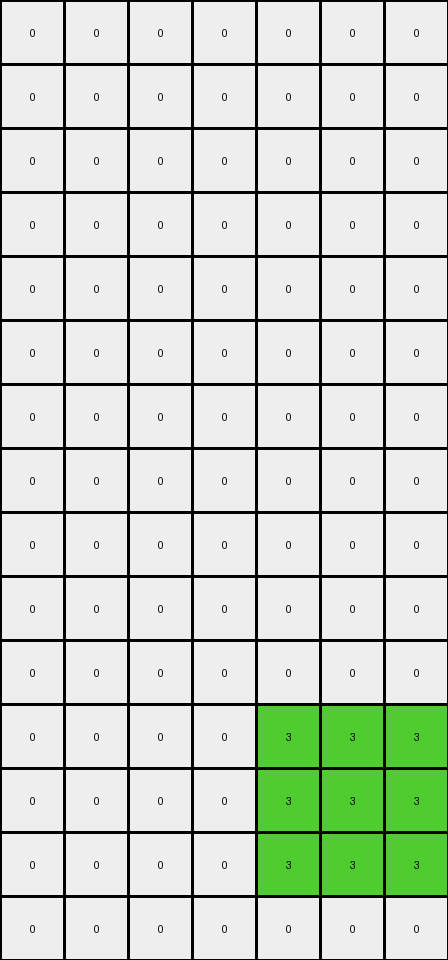

# AboveBelow2 • 017 • refine_dreamer

---


Previous Code:
```python
"""
The transformation rule is:
1. Identify all objects in the input grid.
2. Keep only the green objects in the output grid, in their original positions.
3. Set the background of the output grid to white (0).
"""

import numpy as np

def find_objects(grid):
    """
    Identifies contiguous objects in a grid.  This version assumes
    we just need to isolate a specific color, which simplifies it
    significantly vs. a full object finder.
    """
    objects = {}
    visited = np.zeros_like(grid, dtype=bool)

    for row_index, row in enumerate(grid):
      for col_index, pixel in enumerate(row):
        if not visited[row_index, col_index]:
          if pixel not in objects:
             objects[pixel] = []
          visited, object_pixels = flood_fill(grid, row_index, col_index, pixel, visited)
          objects[pixel].append(object_pixels)

    return objects

def flood_fill(grid, start_row, start_col, target_color, visited):
    """
    Performs a flood fill algorithm to find contiguous regions of the same color.
    """
    rows, cols = grid.shape
    object_pixels = []
    stack = [(start_row, start_col)]

    while stack:
        row, col = stack.pop()

        if 0 <= row < rows and 0 <= col < cols and grid[row, col] == target_color and not visited[row, col]:
            visited[row, col] = True
            object_pixels.append((row, col))

            stack.append((row + 1, col))
            stack.append((row - 1, col))
            stack.append((row, col + 1))
            stack.append((row, col - 1))

    return visited, object_pixels

def transform(input_grid):
    # Initialize the output grid with the same dimensions as the input grid, filled with 0s (white).
    output_grid = np.zeros_like(input_grid)

    # Find Objects
    objects = find_objects(input_grid)

    # copy green objects
    if 3 in objects: #check if green exists
        for green_object in objects[3]:
            for row, col in green_object:
               output_grid[row, col] = 3

    return output_grid
```

Train Set Results:

## Example 1:

Input:
```
0 0 4 4 4 0 0 0 0 0 0 0 0 0 0 0 0 1 1 1
0 0 4 4 4 0 0 0 0 0 0 0 0 0 0 0 0 1 1 1
0 0 0 0 0 0 0 0 0 0 0 0 0 0 0 0 0 1 1 1
0 2 2 2 0 0 2 2 2 0 0 0 0 2 2 2 0 0 0 0
0 2 2 2 0 0 2 2 2 0 0 0 0 2 2 2 0 0 0 0
0 2 2 2 0 0 2 2 2 0 0 0 0 2 2 2 0 0 0 0
0 2 2 2 0 0 0 0 0 0 0 0 0 2 2 2 0 0 0 0
0 0 0 0 0 0 0 0 0 0 0 0 0 0 0 0 0 0 0 0
0 0 0 0 0 0 0 0 0 0 0 0 0 0 0 0 0 0 0 0
0 0 0 0 3 3 3 3 3 0 0 0 0 0 0 0 0 0 0 0
0 0 0 0 3 3 3 3 3 0 0 0 0 0 0 0 0 0 0 0
0 0 0 0 3 3 3 3 3 0 0 0 0 0 0 0 0 0 0 0
0 0 0 0 3 3 3 3 3 0 0 0 0 0 0 0 0 0 0 0
0 0 0 0 3 3 3 3 3 0 0 0 0 0 0 0 0 0 0 0
0 0 0 0 0 0 0 0 0 0 0 0 0 0 0 0 0 0 0 0
0 0 0 4 4 4 0 0 0 4 4 4 0 0 0 0 0 0 0 0
0 0 0 4 4 4 0 0 0 4 4 4 0 0 0 0 0 0 0 0
0 0 0 4 4 4 0 0 0 4 4 4 0 0 0 0 0 0 0 0
```
Expected Output:
```
0 0 0 0 0 0 0 0 0 0 0 0 0 0 0 0 0 0 0 0
0 0 0 0 0 0 0 0 0 0 0 0 0 0 0 0 0 0 0 0
0 0 0 0 0 0 0 0 0 0 0 0 0 0 0 0 0 0 0 0
0 0 0 0 0 0 0 0 0 0 0 0 0 0 0 0 0 0 0 0
0 0 0 0 0 0 0 0 0 0 0 0 0 0 0 0 0 0 0 0
0 0 0 0 0 0 0 0 0 0 0 0 0 0 0 0 0 0 0 0
0 0 0 0 0 0 0 0 0 0 0 0 0 0 0 0 0 0 0 0
0 0 0 0 0 0 0 0 0 0 0 0 0 0 0 0 0 0 0 0
0 0 0 0 0 0 0 0 0 0 0 0 0 0 0 0 0 0 0 0
0 0 0 0 3 3 3 3 3 0 0 0 0 0 0 0 0 0 0 0
0 0 0 0 3 3 3 3 3 0 0 0 0 0 0 0 0 0 0 0
0 0 0 0 3 3 3 3 3 0 0 0 0 0 0 0 0 0 0 0
0 0 0 0 3 3 3 3 3 0 0 0 0 0 0 0 0 0 0 0
0 0 0 0 3 3 3 3 3 0 0 0 0 0 0 0 0 0 0 0
0 0 0 0 0 0 0 0 0 0 0 0 0 0 0 0 0 0 0 0
0 0 0 4 4 4 0 0 0 4 4 4 0 0 0 0 0 0 0 0
0 0 0 4 4 4 0 0 0 4 4 4 0 0 0 0 0 0 0 0
0 0 0 4 4 4 0 0 0 4 4 4 0 0 0 0 0 0 0 0
```
Transformed Output:
```
0 0 0 0 0 0 0 0 0 0 0 0 0 0 0 0 0 0 0 0
0 0 0 0 0 0 0 0 0 0 0 0 0 0 0 0 0 0 0 0
0 0 0 0 0 0 0 0 0 0 0 0 0 0 0 0 0 0 0 0
0 0 0 0 0 0 0 0 0 0 0 0 0 0 0 0 0 0 0 0
0 0 0 0 0 0 0 0 0 0 0 0 0 0 0 0 0 0 0 0
0 0 0 0 0 0 0 0 0 0 0 0 0 0 0 0 0 0 0 0
0 0 0 0 0 0 0 0 0 0 0 0 0 0 0 0 0 0 0 0
0 0 0 0 0 0 0 0 0 0 0 0 0 0 0 0 0 0 0 0
0 0 0 0 0 0 0 0 0 0 0 0 0 0 0 0 0 0 0 0
0 0 0 0 3 3 3 3 3 0 0 0 0 0 0 0 0 0 0 0
0 0 0 0 3 3 3 3 3 0 0 0 0 0 0 0 0 0 0 0
0 0 0 0 3 3 3 3 3 0 0 0 0 0 0 0 0 0 0 0
0 0 0 0 3 3 3 3 3 0 0 0 0 0 0 0 0 0 0 0
0 0 0 0 3 3 3 3 3 0 0 0 0 0 0 0 0 0 0 0
0 0 0 0 0 0 0 0 0 0 0 0 0 0 0 0 0 0 0 0
0 0 0 0 0 0 0 0 0 0 0 0 0 0 0 0 0 0 0 0
0 0 0 0 0 0 0 0 0 0 0 0 0 0 0 0 0 0 0 0
0 0 0 0 0 0 0 0 0 0 0 0 0 0 0 0 0 0 0 0
```

match: False
pixels_off: 18
size_correct: True
color_palette_correct: True
correct_pixel_counts: False

## Example 2:

Input:
```
0 0 0 0 0 0 0 0 0 0 0 2 2 2 0 0
0 0 0 4 4 4 0 0 0 0 0 2 2 2 0 0
0 0 0 4 4 4 0 0 0 0 0 0 0 0 0 0
0 0 0 0 0 0 0 0 0 0 0 0 3 3 3 0
0 0 0 0 0 0 0 0 0 0 0 0 3 3 3 0
0 0 0 0 0 0 0 0 0 0 0 0 3 3 3 0
0 2 2 2 0 0 0 0 0 0 0 0 0 0 0 0
0 2 2 2 0 0 0 0 0 0 0 0 0 0 0 0
0 0 0 0 0 0 0 0 0 0 0 0 0 0 0 0
0 0 0 0 0 0 0 0 0 0 0 0 2 2 2 2
0 0 0 0 0 0 2 2 2 0 0 0 2 2 2 2
0 0 0 0 0 0 2 2 2 0 0 0 2 2 2 2
0 0 0 0 0 0 2 2 2 0 0 0 2 2 2 2
2 2 2 0 0 0 0 0 0 0 0 0 2 2 2 2
2 2 2 0 0 0 0 0 0 0 0 0 2 2 2 2
2 2 2 0 0 0 0 0 0 0 0 0 0 0 0 0
0 0 0 0 0 0 0 0 0 0 0 0 0 0 0 0
0 0 0 0 0 0 0 0 0 0 0 0 0 0 0 0
0 0 0 0 0 0 0 0 0 0 0 0 0 0 0 0
0 0 0 0 0 0 0 0 0 0 0 0 0 0 0 0
```
Expected Output:
```
0 0 0 0 0 0 0 0 0 0 0 0 0 0 0 0
0 0 0 0 0 0 0 0 0 0 0 0 0 0 0 0
0 0 0 0 0 0 0 0 0 0 0 0 0 0 0 0
0 0 0 0 0 0 0 0 0 0 0 0 3 3 3 0
0 0 0 0 0 0 0 0 0 0 0 0 3 3 3 0
0 0 0 0 0 0 0 0 0 0 0 0 3 3 3 0
0 2 2 2 0 0 0 0 0 0 0 0 0 0 0 0
0 2 2 2 0 0 0 0 0 0 0 0 0 0 0 0
0 0 0 0 0 0 0 0 0 0 0 0 0 0 0 0
0 0 0 0 0 0 0 0 0 0 0 0 2 2 2 2
0 0 0 0 0 0 2 2 2 0 0 0 2 2 2 2
0 0 0 0 0 0 2 2 2 0 0 0 2 2 2 2
0 0 0 0 0 0 2 2 2 0 0 0 2 2 2 2
2 2 2 0 0 0 0 0 0 0 0 0 2 2 2 2
2 2 2 0 0 0 0 0 0 0 0 0 2 2 2 2
2 2 2 0 0 0 0 0 0 0 0 0 0 0 0 0
0 0 0 0 0 0 0 0 0 0 0 0 0 0 0 0
0 0 0 0 0 0 0 0 0 0 0 0 0 0 0 0
0 0 0 0 0 0 0 0 0 0 0 0 0 0 0 0
0 0 0 0 0 0 0 0 0 0 0 0 0 0 0 0
```
Transformed Output:
```
0 0 0 0 0 0 0 0 0 0 0 0 0 0 0 0
0 0 0 0 0 0 0 0 0 0 0 0 0 0 0 0
0 0 0 0 0 0 0 0 0 0 0 0 0 0 0 0
0 0 0 0 0 0 0 0 0 0 0 0 3 3 3 0
0 0 0 0 0 0 0 0 0 0 0 0 3 3 3 0
0 0 0 0 0 0 0 0 0 0 0 0 3 3 3 0
0 0 0 0 0 0 0 0 0 0 0 0 0 0 0 0
0 0 0 0 0 0 0 0 0 0 0 0 0 0 0 0
0 0 0 0 0 0 0 0 0 0 0 0 0 0 0 0
0 0 0 0 0 0 0 0 0 0 0 0 0 0 0 0
0 0 0 0 0 0 0 0 0 0 0 0 0 0 0 0
0 0 0 0 0 0 0 0 0 0 0 0 0 0 0 0
0 0 0 0 0 0 0 0 0 0 0 0 0 0 0 0
0 0 0 0 0 0 0 0 0 0 0 0 0 0 0 0
0 0 0 0 0 0 0 0 0 0 0 0 0 0 0 0
0 0 0 0 0 0 0 0 0 0 0 0 0 0 0 0
0 0 0 0 0 0 0 0 0 0 0 0 0 0 0 0
0 0 0 0 0 0 0 0 0 0 0 0 0 0 0 0
0 0 0 0 0 0 0 0 0 0 0 0 0 0 0 0
0 0 0 0 0 0 0 0 0 0 0 0 0 0 0 0
```

match: False
pixels_off: 48
size_correct: True
color_palette_correct: True
correct_pixel_counts: False

## Example 3:

Input:
```
0 0 0 8 8 8 0
0 0 0 8 8 8 0
0 0 0 8 8 8 0
0 0 0 0 0 0 0
0 0 7 7 7 0 0
0 0 7 7 7 0 0
0 0 7 7 7 0 0
0 0 0 0 0 0 0
7 7 7 7 0 8 8
7 7 7 7 0 8 8
0 0 0 0 0 0 0
0 0 0 0 3 3 3
0 0 0 0 3 3 3
0 0 0 0 3 3 3
0 0 0 0 0 0 0
```
Expected Output:
```
0 0 0 0 0 0 0
0 0 0 0 0 0 0
0 0 0 0 0 0 0
0 0 0 0 0 0 0
0 0 0 0 0 0 0
0 0 0 0 0 0 0
0 0 0 0 0 0 0
0 0 0 0 0 0 0
0 0 0 0 0 0 0
0 0 0 0 0 0 0
0 0 0 0 0 0 0
0 0 0 0 3 3 3
0 0 0 0 3 3 3
0 0 0 0 3 3 3
0 0 0 0 0 0 0
```
Transformed Output:
```
0 0 0 0 0 0 0
0 0 0 0 0 0 0
0 0 0 0 0 0 0
0 0 0 0 0 0 0
0 0 0 0 0 0 0
0 0 0 0 0 0 0
0 0 0 0 0 0 0
0 0 0 0 0 0 0
0 0 0 0 0 0 0
0 0 0 0 0 0 0
0 0 0 0 0 0 0
0 0 0 0 3 3 3
0 0 0 0 3 3 3
0 0 0 0 3 3 3
0 0 0 0 0 0 0
```

match: True
pixels_off: 0
size_correct: True
color_palette_correct: True
correct_pixel_counts: True

**INSTRUCTIONS**

The code above was generated based on observations from the first training
example

we have tested the transform function on each of the task example inputs and
compared with the expected output

review each of the examples provided and the results and consider how the
natural language program should be updated to accommodate this new knowledge

respond with the following deliverables:

- general assessment of the information provided and strategy for resolving the
  errors
- gather metrics about each of the examples and results - use code_execution to
  develop accurate reports on your assumptions
- a YAML block documenting facts - Focus on identifying objects, their properties, and the actions performed on them.
- a natural language program - Be as clear and concise as possible, providing a complete description of the transformation rule.


your responses should be considered as information in a report - not a
conversation
