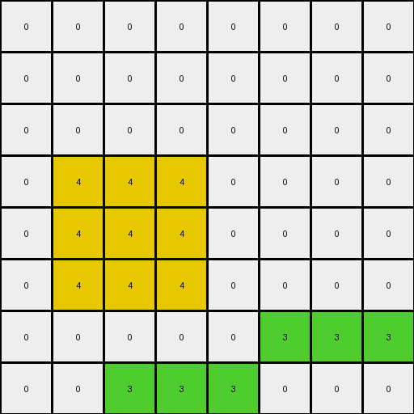
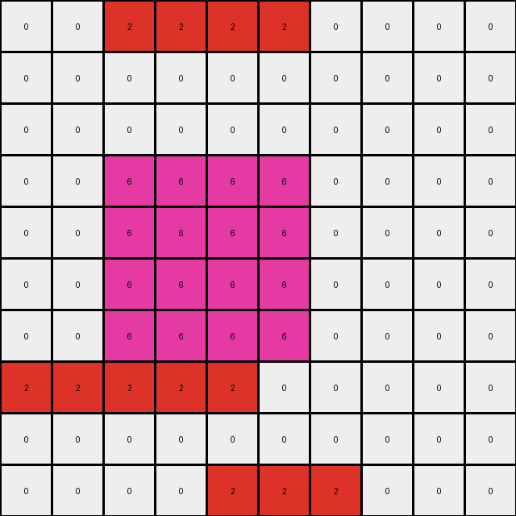

# AboveBelow3 • 003 • refine_dreamer

---


Previous Code:
```python
"""
Identify all horizontal lines of pixels with the color green (value 3).
Delete the top green horizontal line.
"""

import numpy as np

def find_horizontal_lines(grid, color):
    lines = []
    for i, row in enumerate(grid):
        start = -1
        for j, pixel in enumerate(row):
            if pixel == color:
                if start == -1:
                    start = j
            elif start != -1:
                lines.append((i, start, j - 1))
                start = -1
        if start != -1:
            lines.append((i, start, len(row) - 1))
    return lines

def transform(input_grid):
    """
    Transforms the input grid by removing the top horizontal green line.
    """
    # Initialize output grid as a copy of the input grid
    output_grid = np.copy(input_grid)
    
    # Find all horizontal lines of color green (3)
    green_lines = find_horizontal_lines(output_grid, 3)
    
    # Find the top-most green line.
    if green_lines:
        top_green_line_row = min(line[0] for line in green_lines)
        #remove the top green line
        for line in green_lines:
          if line[0] == top_green_line_row:
            for col in range(line[1],line[2]+1):
                output_grid[line[0]][col] = 0

    return output_grid
```

Train Set Results:

## Example 1:

Input:
```
0 0 0 0 0 0 0 0
0 3 3 3 0 0 0 0
0 0 0 0 0 0 0 0
0 4 4 4 0 0 0 0
0 4 4 4 0 0 0 0
0 4 4 4 0 0 0 0
0 0 0 0 0 3 3 3
0 0 3 3 3 0 0 0
```
Expected Output:
```
0 0 0 0 0 0 0 0
0 0 0 0 0 0 0 0
0 3 3 3 0 0 0 0
0 4 4 4 0 0 0 0
0 4 4 4 0 0 0 0
0 4 4 4 0 0 0 0
0 0 0 0 0 3 3 3
0 0 3 3 3 0 0 0
```
Transformed Output:
```
0 0 0 0 0 0 0 0
0 0 0 0 0 0 0 0
0 0 0 0 0 0 0 0
0 4 4 4 0 0 0 0
0 4 4 4 0 0 0 0
0 4 4 4 0 0 0 0
0 0 0 0 0 3 3 3
0 0 3 3 3 0 0 0
```

match: False
pixels_off: 3
size_correct: True
color_palette_correct: True
correct_pixel_counts: False

## Example 2:

Input:
```
0 0 2 2 2 2 0 0 0 0
0 0 0 0 0 0 0 0 0 0
0 0 0 0 0 0 0 0 0 0
0 0 6 6 6 6 0 0 0 0
0 0 6 6 6 6 0 0 0 0
0 0 6 6 6 6 0 0 0 0
0 0 6 6 6 6 0 0 0 0
2 2 2 2 2 0 0 0 0 0
0 0 0 0 0 0 0 0 0 0
0 0 0 0 2 2 2 0 0 0
```
Expected Output:
```
0 0 0 0 0 0 0 0 0 0
0 0 0 0 0 0 0 0 0 0
0 0 2 2 2 2 0 0 0 0
0 0 6 6 6 6 0 0 0 0
0 0 6 6 6 6 0 0 0 0
0 0 6 6 6 6 0 0 0 0
0 0 6 6 6 6 0 0 0 0
2 2 2 2 2 0 0 0 0 0
0 0 0 0 0 0 0 0 0 0
0 0 0 0 2 2 2 0 0 0
```
Transformed Output:
```
0 0 2 2 2 2 0 0 0 0
0 0 0 0 0 0 0 0 0 0
0 0 0 0 0 0 0 0 0 0
0 0 6 6 6 6 0 0 0 0
0 0 6 6 6 6 0 0 0 0
0 0 6 6 6 6 0 0 0 0
0 0 6 6 6 6 0 0 0 0
2 2 2 2 2 0 0 0 0 0
0 0 0 0 0 0 0 0 0 0
0 0 0 0 2 2 2 0 0 0
```

match: False
pixels_off: 8
size_correct: True
color_palette_correct: True
correct_pixel_counts: True

## Example 3:

Input:
```
0 0 4 4 0 0 0
0 0 0 0 0 0 0
0 0 1 1 0 0 0
0 0 1 1 0 0 0
0 4 4 4 0 0 0
0 0 0 0 0 0 0
0 0 0 0 0 0 0
```
Expected Output:
```
0 0 0 0 0 0 0
0 0 4 4 0 0 0
0 0 1 1 0 0 0
0 0 1 1 0 0 0
0 4 4 4 0 0 0
0 0 0 0 0 0 0
0 0 0 0 0 0 0
```
Transformed Output:
```
0 0 4 4 0 0 0
0 0 0 0 0 0 0
0 0 1 1 0 0 0
0 0 1 1 0 0 0
0 4 4 4 0 0 0
0 0 0 0 0 0 0
0 0 0 0 0 0 0
```

match: False
pixels_off: 4
size_correct: True
color_palette_correct: True
correct_pixel_counts: True

**INSTRUCTIONS**

The code above was generated based on observations from the first training
example

we have tested the transform function on each of the task example inputs and
compared with the expected output

review each of the examples provided and the results and consider how the
natural language program should be updated to accommodate this new knowledge

respond with the following deliverables:

- general assessment of the information provided and strategy for resolving the
  errors
- gather metrics about each of the examples and results - use code_execution to
  develop accurate reports on your assumptions
- a YAML block documenting facts - Focus on identifying objects, their properties, and the actions performed on them.
- a natural language program - Be as clear and concise as possible, providing a complete description of the transformation rule.


your responses should be considered as information in a report - not a
conversation
