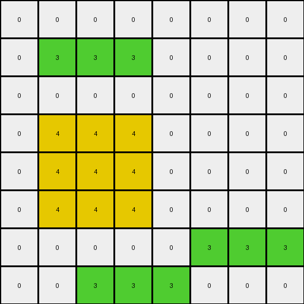

# AboveBelow3 • 009 • refine_dreamer

---


Previous Code:
```python
"""
The transformation rule is a downward shift of only the top red region by two rows, leaving the other colored regions untouched.
"""

import numpy as np

def find_top_red_region(grid):
    """Finds the top red region in the grid."""
    rows, cols = grid.shape
    top_red_region = []
    for r in range(rows):
        for c in range(cols):
            if grid[r, c] == 2:
                top_red_region.append((r, c))
        if any(grid[r,c] == 6 for c in range(cols)): #stop after encounter magenta object
            break
    return top_red_region

def find_magenta_region(grid):
     # find magenta object
    rows, cols = grid.shape
    magenta_region = []
    for r in range(rows):
        for c in range(cols):
            if grid[r,c] == 6:
                magenta_region.append((r,c))
    return magenta_region

def find_bottom_red_region(grid):
    # Find bottom red region.
    rows, cols = grid.shape
    bottom_red_region = []

    for r in range(rows):
        for c in range(cols):
            if grid[r,c] == 2:
                if not any(grid[row,c] == 2 for row in range(0,r)):
                    bottom_red_region.append((r,c))
    return bottom_red_region
    

def transform(input_grid):
    # Initialize output_grid as a copy of the input_grid
    output_grid = np.copy(input_grid)
    rows, cols = input_grid.shape

    # Find the top red region
    top_red_region = find_top_red_region(input_grid)
    
    #Find magenta region
    magenta_region = find_magenta_region(input_grid)

    # find the bottom red regions
    bottom_red_region = find_bottom_red_region(input_grid)

    # Clear the original top red region in the output grid
    for r, c in top_red_region:
        output_grid[r, c] = 0

    # Shift the top red region down by two rows
    for r, c in top_red_region:
        new_r = r + 2
        if new_r < rows:  # Ensure we don't go out of bounds
            output_grid[new_r, c] = 2
            
    return output_grid
```

Train Set Results:

## Example 1:

Input:
```
0 0 0 0 0 0 0 0
0 3 3 3 0 0 0 0
0 0 0 0 0 0 0 0
0 4 4 4 0 0 0 0
0 4 4 4 0 0 0 0
0 4 4 4 0 0 0 0
0 0 0 0 0 3 3 3
0 0 3 3 3 0 0 0
```
Expected Output:
```
0 0 0 0 0 0 0 0
0 0 0 0 0 0 0 0
0 3 3 3 0 0 0 0
0 4 4 4 0 0 0 0
0 4 4 4 0 0 0 0
0 4 4 4 0 0 0 0
0 0 0 0 0 3 3 3
0 0 3 3 3 0 0 0
```
Transformed Output:
```
0 0 0 0 0 0 0 0
0 3 3 3 0 0 0 0
0 0 0 0 0 0 0 0
0 4 4 4 0 0 0 0
0 4 4 4 0 0 0 0
0 4 4 4 0 0 0 0
0 0 0 0 0 3 3 3
0 0 3 3 3 0 0 0
```

match: False
pixels_off: 6
size_correct: True
color_palette_correct: True
correct_pixel_counts: True

## Example 2:

Input:
```
0 0 2 2 2 2 0 0 0 0
0 0 0 0 0 0 0 0 0 0
0 0 0 0 0 0 0 0 0 0
0 0 6 6 6 6 0 0 0 0
0 0 6 6 6 6 0 0 0 0
0 0 6 6 6 6 0 0 0 0
0 0 6 6 6 6 0 0 0 0
2 2 2 2 2 0 0 0 0 0
0 0 0 0 0 0 0 0 0 0
0 0 0 0 2 2 2 0 0 0
```
Expected Output:
```
0 0 0 0 0 0 0 0 0 0
0 0 0 0 0 0 0 0 0 0
0 0 2 2 2 2 0 0 0 0
0 0 6 6 6 6 0 0 0 0
0 0 6 6 6 6 0 0 0 0
0 0 6 6 6 6 0 0 0 0
0 0 6 6 6 6 0 0 0 0
2 2 2 2 2 0 0 0 0 0
0 0 0 0 0 0 0 0 0 0
0 0 0 0 2 2 2 0 0 0
```
Transformed Output:
```
0 0 0 0 0 0 0 0 0 0
0 0 0 0 0 0 0 0 0 0
0 0 2 2 2 2 0 0 0 0
0 0 6 6 6 6 0 0 0 0
0 0 6 6 6 6 0 0 0 0
0 0 6 6 6 6 0 0 0 0
0 0 6 6 6 6 0 0 0 0
2 2 2 2 2 0 0 0 0 0
0 0 0 0 0 0 0 0 0 0
0 0 0 0 2 2 2 0 0 0
```

match: True
pixels_off: 0
size_correct: True
color_palette_correct: True
correct_pixel_counts: True

## Example 3:

Input:
```
0 0 4 4 0 0 0
0 0 0 0 0 0 0
0 0 1 1 0 0 0
0 0 1 1 0 0 0
0 4 4 4 0 0 0
0 0 0 0 0 0 0
0 0 0 0 0 0 0
```
Expected Output:
```
0 0 0 0 0 0 0
0 0 4 4 0 0 0
0 0 1 1 0 0 0
0 0 1 1 0 0 0
0 4 4 4 0 0 0
0 0 0 0 0 0 0
0 0 0 0 0 0 0
```
Transformed Output:
```
0 0 4 4 0 0 0
0 0 0 0 0 0 0
0 0 1 1 0 0 0
0 0 1 1 0 0 0
0 4 4 4 0 0 0
0 0 0 0 0 0 0
0 0 0 0 0 0 0
```

match: False
pixels_off: 4
size_correct: True
color_palette_correct: True
correct_pixel_counts: True

**INSTRUCTIONS**

The code above was generated based on observations from the first training
example

we have tested the transform function on each of the task example inputs and
compared with the expected output

review each of the examples provided and the results and consider how the
natural language program should be updated to accommodate this new knowledge

respond with the following deliverables:

- general assessment of the information provided and strategy for resolving the
  errors
- gather metrics about each of the examples and results - use code_execution to
  develop accurate reports on your assumptions
- a YAML block documenting facts - Focus on identifying objects, their properties, and the actions performed on them.
- a natural language program - Be as clear and concise as possible, providing a complete description of the transformation rule.


your responses should be considered as information in a report - not a
conversation
