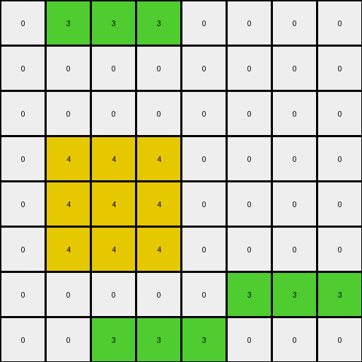
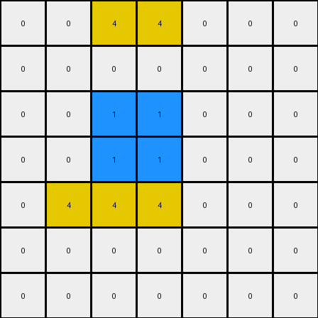

# AboveBelow3 • 011 • refine_dreamer

---

Previous Code:
```python
"""
The transformation rule is to identify the top-most contiguous region of any color and shift it upwards by one row, unless it's already at the top edge.
"""

import numpy as np

def find_topmost_region(grid):
    """Finds the top-most contiguous region in the grid."""
    rows, cols = grid.shape
    topmost_region = []
    topmost_row = rows  # Initialize with a value larger than any possible row index
    
    # Find the highest row with any non-zero pixels
    for r in range(rows):
        for c in range(cols):
            if grid[r, c] != 0:
                topmost_row = min(topmost_row,r)

    if topmost_row == rows:
        return []
    # Find all connected pixels starting from the topmost row
    first_color = 0
    for c in range(cols):
        if grid[topmost_row,c] != 0:
            first_color = grid[topmost_row,c]
            break

    visited = set()
    
    def is_valid(row, col):
        return 0 <= row < rows and 0 <= col < cols

    def dfs(row, col):
        if (row, col) in visited or not is_valid(row, col) or grid[row, col] != first_color:
            return
        visited.add((row, col))
        topmost_region.append((row, col))
        
        # Explore adjacent cells (up, down, left, right)
        dfs(row + 1, col)
        dfs(row - 1, col)
        dfs(row, col + 1)
        dfs(row, col - 1)

    for c in range(cols):
        if grid[topmost_row,c] == first_color:
            dfs(topmost_row,c)

    return topmost_region

def transform(input_grid):
    """Transforms the input grid by shifting the top-most region up by one row."""
    output_grid = np.copy(input_grid)
    rows, cols = input_grid.shape

    # Find the top-most region
    topmost_region = find_topmost_region(input_grid)

    if not topmost_region:
        return output_grid

    # Determine the color of the region
    region_color = input_grid[topmost_region[0]]

    # Clear the original region in the output grid
    for r, c in topmost_region:
        output_grid[r, c] = 0

    # Shift the region up by one row, handling boundary conditions
    for r, c in topmost_region:
        new_r = r - 1
        if new_r >= 0:  # Ensure we don't go out of bounds (top edge)
            output_grid[new_r, c] = region_color
        else:
            output_grid[r,c] = region_color #add the original position back

    return output_grid
```

Train Set Results:

## Example 1:

Input:
```
0 0 0 0 0 0 0 0
0 3 3 3 0 0 0 0
0 0 0 0 0 0 0 0
0 4 4 4 0 0 0 0
0 4 4 4 0 0 0 0
0 4 4 4 0 0 0 0
0 0 0 0 0 3 3 3
0 0 3 3 3 0 0 0
```
Expected Output:
```
0 0 0 0 0 0 0 0
0 0 0 0 0 0 0 0
0 3 3 3 0 0 0 0
0 4 4 4 0 0 0 0
0 4 4 4 0 0 0 0
0 4 4 4 0 0 0 0
0 0 0 0 0 3 3 3
0 0 3 3 3 0 0 0
```
Transformed Output:
```
0 3 3 3 0 0 0 0
0 0 0 0 0 0 0 0
0 0 0 0 0 0 0 0
0 4 4 4 0 0 0 0
0 4 4 4 0 0 0 0
0 4 4 4 0 0 0 0
0 0 0 0 0 3 3 3
0 0 3 3 3 0 0 0
```

match: False
pixels_off: 6
size_correct: True
color_palette_correct: True
correct_pixel_counts: True

## Example 2:

Input:
```
0 0 2 2 2 2 0 0 0 0
0 0 0 0 0 0 0 0 0 0
0 0 0 0 0 0 0 0 0 0
0 0 6 6 6 6 0 0 0 0
0 0 6 6 6 6 0 0 0 0
0 0 6 6 6 6 0 0 0 0
0 0 6 6 6 6 0 0 0 0
2 2 2 2 2 0 0 0 0 0
0 0 0 0 0 0 0 0 0 0
0 0 0 0 2 2 2 0 0 0
```
Expected Output:
```
0 0 0 0 0 0 0 0 0 0
0 0 0 0 0 0 0 0 0 0
0 0 2 2 2 2 0 0 0 0
0 0 6 6 6 6 0 0 0 0
0 0 6 6 6 6 0 0 0 0
0 0 6 6 6 6 0 0 0 0
0 0 6 6 6 6 0 0 0 0
2 2 2 2 2 0 0 0 0 0
0 0 0 0 0 0 0 0 0 0
0 0 0 0 2 2 2 0 0 0
```
Transformed Output:
```
0 0 2 2 2 2 0 0 0 0
0 0 0 0 0 0 0 0 0 0
0 0 0 0 0 0 0 0 0 0
0 0 6 6 6 6 0 0 0 0
0 0 6 6 6 6 0 0 0 0
0 0 6 6 6 6 0 0 0 0
0 0 6 6 6 6 0 0 0 0
2 2 2 2 2 0 0 0 0 0
0 0 0 0 0 0 0 0 0 0
0 0 0 0 2 2 2 0 0 0
```

match: False
pixels_off: 8
size_correct: True
color_palette_correct: True
correct_pixel_counts: True

## Example 3:

Input:
```
0 0 4 4 0 0 0
0 0 0 0 0 0 0
0 0 1 1 0 0 0
0 0 1 1 0 0 0
0 4 4 4 0 0 0
0 0 0 0 0 0 0
0 0 0 0 0 0 0
```
Expected Output:
```
0 0 0 0 0 0 0
0 0 4 4 0 0 0
0 0 1 1 0 0 0
0 0 1 1 0 0 0
0 4 4 4 0 0 0
0 0 0 0 0 0 0
0 0 0 0 0 0 0
```
Transformed Output:
```
0 0 4 4 0 0 0
0 0 0 0 0 0 0
0 0 1 1 0 0 0
0 0 1 1 0 0 0
0 4 4 4 0 0 0
0 0 0 0 0 0 0
0 0 0 0 0 0 0
```

match: False
pixels_off: 4
size_correct: True
color_palette_correct: True
correct_pixel_counts: True
**INSTRUCTIONS**

The code above was generated based on observations from the first training
example

we have tested the transform function on each of the task example inputs and
compared with the expected output

review each of the examples provided and the results and consider how the
natural language program should be updated to accommodate this new knowledge

respond with the following deliverables:

- general assessment of the information provided and strategy for resolving the
  errors
- gather metrics about each of the examples and results - use code_execution to
  develop accurate reports on your assumptions
- a YAML block documenting facts - Focus on identifying objects, their properties, and the actions performed on them.
- a natural language program - Be as clear and concise as possible, providing a complete description of the transformation rule.


your responses should be considered as information in a report - not a
conversation
