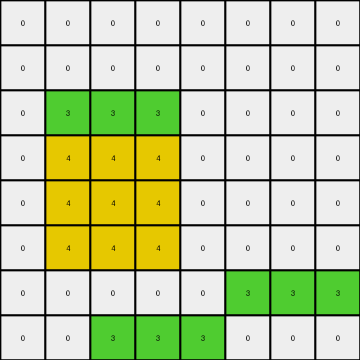
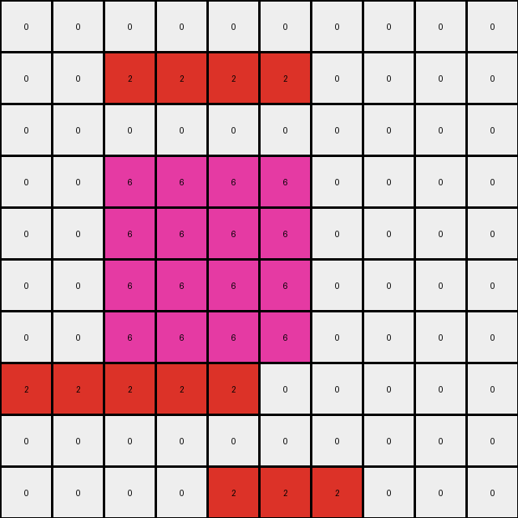
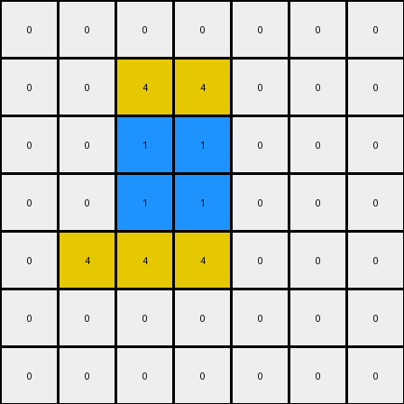

# AboveBelow3 • 017 • refine_dreamer

---


Previous Code:
```python
"""
The transformation involves identifying the top-most horizontal rectangle in the input grid and moving it down by one position (one row below current position).
"""

import numpy as np

def find_top_rectangle(grid):
    """Finds the top-most horizontal rectangle in the grid."""
    rows, cols = grid.shape
    visited = np.zeros_like(grid, dtype=bool)
    top_rectangle = None
    top_row = rows  # Initialize with a row number that's beyond the grid

    for r in range(rows):
        for c in range(cols):
            if not visited[r, c] and grid[r, c] != 0:
                color = grid[r, c]
                width = 0
                # Check for horizontal rectangle
                c_temp = c
                while c_temp < cols and grid[r, c_temp] == color:
                    width += 1
                    c_temp += 1

                if width > 0: # is it a rectangle?
                    # check if all rows below until color changes are same
                    height = 1
                    r_temp = r + 1
                    valid_rect = True
                    while r_temp < rows and grid[r_temp,c] == color:
                        for i in range(width):
                            if c + i >= cols or grid[r_temp, c+i] != color:
                                valid_rect = False
                                break
                        if not valid_rect:
                            break

                        height += 1
                        r_temp += 1

                    if valid_rect: # we found a rectangle, now check to mark it as visited.
                        for i in range(r, r + height):
                            for j in range(c, c + width):
                                visited[i,j] = True

                        if r < top_row: # is this the top most?
                            top_row = r
                            top_rectangle = ((r, c), (width, height), color)


    return top_rectangle

def move_rectangle_down(grid, start_pos, size, color):
    """Moves the specified rectangle down by one position."""
    new_grid = np.copy(grid)
    r, c = start_pos
    width, height = size

    # Clear old position
    for i in range(r, r + height):
        for j in range(c, c + width):
            new_grid[i, j] = 0

    # Set new position - one position down
    new_r = r + 1
    for i in range(new_r, new_r + height):
        for j in range(c, c + width):
          if i < new_grid.shape[0]:
            new_grid[i, j] = color

    return new_grid

def transform(input_grid):
    # initialize output_grid
    output_grid = np.copy(input_grid)

    # Find the top-most horizontal rectangle
    top_rect = find_top_rectangle(output_grid)

    if top_rect:
        start_pos, size, color = top_rect
        # Move the rectangle down by one row
        output_grid = move_rectangle_down(output_grid, start_pos, size, color)

    return output_grid
```

Train Set Results:

## Example 1:

Input:
```
0 0 0 0 0 0 0 0
0 3 3 3 0 0 0 0
0 0 0 0 0 0 0 0
0 4 4 4 0 0 0 0
0 4 4 4 0 0 0 0
0 4 4 4 0 0 0 0
0 0 0 0 0 3 3 3
0 0 3 3 3 0 0 0
```
Expected Output:
```
0 0 0 0 0 0 0 0
0 0 0 0 0 0 0 0
0 3 3 3 0 0 0 0
0 4 4 4 0 0 0 0
0 4 4 4 0 0 0 0
0 4 4 4 0 0 0 0
0 0 0 0 0 3 3 3
0 0 3 3 3 0 0 0
```
Transformed Output:
```
0 0 0 0 0 0 0 0
0 0 0 0 0 0 0 0
0 3 3 3 0 0 0 0
0 4 4 4 0 0 0 0
0 4 4 4 0 0 0 0
0 4 4 4 0 0 0 0
0 0 0 0 0 3 3 3
0 0 3 3 3 0 0 0
```

match: True
pixels_off: 0
size_correct: True
color_palette_correct: True
correct_pixel_counts: True

## Example 2:

Input:
```
0 0 2 2 2 2 0 0 0 0
0 0 0 0 0 0 0 0 0 0
0 0 0 0 0 0 0 0 0 0
0 0 6 6 6 6 0 0 0 0
0 0 6 6 6 6 0 0 0 0
0 0 6 6 6 6 0 0 0 0
0 0 6 6 6 6 0 0 0 0
2 2 2 2 2 0 0 0 0 0
0 0 0 0 0 0 0 0 0 0
0 0 0 0 2 2 2 0 0 0
```
Expected Output:
```
0 0 0 0 0 0 0 0 0 0
0 0 0 0 0 0 0 0 0 0
0 0 2 2 2 2 0 0 0 0
0 0 6 6 6 6 0 0 0 0
0 0 6 6 6 6 0 0 0 0
0 0 6 6 6 6 0 0 0 0
0 0 6 6 6 6 0 0 0 0
2 2 2 2 2 0 0 0 0 0
0 0 0 0 0 0 0 0 0 0
0 0 0 0 2 2 2 0 0 0
```
Transformed Output:
```
0 0 0 0 0 0 0 0 0 0
0 0 2 2 2 2 0 0 0 0
0 0 0 0 0 0 0 0 0 0
0 0 6 6 6 6 0 0 0 0
0 0 6 6 6 6 0 0 0 0
0 0 6 6 6 6 0 0 0 0
0 0 6 6 6 6 0 0 0 0
2 2 2 2 2 0 0 0 0 0
0 0 0 0 0 0 0 0 0 0
0 0 0 0 2 2 2 0 0 0
```

match: False
pixels_off: 8
size_correct: True
color_palette_correct: True
correct_pixel_counts: True

## Example 3:

Input:
```
0 0 4 4 0 0 0
0 0 0 0 0 0 0
0 0 1 1 0 0 0
0 0 1 1 0 0 0
0 4 4 4 0 0 0
0 0 0 0 0 0 0
0 0 0 0 0 0 0
```
Expected Output:
```
0 0 0 0 0 0 0
0 0 4 4 0 0 0
0 0 1 1 0 0 0
0 0 1 1 0 0 0
0 4 4 4 0 0 0
0 0 0 0 0 0 0
0 0 0 0 0 0 0
```
Transformed Output:
```
0 0 0 0 0 0 0
0 0 4 4 0 0 0
0 0 1 1 0 0 0
0 0 1 1 0 0 0
0 4 4 4 0 0 0
0 0 0 0 0 0 0
0 0 0 0 0 0 0
```

match: True
pixels_off: 0
size_correct: True
color_palette_correct: True
correct_pixel_counts: True

**INSTRUCTIONS**

The code above was generated based on observations from the first training
example

we have tested the transform function on each of the task example inputs and
compared with the expected output

review each of the examples provided and the results and consider how the
natural language program should be updated to accommodate this new knowledge

respond with the following deliverables:

- general assessment of the information provided and strategy for resolving the
  errors
- gather metrics about each of the examples and results - use code_execution to
  develop accurate reports on your assumptions
- a YAML block documenting facts - Focus on identifying objects, their properties, and the actions performed on them.
- a natural language program - Be as clear and concise as possible, providing a complete description of the transformation rule.


your responses should be considered as information in a report - not a
conversation
