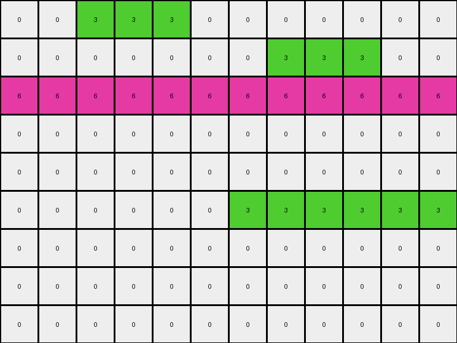

# AboveBelow4 • 003 • refine_dreamer

---

Previous Code:
```python
"""
1.  **Identify Stripes:** Locate all horizontal and vertical stripes of red (2) and yellow (4) pixels. A stripe is defined as a contiguous sequence of pixels of the same color along a row or column.
2.  **Find Intersections:** Determine the points (pixels) where the red stripes intersect the yellow stripe. An intersection occurs where a red pixel in a red stripe is in the same row or column as a section of the horizontal yellow stripe.
3.  **Color Replacement:** At each intersection point identified in step 2, change the color of the pixel from red (2) to yellow (4).
4. **Preserve other:** All other pixels should not be changed.
"""

import numpy as np

def find_stripes(grid, color, orientation):
    stripes = []
    if orientation == "horizontal":
        for i, row in enumerate(grid):
            stripe_start = None
            for j, pixel in enumerate(row):
                if pixel == color:
                    if stripe_start is None:
                        stripe_start = j
                elif stripe_start is not None:
                    stripes.append((i, stripe_start, i, j - 1))
                    stripe_start = None
            if stripe_start is not None:
                stripes.append((i, stripe_start, i, len(row) - 1))
    elif orientation == "vertical":
        for j in range(grid.shape[1]):
            stripe_start = None
            for i, pixel in enumerate(grid[:, j]):
                if pixel == color:
                    if stripe_start is None:
                        stripe_start = i
                elif stripe_start is not None:
                    stripes.append((stripe_start, j, i - 1, j))
                    stripe_start = None
            if stripe_start is not None:
                stripes.append((stripe_start, j, grid.shape[0] - 1, j))
    return stripes

def find_intersections(red_stripes, yellow_stripes):
    intersections = []
    for r_start_row, r_start_col, r_end_row, r_end_col in red_stripes:
      for y_start_row, y_start_col, y_end_row, y_end_col in yellow_stripes:
        if r_start_row == r_end_row: # red horizontal
          if y_start_row == y_end_row: # yellow horizontal
            continue # both horizontal
          else: # yellow vertical
            if y_start_col >= r_start_col and y_start_col <= r_end_col and r_start_row >= y_start_row and r_start_row <= y_end_row:
              intersections.append( (r_start_row, y_start_col))
        else: # red vertical
          if y_start_row == y_end_row: # yellow horizontal
            if r_start_row <= y_start_row and r_end_row >= y_start_row and y_start_col <= r_start_col and y_end_col >= r_start_col:
              intersections.append( (y_start_row, r_start_col))

          else: # yellow vertical
            continue; # both vertical

    return intersections

def transform(input_grid):
    # initialize output_grid
    grid = np.array(input_grid)
    output_grid = np.copy(grid)

    # Find red and yellow stripes
    red_horizontal_stripes = find_stripes(grid, 2, "horizontal")
    red_vertical_stripes = find_stripes(grid, 2, "vertical")
    yellow_horizontal_stripes = find_stripes(grid, 4, "horizontal")
    yellow_vertical_stripes = find_stripes(grid, 4, "vertical")  #find vertical yellow as well

    red_stripes = red_horizontal_stripes + red_vertical_stripes
    yellow_stripes = yellow_horizontal_stripes + yellow_vertical_stripes

    # Find intersection points
    intersections = find_intersections(red_stripes, yellow_stripes)

    # change output pixels 
    for row, col in intersections:
        output_grid[row, col] = 4

    return output_grid
```

Train Set Results:

## Example 1:

Input:
```
0 0 0 0 0 0 0 0 0 0
0 0 2 2 2 0 0 2 2 2
0 0 0 0 0 0 0 0 0 0
0 0 0 0 2 2 2 0 0 0
4 4 4 4 4 4 4 4 4 4
0 0 0 0 0 0 0 0 0 0
0 0 0 0 0 0 0 0 0 0
0 2 2 2 0 0 0 0 0 0
0 0 0 0 2 2 2 0 0 0
0 0 0 0 0 0 0 0 0 0
```
Expected Output:
```
0 0 0 0 0 0 0 0 0 0
0 0 4 2 2 0 0 4 2 2
0 0 0 0 0 0 0 0 0 0
0 0 0 0 4 2 2 0 0 0
4 4 4 4 4 4 4 4 4 4
0 0 0 0 0 0 0 0 0 0
0 0 0 0 0 0 0 0 0 0
0 2 2 4 0 0 0 0 0 0
0 0 0 0 2 2 4 0 0 0
0 0 0 0 0 0 0 0 0 0
```
Transformed Output:
```
0 0 0 0 0 0 0 0 0 0
0 0 2 2 2 0 0 2 2 2
0 0 0 0 0 0 0 0 0 0
0 0 0 0 2 2 2 0 0 0
4 4 4 4 4 4 4 4 4 4
0 0 0 0 0 0 0 0 0 0
0 0 0 0 0 0 0 0 0 0
0 2 2 2 0 0 0 0 0 0
0 0 0 0 2 2 2 0 0 0
0 0 0 0 0 0 0 0 0 0
```

match: False
pixels_off: 5
size_correct: True
color_palette_correct: True
correct_pixel_counts: False

## Example 2:

Input:
```
0 0 3 3 3 0 0 0 0 0 0 0
0 0 0 0 0 0 0 3 3 3 0 0
6 6 6 6 6 6 6 6 6 6 6 6
0 0 0 0 0 0 0 0 0 0 0 0
0 0 0 0 0 0 0 0 0 0 0 0
0 0 0 0 0 0 3 3 3 3 3 3
0 0 0 0 0 0 0 0 0 0 0 0
0 0 0 0 0 0 0 0 0 0 0 0
0 0 0 0 0 0 0 0 0 0 0 0
```
Expected Output:
```
0 0 6 3 3 0 0 0 0 0 0 0
0 0 0 0 0 0 0 6 3 3 0 0
6 6 6 6 6 6 6 6 6 6 6 6
0 0 0 0 0 0 0 0 0 0 0 0
0 0 0 0 0 0 0 0 0 0 0 0
0 0 0 0 0 0 3 3 3 3 3 6
0 0 0 0 0 0 0 0 0 0 0 0
0 0 0 0 0 0 0 0 0 0 0 0
0 0 0 0 0 0 0 0 0 0 0 0
```
Transformed Output:
```
0 0 3 3 3 0 0 0 0 0 0 0
0 0 0 0 0 0 0 3 3 3 0 0
6 6 6 6 6 6 6 6 6 6 6 6
0 0 0 0 0 0 0 0 0 0 0 0
0 0 0 0 0 0 0 0 0 0 0 0
0 0 0 0 0 0 3 3 3 3 3 3
0 0 0 0 0 0 0 0 0 0 0 0
0 0 0 0 0 0 0 0 0 0 0 0
0 0 0 0 0 0 0 0 0 0 0 0
```

match: False
pixels_off: 3
size_correct: True
color_palette_correct: True
correct_pixel_counts: False
**INSTRUCTIONS**

The code above was generated based on observations from the first training
example

we have tested the transform function on each of the task example inputs and
compared with the expected output

review each of the examples provided and the results and consider how the
natural language program should be updated to accommodate this new knowledge

respond with the following deliverables:

- general assessment of the information provided and strategy for resolving the
  errors
- gather metrics about each of the examples and results - use code_execution to
  develop accurate reports on your assumptions
- a YAML block documenting facts - Focus on identifying objects, their properties, and the actions performed on them.
- a natural language program - Be as clear and concise as possible, providing a complete description of the transformation rule.


your responses should be considered as information in a report - not a
conversation
