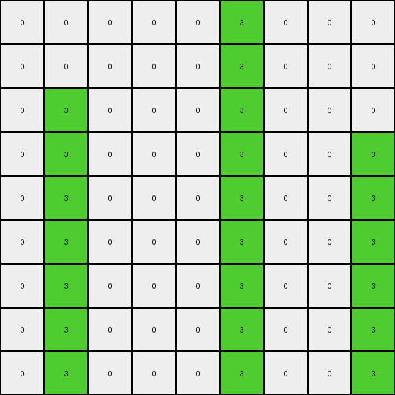
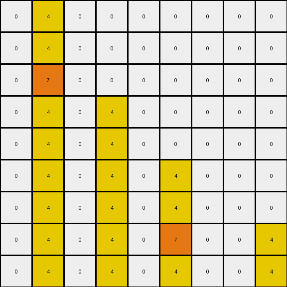

# AboveBelow5 • 005 • refine_dreamer

---

Previous Code:
```python
"""
1.  **Identify the center column:** In a square grid, find the central vertical column.
2.  **Preserve all pixels of Colors 0, 4, and 7, in any position.**
3.  **Check for color changes only if there are any changes at all.**
4.  **Specific Changes**:
    *   If there is green (3) in the central column, change it to blue (1)
    *   If there is blue (1) *not* in the center column, change it to green (3)
5.  **All other pixels remain unchanged.**
"""

import numpy as np

def transform(input_grid):
    output_grid = np.copy(input_grid)  # Initialize output grid with the original values
    rows, cols = input_grid.shape
    center_col = cols // 2  # Integer division to find center column.

    # Check if colors 4 or 7 are present. If so, return input grid as is.
    if 4 in input_grid or 7 in input_grid:
        return output_grid

    # Iterate over each cell of input and apply rule
    for r in range(rows):
        for c in range(cols):
            if input_grid[r, c] == 3 and c == center_col:  # Green and in center column.
                output_grid[r, c] = 1
            elif input_grid[r, c] == 1 and c != center_col:  # Blue and not in center column.
                output_grid[r, c] = 3
    return output_grid
```

Train Set Results:

## Example 1:

Input:
```
0 0 0 0 0 1 0 0 0
0 0 0 0 0 1 0 0 0
0 1 0 0 0 1 0 0 0
0 1 0 0 0 3 0 0 1
0 1 0 0 0 1 0 0 1
0 1 0 0 0 1 0 0 1
0 1 0 0 0 1 0 0 3
0 3 0 0 0 1 0 0 1
0 1 0 0 0 1 0 0 1
```
Expected Output:
```
0 0 0 0 0 3 0 0 0
0 0 0 0 0 3 0 0 0
0 3 0 0 0 3 0 0 0
0 3 0 0 0 3 0 0 3
0 3 0 0 0 1 0 0 3
0 3 0 0 0 1 0 0 3
0 3 0 0 0 1 0 0 3
0 3 0 0 0 1 0 0 1
0 1 0 0 0 1 0 0 1
```
Transformed Output:
```
0 0 0 0 0 3 0 0 0
0 0 0 0 0 3 0 0 0
0 3 0 0 0 3 0 0 0
0 3 0 0 0 3 0 0 3
0 3 0 0 0 3 0 0 3
0 3 0 0 0 3 0 0 3
0 3 0 0 0 3 0 0 3
0 3 0 0 0 3 0 0 3
0 3 0 0 0 3 0 0 3
```

match: False
pixels_off: 8
size_correct: True
color_palette_correct: True
correct_pixel_counts: False

## Example 2:

Input:
```
0 4 0 0 0 0 0 0 0
0 4 0 0 0 0 0 0 0
0 7 0 0 0 0 0 0 0
0 4 0 4 0 0 0 0 0
0 4 0 4 0 0 0 0 0
0 4 0 4 0 4 0 0 0
0 4 0 4 0 4 0 0 0
0 4 0 4 0 7 0 0 4
0 4 0 4 0 4 0 0 4
```
Expected Output:
```
0 7 0 0 0 0 0 0 0
0 7 0 0 0 0 0 0 0
0 7 0 0 0 0 0 0 0
0 4 0 4 0 0 0 0 0
0 4 0 4 0 0 0 0 0
0 4 0 4 0 7 0 0 0
0 4 0 4 0 7 0 0 0
0 4 0 4 0 7 0 0 4
0 4 0 4 0 4 0 0 4
```
Transformed Output:
```
0 4 0 0 0 0 0 0 0
0 4 0 0 0 0 0 0 0
0 7 0 0 0 0 0 0 0
0 4 0 4 0 0 0 0 0
0 4 0 4 0 0 0 0 0
0 4 0 4 0 4 0 0 0
0 4 0 4 0 4 0 0 0
0 4 0 4 0 7 0 0 4
0 4 0 4 0 4 0 0 4
```

match: False
pixels_off: 4
size_correct: True
color_palette_correct: True
correct_pixel_counts: False
**INSTRUCTIONS**

The code above was generated based on observations from the first training
example

we have tested the transform function on each of the task example inputs and
compared with the expected output

review each of the examples provided and the results and consider how the
natural language program should be updated to accommodate this new knowledge

respond with the following deliverables:

- general assessment of the information provided and strategy for resolving the
  errors
- gather metrics about each of the examples and results - use code_execution to
  develop accurate reports on your assumptions
- a YAML block documenting facts - Focus on identifying objects, their properties, and the actions performed on them.
- a natural language program - Be as clear and concise as possible, providing a complete description of the transformation rule.


your responses should be considered as information in a report - not a
conversation
