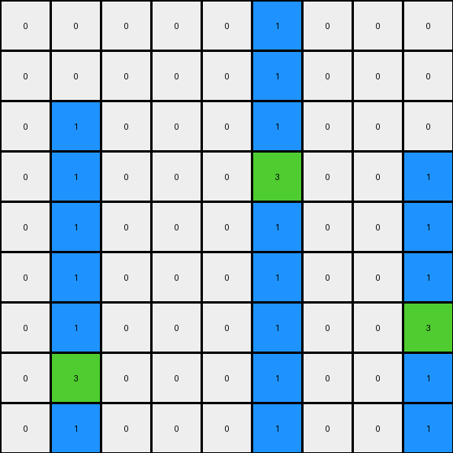
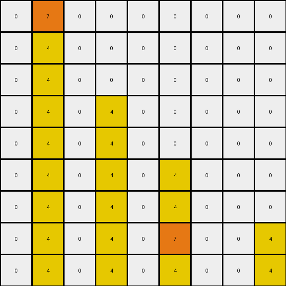

# AboveBelow5 • 009 • refine_dreamer

---


Previous Code:
```python
"""
The transformation identifies the orange (7) pixel in the second column of the input grid.
if the y position of the orange is > 1, then change the top most cell in column 2, to 7.
The yellow 4 fills the original position of the moved orange (7).
"""

import numpy as np

def find_pixel_by_color_in_column(grid, color, column_index):
    # Find the coordinates (row, col) of a pixel of the specified color within a given column.
    for row_index, row in enumerate(grid):
        if row[column_index] == color:
            return (row_index, column_index)
    return None  # Return None if no such pixel is found.

def transform(input_grid):
    # initialize output_grid
    output_grid = np.copy(input_grid)
    
    # Find the orange pixel in the second column (index 1).
    orange_pixel_coords = find_pixel_by_color_in_column(input_grid, 7, 1)
    
    # if no orange, return
    if orange_pixel_coords is None:
      return output_grid
    
    # change the top cell to be orange
    output_grid[0][1] = 7
    
    if orange_pixel_coords[0] > 0:
        output_grid[orange_pixel_coords[0]][1] = 4

    return output_grid
```

Train Set Results:

## Example 1:

Input:
```
0 0 0 0 0 1 0 0 0
0 0 0 0 0 1 0 0 0
0 1 0 0 0 1 0 0 0
0 1 0 0 0 3 0 0 1
0 1 0 0 0 1 0 0 1
0 1 0 0 0 1 0 0 1
0 1 0 0 0 1 0 0 3
0 3 0 0 0 1 0 0 1
0 1 0 0 0 1 0 0 1
```
Expected Output:
```
0 0 0 0 0 3 0 0 0
0 0 0 0 0 3 0 0 0
0 3 0 0 0 3 0 0 0
0 3 0 0 0 3 0 0 3
0 3 0 0 0 1 0 0 3
0 3 0 0 0 1 0 0 3
0 3 0 0 0 1 0 0 3
0 3 0 0 0 1 0 0 1
0 1 0 0 0 1 0 0 1
```
Transformed Output:
```
0 0 0 0 0 1 0 0 0
0 0 0 0 0 1 0 0 0
0 1 0 0 0 1 0 0 0
0 1 0 0 0 3 0 0 1
0 1 0 0 0 1 0 0 1
0 1 0 0 0 1 0 0 1
0 1 0 0 0 1 0 0 3
0 3 0 0 0 1 0 0 1
0 1 0 0 0 1 0 0 1
```

match: False
pixels_off: 11
size_correct: True
color_palette_correct: True
correct_pixel_counts: False

## Example 2:

Input:
```
0 4 0 0 0 0 0 0 0
0 4 0 0 0 0 0 0 0
0 7 0 0 0 0 0 0 0
0 4 0 4 0 0 0 0 0
0 4 0 4 0 0 0 0 0
0 4 0 4 0 4 0 0 0
0 4 0 4 0 4 0 0 0
0 4 0 4 0 7 0 0 4
0 4 0 4 0 4 0 0 4
```
Expected Output:
```
0 7 0 0 0 0 0 0 0
0 7 0 0 0 0 0 0 0
0 7 0 0 0 0 0 0 0
0 4 0 4 0 0 0 0 0
0 4 0 4 0 0 0 0 0
0 4 0 4 0 7 0 0 0
0 4 0 4 0 7 0 0 0
0 4 0 4 0 7 0 0 4
0 4 0 4 0 4 0 0 4
```
Transformed Output:
```
0 7 0 0 0 0 0 0 0
0 4 0 0 0 0 0 0 0
0 4 0 0 0 0 0 0 0
0 4 0 4 0 0 0 0 0
0 4 0 4 0 0 0 0 0
0 4 0 4 0 4 0 0 0
0 4 0 4 0 4 0 0 0
0 4 0 4 0 7 0 0 4
0 4 0 4 0 4 0 0 4
```

match: False
pixels_off: 4
size_correct: True
color_palette_correct: True
correct_pixel_counts: False

**INSTRUCTIONS**

The code above was generated based on observations from the first training
example

we have tested the transform function on each of the task example inputs and
compared with the expected output

review each of the examples provided and the results and consider how the
natural language program should be updated to accommodate this new knowledge

respond with the following deliverables:

- general assessment of the information provided and strategy for resolving the
  errors
- gather metrics about each of the examples and results - use code_execution to
  develop accurate reports on your assumptions
- a YAML block documenting facts - Focus on identifying objects, their properties, and the actions performed on them.
- a natural language program - Be as clear and concise as possible, providing a complete description of the transformation rule.


your responses should be considered as information in a report - not a
conversation
