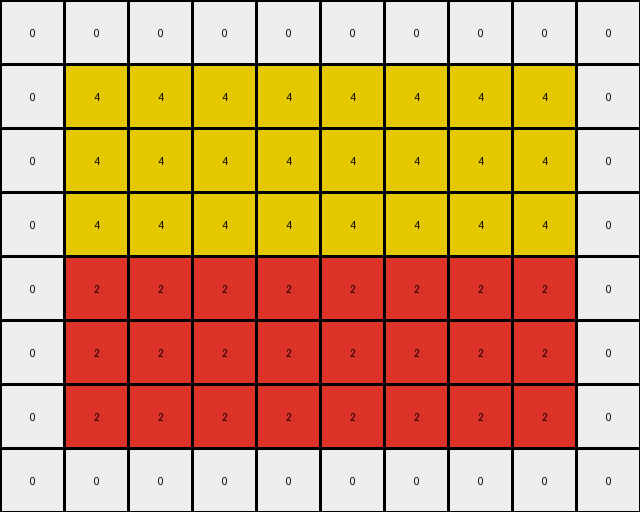

# AboveBelow6 • 003 • refine_dreamer

---


Previous Code:
```python
"""
1. Identify Objects: Locate the rectangular band of red (2) pixels. Also, note the surrounding yellow (4) and white (0) areas.
2. Red Band Expansion: The transformation rule is to expand the red band downwards. Specifically, copy the existing row of the red band twice, placing the copies immediately below the original red band.
3. Preservation: All pixels not modified by the expansion remain the same between the input and output. Thus all the white pixels, and the yellow pixels above the red band remain unchanged. The yellow pixels at the bottom are replaced.
"""

import numpy as np

def find_red_band(grid):
    # Find the row indices where red pixels are present
    red_rows = np.where(np.any(grid == 2, axis=1))[0]
    if len(red_rows) > 0:
        # Assuming the red band is contiguous, return the start and end row
        return red_rows[0], red_rows[-1]
    else:
        return None, None

def transform(input_grid):
    # Initialize output_grid as a copy of the input_grid
    output_grid = np.copy(input_grid)
    
    # Find the red band
    start_row, end_row = find_red_band(input_grid)

    # If red band is not found just return the input.
    if start_row is None:
        return output_grid
    
    # Get red band row
    red_band_row = input_grid[start_row, :]
    
    # Expand the red band downwards by 2 rows
    for i in range(1, 3):
      output_grid[end_row + i, :] = red_band_row
    
    return output_grid
```

Train Set Results:

## Example 1:

Input:
```
0 0 0 0 0 0 0 0 0 0
0 4 4 4 4 4 4 4 4 0
0 4 4 4 4 4 4 4 4 0
0 4 4 4 4 4 4 4 4 0
0 2 2 2 2 2 2 2 2 0
0 4 4 4 4 4 4 4 4 0
0 4 4 4 4 4 4 4 4 0
0 0 0 0 0 0 0 0 0 0
```
Expected Output:
```
0 0 0 0 0 0 0 0 0 0
0 4 4 4 4 4 4 4 4 0
0 4 4 4 4 4 4 4 4 0
0 4 4 4 4 4 4 4 4 0
0 2 2 2 2 2 2 2 2 0
0 2 2 2 2 2 2 2 2 0
0 2 2 2 2 2 2 2 2 0
0 0 0 0 0 0 0 0 0 0
```
Transformed Output:
```
0 0 0 0 0 0 0 0 0 0
0 4 4 4 4 4 4 4 4 0
0 4 4 4 4 4 4 4 4 0
0 4 4 4 4 4 4 4 4 0
0 2 2 2 2 2 2 2 2 0
0 2 2 2 2 2 2 2 2 0
0 2 2 2 2 2 2 2 2 0
0 0 0 0 0 0 0 0 0 0
```

match: True
pixels_off: 0
size_correct: True
color_palette_correct: True
correct_pixel_counts: True

## Example 2:

Input:
```
0 0 0 0 0 0 0 0 0 0 0 0 0 0
0 0 0 0 0 0 0 0 5 5 5 5 5 0
5 5 5 5 5 5 5 0 5 5 5 5 5 0
5 5 5 5 5 5 5 0 5 5 5 5 5 0
5 5 5 5 5 5 5 0 5 5 5 5 5 0
5 2 2 5 2 2 5 0 5 5 5 5 5 0
5 5 5 5 5 5 5 0 5 5 5 5 5 0
5 5 5 5 5 5 5 0 2 2 5 2 2 0
0 0 0 0 0 0 0 0 5 5 5 5 5 0
```
Expected Output:
```
0 0 0 0 0 0 0 0 0 0 0 0 0 0
0 0 0 0 0 0 0 0 5 5 5 5 5 0
5 5 5 5 5 5 5 0 5 5 5 5 5 0
5 5 5 5 5 5 5 0 5 5 5 5 5 0
5 5 5 5 5 5 5 0 5 5 5 5 5 0
5 2 2 5 2 2 5 0 5 5 5 5 5 0
5 2 2 5 2 2 5 0 5 5 5 5 5 0
5 2 2 5 2 2 5 0 2 2 5 2 2 0
0 0 0 0 0 0 0 0 2 2 5 2 2 0
```
match: ERROR: index 9 is out of bounds for axis 0 with size 9
pixels_off: None
size_correct: None
color_palette_correct: None
correct_pixel_counts: None

**INSTRUCTIONS**

The code above was generated based on observations from the first training
example

we have tested the transform function on each of the task example inputs and
compared with the expected output

review each of the examples provided and the results and consider how the
natural language program should be updated to accommodate this new knowledge

respond with the following deliverables:

- general assessment of the information provided and strategy for resolving the
  errors
- gather metrics about each of the examples and results - use code_execution to
  develop accurate reports on your assumptions
- a YAML block documenting facts - Focus on identifying objects, their properties, and the actions performed on them.
- a natural language program - Be as clear and concise as possible, providing a complete description of the transformation rule.


your responses should be considered as information in a report - not a
conversation
