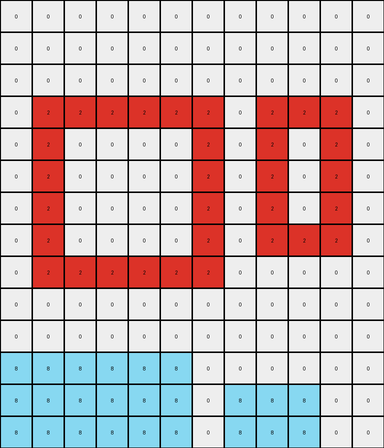

# AboveBelow7 • 009 • refine_dreamer

---


Previous Code:
```python
"""
The transformation involves identifying contiguous regions of azure (8) and red (2) pixels. The azure regions are moved downwards, with the top-left azure region moving to the bottom-left and the top-center azure region moving to the bottom-right. The red region remains stationary.
"""

import numpy as np

def find_objects(grid, color):
    """
    Finds contiguous regions of a specified color in the grid.
    Returns a list of coordinates (row, col) for each object.
    """
    visited = set()
    objects = []

    def dfs(row, col, current_object):
        if (row, col) in visited or row < 0 or row >= grid.shape[0] or col < 0 or col >= grid.shape[1] or grid[row, col] != color:
            return
        visited.add((row, col))
        current_object.append((row, col))
        dfs(row + 1, col, current_object)
        dfs(row - 1, col, current_object)
        dfs(row, col + 1, current_object)
        dfs(row, col - 1, current_object)

    for row in range(grid.shape[0]):
        for col in range(grid.shape[1]):
            if grid[row, col] == color and (row, col) not in visited:
                current_object = []
                dfs(row, col, current_object)
                objects.append(current_object)
    return objects

def transform(input_grid):
    # Initialize output_grid as a copy of the input_grid
    output_grid = np.copy(input_grid)

    # Find azure (8) objects
    azure_objects = find_objects(input_grid, 8)

    # Find red (2) object
    red_object = find_objects(input_grid, 2)

    # Clear initial positions of azure objects in the output grid
    for obj in azure_objects:
        for row, col in obj:
            output_grid[row, col] = 0

    # determine destination row
    dest_row = input_grid.shape[0] - 1

    # Move the first azure object (top-left) to the bottom-left
    if len(azure_objects) > 0 :
      obj1 = azure_objects[0]
      obj1_height = max(row for row, _ in obj1) - min(row for row, _ in obj1) + 1
      obj1_width = max(col for _, col in obj1) - min(col for _, col in obj1) + 1
      
      start_row = dest_row - obj1_height + 1
      start_col = 0
      for i in range(obj1_height) :
        for j in range(obj1_width) :
          output_grid[start_row + i, start_col + j] = 8

    # Move the second azure object (top-middle) to the bottom-right
    if len(azure_objects) > 1:
        obj2 = azure_objects[1]
        obj2_height = max(row for row, _ in obj2) - min(row for row, _ in obj2) + 1
        obj2_width = max(col for _, col in obj2) - min(col for _, col in obj2) + 1
        
        start_row = dest_row - obj2_height + 1
        start_col = input_grid.shape[1] - obj2_width - 2 # approximate location
        for i in range(obj2_height) :
          for j in range(obj2_width) :
            output_grid[start_row + i, start_col + j] = 8

    # Keep the red region unchanged (already in place due to copy)

    return output_grid
```

Train Set Results:

## Example 1:

Input:
```
0 0 0 0 0 0 0 0 0 0 0 0 0 0 0
0 0 0 0 0 0 0 0 0 0 0 0 0 0 0
0 0 0 0 0 0 0 0 0 0 0 0 0 0 0
0 0 0 0 4 4 4 4 4 4 4 4 0 0 0
0 0 0 0 3 3 3 3 3 3 3 3 0 0 0
0 0 0 0 3 0 0 0 0 0 0 3 0 0 0
0 0 0 0 3 0 0 0 0 0 0 3 0 0 0
0 0 0 0 3 0 0 0 0 0 0 3 0 0 0
0 0 0 0 3 3 3 3 3 3 3 3 0 0 0
0 0 0 0 0 0 0 0 0 0 0 0 0 0 0
```
Expected Output:
```
0 0 0 0 0 0 0 0 0 0 0 0 0 0 0
0 0 0 0 0 0 0 0 0 0 0 0 0 0 0
0 0 0 0 0 0 0 0 0 0 0 0 0 0 0
0 0 0 0 0 0 0 0 0 0 0 0 0 0 0
0 0 0 0 3 3 3 3 3 3 3 3 0 0 0
0 0 0 0 3 0 0 0 0 0 0 3 0 0 0
0 0 0 0 3 0 0 0 0 0 0 3 0 0 0
0 0 0 0 3 0 0 0 0 0 0 3 0 0 0
0 0 0 0 3 3 3 3 3 3 3 3 0 0 0
0 0 0 0 4 4 4 4 4 4 4 4 0 0 0
```
Transformed Output:
```
0 0 0 0 0 0 0 0 0 0 0 0 0 0 0
0 0 0 0 0 0 0 0 0 0 0 0 0 0 0
0 0 0 0 0 0 0 0 0 0 0 0 0 0 0
0 0 0 0 4 4 4 4 4 4 4 4 0 0 0
0 0 0 0 3 3 3 3 3 3 3 3 0 0 0
0 0 0 0 3 0 0 0 0 0 0 3 0 0 0
0 0 0 0 3 0 0 0 0 0 0 3 0 0 0
0 0 0 0 3 0 0 0 0 0 0 3 0 0 0
0 0 0 0 3 3 3 3 3 3 3 3 0 0 0
0 0 0 0 0 0 0 0 0 0 0 0 0 0 0
```

match: False
pixels_off: 16
size_correct: True
color_palette_correct: True
correct_pixel_counts: True

## Example 2:

Input:
```
0 0 0 8 8 0 0 0 0 0 0 0
0 0 8 8 8 8 0 0 0 8 0 0
0 8 8 8 8 8 8 0 8 8 8 0
0 2 2 2 2 2 2 0 2 2 2 0
0 2 0 0 0 0 2 0 2 0 2 0
0 2 0 0 0 0 2 0 2 0 2 0
0 2 0 0 0 0 2 0 2 0 2 0
0 2 0 0 0 0 2 0 2 2 2 0
0 2 2 2 2 2 2 0 0 0 0 0
0 0 0 0 0 0 0 0 0 0 0 0
0 0 0 0 0 0 0 0 0 0 0 0
0 0 0 0 0 0 0 0 0 0 0 0
0 0 0 0 0 0 0 0 0 0 0 0
0 0 0 0 0 0 0 0 0 0 0 0
```
Expected Output:
```
0 0 0 0 0 0 0 0 0 0 0 0
0 0 0 0 0 0 0 0 0 0 0 0
0 0 0 0 0 0 0 0 0 0 0 0
0 2 2 2 2 2 2 0 2 2 2 0
0 2 0 0 0 0 2 0 2 0 2 0
0 2 0 0 0 0 2 0 2 0 2 0
0 2 0 0 0 0 2 0 2 0 2 0
0 2 0 0 0 0 2 0 2 2 2 0
0 2 2 2 2 2 2 0 0 8 0 0
0 0 0 8 8 0 0 0 8 8 8 0
0 0 8 8 8 8 0 0 0 0 0 0
0 8 8 8 8 8 8 0 0 0 0 0
0 0 0 0 0 0 0 0 0 0 0 0
0 0 0 0 0 0 0 0 0 0 0 0
```
Transformed Output:
```
0 0 0 0 0 0 0 0 0 0 0 0
0 0 0 0 0 0 0 0 0 0 0 0
0 0 0 0 0 0 0 0 0 0 0 0
0 2 2 2 2 2 2 0 2 2 2 0
0 2 0 0 0 0 2 0 2 0 2 0
0 2 0 0 0 0 2 0 2 0 2 0
0 2 0 0 0 0 2 0 2 0 2 0
0 2 0 0 0 0 2 0 2 2 2 0
0 2 2 2 2 2 2 0 0 0 0 0
0 0 0 0 0 0 0 0 0 0 0 0
0 0 0 0 0 0 0 0 0 0 0 0
8 8 8 8 8 8 0 0 0 0 0 0
8 8 8 8 8 8 0 8 8 8 0 0
8 8 8 8 8 8 0 8 8 8 0 0
```

match: False
pixels_off: 30
size_correct: True
color_palette_correct: True
correct_pixel_counts: False

**INSTRUCTIONS**

The code above was generated based on observations from the first training
example

we have tested the transform function on each of the task example inputs and
compared with the expected output

review each of the examples provided and the results and consider how the
natural language program should be updated to accommodate this new knowledge

respond with the following deliverables:

- general assessment of the information provided and strategy for resolving the
  errors
- gather metrics about each of the examples and results - use code_execution to
  develop accurate reports on your assumptions
- a YAML block documenting facts - Focus on identifying objects, their properties, and the actions performed on them.
- a natural language program - Be as clear and concise as possible, providing a complete description of the transformation rule.


your responses should be considered as information in a report - not a
conversation
