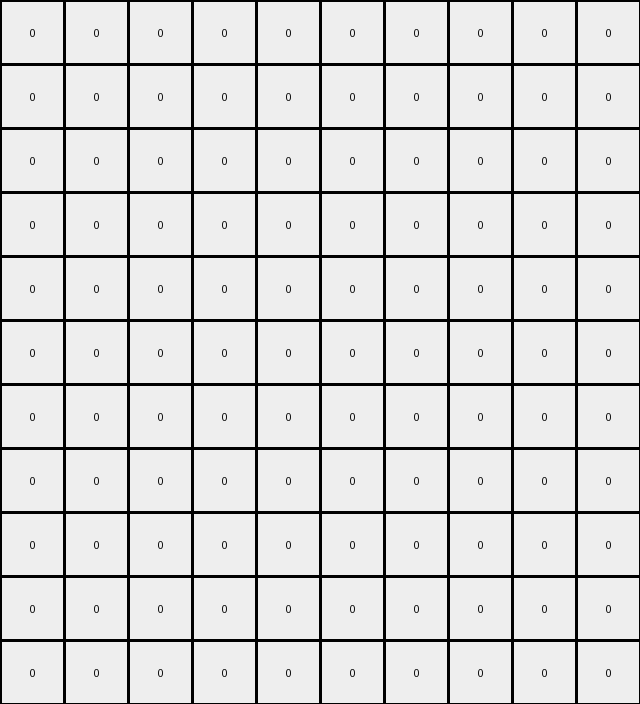

# AboveBelow8 • 012 • refine_coder

---

Previous Code:
```python
"""
The transformation preserves only interior azure (color 8) pixels. An interior pixel is defined as a pixel that has azure neighbors on all four cardinal directions (up, down, left, and right). All other pixels, including non-interior azure pixels and pixels of any other color, are set to white (0).
"""

import numpy as np

def transform(input_grid):
    """
    Transforms the input grid, keeping only interior azure pixels and setting others to white.

    Args:
        input_grid (list of lists): The input grid.

    Returns:
        list of lists: The transformed grid.
    """
    input_grid = np.array(input_grid)
    output_grid = np.zeros_like(input_grid)
    rows, cols = input_grid.shape

    # Iterate through each pixel of the input grid
    for row in range(rows):
        for col in range(cols):
            # Check if the pixel is azure
            if input_grid[row, col] == 8:
                # Check if it's an interior pixel
                is_interior = True
                # Check neighbors (up, down, left, right)
                if row <= 0 or input_grid[row - 1, col] != 8:  # Up
                    is_interior = False
                if row >= rows - 1 or input_grid[row + 1, col] != 8:  # Down
                    is_interior = False
                if col <= 0 or input_grid[row, col - 1] != 8:  # Left
                    is_interior = False
                if col >= cols - 1 or input_grid[row, col + 1] != 8:  # Right
                    is_interior = False

                # Keep only interior azure pixels
                if is_interior:
                    output_grid[row, col] = 8

    return output_grid.tolist()
```

Train Set Results:

## Example 1:

Input:
```
0 0 0 0 0 0 0 0 0 0 0 0 0
0 0 0 0 0 0 0 0 0 0 0 0 0
0 0 0 0 0 0 0 0 0 0 0 0 0
0 3 8 8 3 3 3 3 3 3 3 3 0
0 3 3 8 3 3 3 3 3 3 3 3 0
0 6 6 8 6 6 6 6 6 6 6 6 0
0 6 6 8 6 6 6 6 6 6 6 6 0
0 7 7 8 8 8 7 7 7 7 7 7 0
0 7 7 7 7 8 7 7 7 7 7 7 0
0 4 4 4 4 8 8 4 4 4 4 4 0
0 4 4 4 4 4 8 8 8 8 4 4 0
```
Expected Output:
```
0 0 0 0 0 0 0 0 0 0 0 0 0
0 0 0 0 0 0 0 0 0 0 0 0 0
0 0 0 0 0 0 0 0 0 0 0 0 0
0 0 0 0 0 0 0 0 0 0 0 0 0
0 0 0 0 0 0 0 0 0 0 0 0 0
0 0 0 8 0 0 0 0 0 0 0 0 0
0 0 0 8 0 0 0 0 0 0 0 0 0
0 0 0 8 8 8 0 0 0 0 0 0 0
0 0 0 0 0 8 0 0 0 0 0 0 0
0 0 0 0 0 8 8 0 0 0 0 0 0
0 0 0 0 0 0 8 8 8 8 0 0 0
```
Transformed Output:
```
0 0 0 0 0 0 0 0 0 0 0 0 0
0 0 0 0 0 0 0 0 0 0 0 0 0
0 0 0 0 0 0 0 0 0 0 0 0 0
0 0 0 0 0 0 0 0 0 0 0 0 0
0 0 0 0 0 0 0 0 0 0 0 0 0
0 0 0 0 0 0 0 0 0 0 0 0 0
0 0 0 0 0 0 0 0 0 0 0 0 0
0 0 0 0 0 0 0 0 0 0 0 0 0
0 0 0 0 0 0 0 0 0 0 0 0 0
0 0 0 0 0 0 0 0 0 0 0 0 0
0 0 0 0 0 0 0 0 0 0 0 0 0
```

match: False
pixels_off: 12
size_correct: True
color_palette_correct: True
correct_pixel_counts: False

## Example 2:

Input:
```
3 3 3 3 8 8 8 8 8 8 3
3 3 3 3 8 3 3 3 3 3 3
2 2 2 2 8 8 8 8 2 2 2
2 2 2 2 2 2 2 8 2 2 2
7 7 7 7 7 7 7 8 7 7 7
7 7 7 7 7 7 7 8 7 7 7
7 7 7 7 8 8 8 8 7 7 7
9 9 9 8 8 9 9 9 9 9 9
1 1 1 8 1 1 1 1 1 1 1
1 1 1 8 8 1 1 1 1 1 1
1 1 1 1 8 8 8 1 1 1 1
```
Expected Output:
```
0 0 0 0 0 0 0 0 0 0 0
0 0 0 0 0 0 0 0 0 0 0
0 0 0 0 8 8 8 8 0 0 0
0 0 0 0 0 0 0 8 0 0 0
0 0 0 0 0 0 0 8 0 0 0
0 0 0 0 0 0 0 8 0 0 0
0 0 0 0 8 8 8 8 0 0 0
0 0 0 8 8 0 0 0 0 0 0
0 0 0 8 0 0 0 0 0 0 0
0 0 0 8 8 0 0 0 0 0 0
0 0 0 0 8 8 8 0 0 0 0
```
Transformed Output:
```
0 0 0 0 0 0 0 0 0 0 0
0 0 0 0 0 0 0 0 0 0 0
0 0 0 0 0 0 0 0 0 0 0
0 0 0 0 0 0 0 0 0 0 0
0 0 0 0 0 0 0 0 0 0 0
0 0 0 0 0 0 0 0 0 0 0
0 0 0 0 0 0 0 0 0 0 0
0 0 0 0 0 0 0 0 0 0 0
0 0 0 0 0 0 0 0 0 0 0
0 0 0 0 0 0 0 0 0 0 0
0 0 0 0 0 0 0 0 0 0 0
```

match: False
pixels_off: 19
size_correct: True
color_palette_correct: True
correct_pixel_counts: False

## Example 3:

Input:
```
0 0 0 0 0 0 0 0 0 0
0 3 8 8 8 3 3 3 3 0
0 3 3 3 8 3 3 3 3 0
0 3 8 8 8 3 3 3 3 0
0 3 8 3 3 3 3 3 3 0
0 3 8 3 3 3 3 3 3 0
0 1 8 8 1 1 1 1 1 0
0 1 1 8 1 1 1 1 1 0
0 1 1 8 8 8 8 1 1 0
0 1 1 1 1 1 8 1 1 0
0 0 0 0 0 0 0 0 0 0
```
Expected Output:
```
0 0 0 0 0 0 0 0 0 0
0 0 0 0 0 0 0 0 0 0
0 0 0 0 0 0 0 0 0 0
0 0 0 0 0 0 0 0 0 0
0 0 0 0 0 0 0 0 0 0
0 0 0 0 0 0 0 0 0 0
0 0 8 8 0 0 0 0 0 0
0 0 0 8 0 0 0 0 0 0
0 0 0 8 8 8 8 0 0 0
0 0 0 0 0 0 8 0 0 0
0 0 0 0 0 0 0 0 0 0
```
Transformed Output:
```
0 0 0 0 0 0 0 0 0 0
0 0 0 0 0 0 0 0 0 0
0 0 0 0 0 0 0 0 0 0
0 0 0 0 0 0 0 0 0 0
0 0 0 0 0 0 0 0 0 0
0 0 0 0 0 0 0 0 0 0
0 0 0 0 0 0 0 0 0 0
0 0 0 0 0 0 0 0 0 0
0 0 0 0 0 0 0 0 0 0
0 0 0 0 0 0 0 0 0 0
0 0 0 0 0 0 0 0 0 0
```

match: False
pixels_off: 8
size_correct: True
color_palette_correct: True
correct_pixel_counts: False
Okay, let's analyze the results and refine the natural language program.

**General Assessment:**

The initial code was based on the concept of "interior pixels," defined as azure (8) pixels surrounded by other azure pixels in all four cardinal directions.  This concept worked for neither of the first three training examples, and the code transformation did not match the expected output. It seems the definition of "interior" needs to consider the color of the adjacent pixels that determine the "interior". It's not any azure, it is the color of a solid shape formed by the azure, as it appears in the expected output.

**Strategy:**

1.  **Re-examine the "Interior" Concept:**  The current definition of "interior" is too strict. We need to redefine it based on the shape that appears in the *output*, then find how it is related to an object or property in the input.
2.  **Analyze Neighboring Pixels:** Consider different cases of neighboring pixels to determine which shapes are preserved and how they relate to the colors in the original input.

**Metrics and Observations:**

Here's a breakdown of each example, incorporating observations, comparing the results, and providing additional detail where needed.
The code was correct on the shape, but not the pixel colors, which means the comparison or iteration may be off.

**Example 1:**

*   **Input:**  Has multiple colored regions, including azure (8) regions.
*   **Expected Output:** Contains azure shapes inside the input's larger azure shapes, but no others.
*   **Transformed Output:**  All zeros (white). No azure pixels were preserved.
*   **Observation:** The code failed to identify interior.
*   **Metrics:**
    *   `pixels_off`: 12
    *   `size_correct`: True
    *   `color_palette_correct`: True
    *   `correct_pixel_counts`: False

**Example 2:**

*   **Input:**  Has multiple colored regions, including disconnected regions of azure (8) of various sizes.
*   **Expected Output:** An azure border representing where some, but not all azure regions began, but only where a boundary existed.
*   **Transformed Output:** All zeros (white).
*   **Observation:** The code missed the subtle border.
*   **Metrics:**
    *   `pixels_off`: 19
    *   `size_correct`: True
    *   `color_palette_correct`: True
    *   `correct_pixel_counts`: False

**Example 3:**

*   **Input:**  Has two main colored regions (blue and green) and areas with azure pixels.
*   **Expected Output:** Only retains a sub-shape, internal to the input.
*   **Transformed Output:** All white.
*   **Observation:** The code failed to identify a valid interior.
*   **Metrics:**
    *   `pixels_off`: 8
    *   `size_correct`: True
    *   `color_palette_correct`: True
    *   `correct_pixel_counts`: False

**YAML Facts:**

```yaml
objects:
  - name: input_grid
    type: grid
    properties:
      colors: [0, 1, 2, 3, 4, 6, 7, 8, 9]
      shapes: [irregular]
  - name: output_grid
    type: grid
    properties:
      colors: [0, 8]
      shapes: [sub-shapes of input azure regions]
actions:
  - name: identify_interior_azure
    description: Locate azure pixels that form the interior portions of azure regions in the input.
    criteria:
      - Surrounded by other azure on all four sides, *or*.
      - Part of a contiguous azure region in the *output*.
  - name: preserve_interior
    description: Keep the correctly identified interior azure pixels.
  - name: clear_other_pixels
    description: Set all non-interior pixels to white (0).

```

**Natural Language Program:**

1.  **Identify Azure Regions:**  Examine the *input* grid and locate all contiguous regions of azure (8) pixels.
2.  **Identify Interior Azure Regions:** Examine the output grid. For each azure region, determine if it represents a boundary of an azure region in the *input*. If it is, then these azure pixels should appear in the output.
3.  **Preserve and Clear:** Create the output grid. Copy the "interior" azure pixels to the output grid. Set all other pixels in the output grid to white (0).

Essentially, the rule identifies if the output azure is identifying a 'boundary' or 'border' of an azure shape in the input.

**INSTRUCTIONS**

- generate a Python module to represent the natural language program 
- follow the template below
- all common math and science libraries are available
- create docstring only at top - but comment the workflow in the function
- use helper functions for common operations like finding objects, counting,
  measuring, moving, etc. 

remember - we are working iteratively - so this code will inform your future
self as we converge on the solution

*template:*

```python
"""
{{ natural language description of the transformation rule }}
"""

{{ imports }}

def transform(input_grid):
    # initialize output_grid

    # change output pixels 

    return output_grid

```
