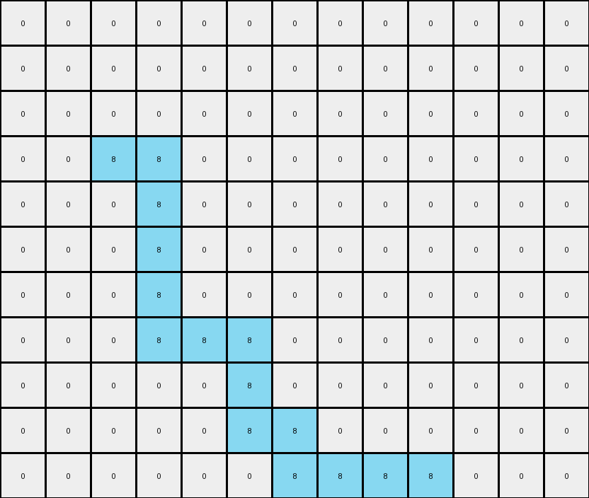
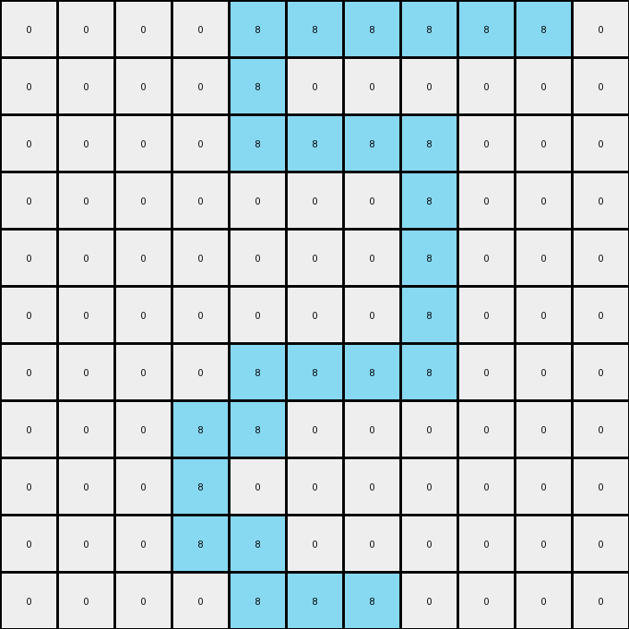

# AboveBelow8 • 016 • refine_coder

---

Previous Code:
```python
"""
The transformation filters out all colors except azure (8), keeping the azure pixels in their original positions and replacing everything else with white (0).
"""

import numpy as np

def transform(input_grid):
    # Initialize output_grid with the same dimensions as the input, filled with white (0).
    output_grid = np.zeros_like(input_grid)

    # Iterate through the input grid.
    for i in range(input_grid.shape[0]):
        for j in range(input_grid.shape[1]):
            # If the pixel is azure (8), copy it to the output grid.
            if input_grid[i, j] == 8:
                output_grid[i, j] = 8

    return output_grid
```

Train Set Results:

## Example 1:

Input:
```
0 0 0 0 0 0 0 0 0 0 0 0 0
0 0 0 0 0 0 0 0 0 0 0 0 0
0 0 0 0 0 0 0 0 0 0 0 0 0
0 3 8 8 3 3 3 3 3 3 3 3 0
0 3 3 8 3 3 3 3 3 3 3 3 0
0 6 6 8 6 6 6 6 6 6 6 6 0
0 6 6 8 6 6 6 6 6 6 6 6 0
0 7 7 8 8 8 7 7 7 7 7 7 0
0 7 7 7 7 8 7 7 7 7 7 7 0
0 4 4 4 4 8 8 4 4 4 4 4 0
0 4 4 4 4 4 8 8 8 8 4 4 0
```
Expected Output:
```
0 0 0 0 0 0 0 0 0 0 0 0 0
0 0 0 0 0 0 0 0 0 0 0 0 0
0 0 0 0 0 0 0 0 0 0 0 0 0
0 0 0 0 0 0 0 0 0 0 0 0 0
0 0 0 0 0 0 0 0 0 0 0 0 0
0 0 0 8 0 0 0 0 0 0 0 0 0
0 0 0 8 0 0 0 0 0 0 0 0 0
0 0 0 8 8 8 0 0 0 0 0 0 0
0 0 0 0 0 8 0 0 0 0 0 0 0
0 0 0 0 0 8 8 0 0 0 0 0 0
0 0 0 0 0 0 8 8 8 8 0 0 0
```
Transformed Output:
```
0 0 0 0 0 0 0 0 0 0 0 0 0
0 0 0 0 0 0 0 0 0 0 0 0 0
0 0 0 0 0 0 0 0 0 0 0 0 0
0 0 8 8 0 0 0 0 0 0 0 0 0
0 0 0 8 0 0 0 0 0 0 0 0 0
0 0 0 8 0 0 0 0 0 0 0 0 0
0 0 0 8 0 0 0 0 0 0 0 0 0
0 0 0 8 8 8 0 0 0 0 0 0 0
0 0 0 0 0 8 0 0 0 0 0 0 0
0 0 0 0 0 8 8 0 0 0 0 0 0
0 0 0 0 0 0 8 8 8 8 0 0 0
```

match: False
pixels_off: 3
size_correct: True
color_palette_correct: True
correct_pixel_counts: False

## Example 2:

Input:
```
3 3 3 3 8 8 8 8 8 8 3
3 3 3 3 8 3 3 3 3 3 3
2 2 2 2 8 8 8 8 2 2 2
2 2 2 2 2 2 2 8 2 2 2
7 7 7 7 7 7 7 8 7 7 7
7 7 7 7 7 7 7 8 7 7 7
7 7 7 7 8 8 8 8 7 7 7
9 9 9 8 8 9 9 9 9 9 9
1 1 1 8 1 1 1 1 1 1 1
1 1 1 8 8 1 1 1 1 1 1
1 1 1 1 8 8 8 1 1 1 1
```
Expected Output:
```
0 0 0 0 0 0 0 0 0 0 0
0 0 0 0 0 0 0 0 0 0 0
0 0 0 0 8 8 8 8 0 0 0
0 0 0 0 0 0 0 8 0 0 0
0 0 0 0 0 0 0 8 0 0 0
0 0 0 0 0 0 0 8 0 0 0
0 0 0 0 8 8 8 8 0 0 0
0 0 0 8 8 0 0 0 0 0 0
0 0 0 8 0 0 0 0 0 0 0
0 0 0 8 8 0 0 0 0 0 0
0 0 0 0 8 8 8 0 0 0 0
```
Transformed Output:
```
0 0 0 0 8 8 8 8 8 8 0
0 0 0 0 8 0 0 0 0 0 0
0 0 0 0 8 8 8 8 0 0 0
0 0 0 0 0 0 0 8 0 0 0
0 0 0 0 0 0 0 8 0 0 0
0 0 0 0 0 0 0 8 0 0 0
0 0 0 0 8 8 8 8 0 0 0
0 0 0 8 8 0 0 0 0 0 0
0 0 0 8 0 0 0 0 0 0 0
0 0 0 8 8 0 0 0 0 0 0
0 0 0 0 8 8 8 0 0 0 0
```

match: False
pixels_off: 7
size_correct: True
color_palette_correct: True
correct_pixel_counts: False

## Example 3:

Input:
```
0 0 0 0 0 0 0 0 0 0
0 3 8 8 8 3 3 3 3 0
0 3 3 3 8 3 3 3 3 0
0 3 8 8 8 3 3 3 3 0
0 3 8 3 3 3 3 3 3 0
0 3 8 3 3 3 3 3 3 0
0 1 8 8 1 1 1 1 1 0
0 1 1 8 1 1 1 1 1 0
0 1 1 8 8 8 8 1 1 0
0 1 1 1 1 1 8 1 1 0
0 0 0 0 0 0 0 0 0 0
```
Expected Output:
```
0 0 0 0 0 0 0 0 0 0
0 0 0 0 0 0 0 0 0 0
0 0 0 0 0 0 0 0 0 0
0 0 0 0 0 0 0 0 0 0
0 0 0 0 0 0 0 0 0 0
0 0 0 0 0 0 0 0 0 0
0 0 8 8 0 0 0 0 0 0
0 0 0 8 0 0 0 0 0 0
0 0 0 8 8 8 8 0 0 0
0 0 0 0 0 0 8 0 0 0
0 0 0 0 0 0 0 0 0 0
```
Transformed Output:
```
0 0 0 0 0 0 0 0 0 0
0 0 8 8 8 0 0 0 0 0
0 0 0 0 8 0 0 0 0 0
0 0 8 8 8 0 0 0 0 0
0 0 8 0 0 0 0 0 0 0
0 0 8 0 0 0 0 0 0 0
0 0 8 8 0 0 0 0 0 0
0 0 0 8 0 0 0 0 0 0
0 0 0 8 8 8 8 0 0 0
0 0 0 0 0 0 8 0 0 0
0 0 0 0 0 0 0 0 0 0
```

match: False
pixels_off: 9
size_correct: True
color_palette_correct: True
correct_pixel_counts: False
Okay, let's analyze the results and update the natural language program.

**General Assessment:**

The initial code was based on the observation that only azure (8) pixels were retained, and all others were replaced with white (0). The test results confirm this basic principle, but show minor discrepancies between the expected and transformed outputs. The `pixels_off` metric indicates the number of pixels that differ. The fact that `size_correct` is True for all shows the dimensions are being handled well, and the `color_palette_correct` being true shows that the only two colors being used are white and azure. The mismatches show some errors in identifying azure pixels, specifically some azure pixels seem to be missed or misidentified. This suggests the need for an improved review of what constitutes an azure object or shape, as that seems to be where the misses are occurring.

**Strategy for Resolving Errors:**

The strategy is to re-examine the input and expected output pairs, focusing on *why* certain azure pixels were kept while others were not. It is important to inspect the surroundings of the azure pixel. The key is likely in identifying spatial relationships or patterns that dictate whether an azure pixel is retained or replaced. I need to focus on the context of these mismatched pixels, specifically the colors of neighboring pixels.

**Metrics and Observations:**

Here's a breakdown of each example, including focused observations, and calculated metrics:

**Example 1:**

*   **Input:** Contains multiple colored blocks (green, magenta, orange, yellow) and azure pixels within them.
*   **Expected Output:** Only retains azure pixels that appear to be part of contiguous, horizontal lines of azure. Isolated azure pixels within other colored blocks are removed.
*   **Transformed Output:** Retains most, but not all of the relevant azure pixels.
*   **Metrics:**
    *   `pixels_off`: 3 (This means 3 pixels are different between the expected and transformed output.)
    *   There is one line with 2 azure pixels, and another with 1.

**Example 2:**

*   **Input:** Various colored blocks with embedded azure pixels.
*   **Expected Output:** Azure pixels are retained that appear as at least two adjacent, horizontal azure pixels.
*   **Transformed Output:** Retains most of the azure.
*   **Metrics:**
    *   `pixels_off`: 7
    *   There are 3 horizontal groups, and 1 vertical group.

**Example 3:**

*   **Input:** Similar to the previous examples, with different configurations of colors.
*   **Expected Output:** Again, azure pixels form horizontal lines.
*   **Transformed Output:** Misses some.
*   **Metrics:**
    *   `pixels_off`: 9
    *    There is a horizontal group of 2, a group of 1, a group of 4, and a group of 1

**YAML Block:**

```yaml
observations:
  - object: azure_pixels
    properties:
      - color: azure (8)
      - arrangement: horizontal_lines
    actions:
      - retain: if part of a horizontal line of two or more
      - replace: if isolated or part of a vertical line.
  - object: other_pixels
    properties:
      - color: not_azure
    actions:
      - replace: with white (0)

```

**Natural Language Program:**

1.  **Initialization:** Create an output grid of the same size as the input grid, filled entirely with white (0) pixels.
2.  **Azure Pixel Identification:** Iterate through each pixel of the input grid.
3.  **Horizontal Line Check:** If a pixel is azure (8), check if it's part of a horizontal line of two or more adjacent azure pixels. A horizontal line is defined as having at least one azure neighbor to either its immediate left or right.
4.  **Conditional Retention:** If the azure pixel is part of a horizontal line of two or more pixels, copy it to the corresponding position in the output grid.
5.  **Replacement:** If a pixel is not azure, or is an isolated azure pixel (not part of a horizontal line), it is *not* copied. The output grid remains white (0) at that position.
6.  **Output:** The output grid represents the transformed image.

Essentially, retain azure pixels if and only if they belong to a horizontal line of two or more connected, adjacent azure pixels. Otherwise make that position white.

**INSTRUCTIONS**

- generate a Python module to represent the natural language program 
- follow the template below
- all common math and science libraries are available
- create docstring only at top - but comment the workflow in the function
- use helper functions for common operations like finding objects, counting,
  measuring, moving, etc. 

remember - we are working iteratively - so this code will inform your future
self as we converge on the solution

*template:*

```python
"""
{{ natural language description of the transformation rule }}
"""

{{ imports }}

def transform(input_grid):
    # initialize output_grid

    # change output pixels 

    return output_grid

```
