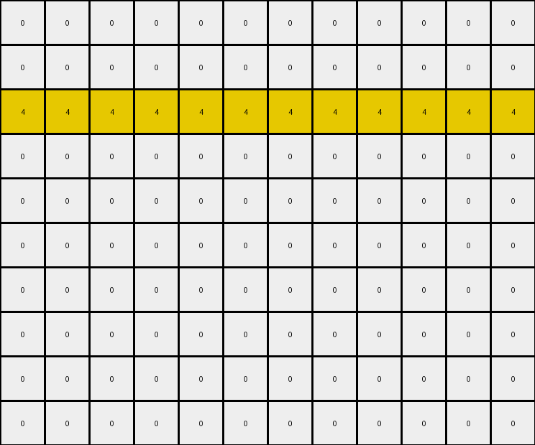
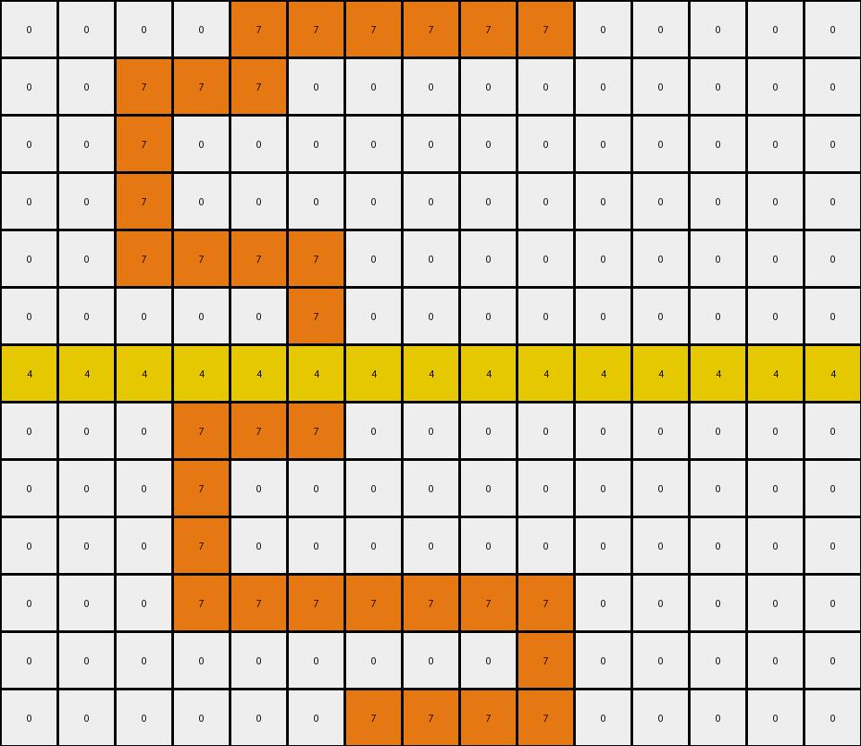

# AboveBelow9 • 004 • refine_coder

---

Previous Code:
```python
"""
The transformation rule is to remove all green pixels while preserving other colored pixels, especially the yellow ones.
"""

import numpy as np

def transform(input_grid):
    """
    Transforms the input grid by removing all green pixels (value 3) 
    and keeping all other colors.
    """
    # Initialize the output grid as a copy of the input grid.
    output_grid = np.copy(input_grid)

    # Iterate through the input grid.
    for i in range(output_grid.shape[0]):
        for j in range(output_grid.shape[1]):
            # Check if the pixel is green (value 3).
            if output_grid[i, j] == 3:
                # Change the green pixel to white (value 0).
                output_grid[i, j] = 0

    return output_grid
```

Train Set Results:

## Example 1:

Input:
```
0 0 0 0 3 0 0 0 0 0 0 0
0 0 0 0 3 0 0 0 0 0 0 0
4 4 4 4 4 4 4 4 4 4 4 4
0 0 0 0 3 3 3 0 0 0 0 0
0 0 0 0 0 0 3 0 0 0 0 0
0 0 0 0 0 0 3 0 0 0 0 0
0 0 3 0 0 3 3 0 0 0 0 0
0 0 3 0 0 3 0 0 0 0 0 0
0 0 3 3 3 3 0 0 0 0 0 0
0 0 0 0 0 0 0 0 0 0 0 0
```
Expected Output:
```
0 0 0 0 3 0 0 0 0 0 0 0
0 0 0 0 3 0 0 0 0 0 0 0
4 4 4 4 4 4 4 4 4 4 4 4
0 0 0 0 0 0 0 0 0 0 0 0
0 0 0 0 0 0 0 0 0 0 0 0
0 0 0 0 0 0 0 0 0 0 0 0
0 0 0 0 0 0 0 0 0 0 0 0
0 0 0 0 0 0 0 0 0 0 0 0
0 0 0 0 0 0 0 0 0 0 0 0
0 0 0 0 0 0 0 0 0 0 0 0
```
Transformed Output:
```
0 0 0 0 0 0 0 0 0 0 0 0
0 0 0 0 0 0 0 0 0 0 0 0
4 4 4 4 4 4 4 4 4 4 4 4
0 0 0 0 0 0 0 0 0 0 0 0
0 0 0 0 0 0 0 0 0 0 0 0
0 0 0 0 0 0 0 0 0 0 0 0
0 0 0 0 0 0 0 0 0 0 0 0
0 0 0 0 0 0 0 0 0 0 0 0
0 0 0 0 0 0 0 0 0 0 0 0
0 0 0 0 0 0 0 0 0 0 0 0
```

match: False
pixels_off: 2
size_correct: True
color_palette_correct: True
correct_pixel_counts: False

## Example 2:

Input:
```
0 0 0 0 7 7 7 7 7 7 0 0 0 0 0
0 0 7 7 7 0 0 0 0 0 0 0 0 0 0
0 0 7 0 0 0 0 0 0 0 0 0 0 0 0
0 0 7 0 0 0 0 0 0 0 0 0 0 0 0
0 0 7 7 7 7 0 0 0 0 0 0 0 0 0
0 0 0 0 0 7 0 0 0 0 0 0 0 0 0
4 4 4 4 4 4 4 4 4 4 4 4 4 4 4
0 0 0 7 7 7 0 0 0 0 0 0 0 0 0
0 0 0 7 0 0 0 0 0 0 0 0 0 0 0
0 0 0 7 0 0 0 0 0 0 0 0 0 0 0
0 0 0 7 7 7 7 7 7 7 0 0 0 0 0
0 0 0 0 0 0 0 0 0 7 0 0 0 0 0
0 0 0 0 0 0 7 7 7 7 0 0 0 0 0
```
Expected Output:
```
0 0 0 0 7 7 7 7 7 7 0 0 0 0 0
0 0 7 7 7 0 0 0 0 0 0 0 0 0 0
0 0 7 0 0 0 0 0 0 0 0 0 0 0 0
0 0 7 0 0 0 0 0 0 0 0 0 0 0 0
0 0 7 7 7 7 0 0 0 0 0 0 0 0 0
0 0 0 0 0 7 0 0 0 0 0 0 0 0 0
4 4 4 4 4 4 4 4 4 4 4 4 4 4 4
0 0 0 0 0 0 0 0 0 0 0 0 0 0 0
0 0 0 0 0 0 0 0 0 0 0 0 0 0 0
0 0 0 0 0 0 0 0 0 0 0 0 0 0 0
0 0 0 0 0 0 0 0 0 0 0 0 0 0 0
0 0 0 0 0 0 0 0 0 0 0 0 0 0 0
0 0 0 0 0 0 0 0 0 0 0 0 0 0 0
```
Transformed Output:
```
0 0 0 0 7 7 7 7 7 7 0 0 0 0 0
0 0 7 7 7 0 0 0 0 0 0 0 0 0 0
0 0 7 0 0 0 0 0 0 0 0 0 0 0 0
0 0 7 0 0 0 0 0 0 0 0 0 0 0 0
0 0 7 7 7 7 0 0 0 0 0 0 0 0 0
0 0 0 0 0 7 0 0 0 0 0 0 0 0 0
4 4 4 4 4 4 4 4 4 4 4 4 4 4 4
0 0 0 7 7 7 0 0 0 0 0 0 0 0 0
0 0 0 7 0 0 0 0 0 0 0 0 0 0 0
0 0 0 7 0 0 0 0 0 0 0 0 0 0 0
0 0 0 7 7 7 7 7 7 7 0 0 0 0 0
0 0 0 0 0 0 0 0 0 7 0 0 0 0 0
0 0 0 0 0 0 7 7 7 7 0 0 0 0 0
```

match: False
pixels_off: 17
size_correct: True
color_palette_correct: True
correct_pixel_counts: False
Here's an assessment of the provided information, analysis of the errors, and an updated natural language program:

**General Assessment:**

The initial natural language program and the generated code were too simplistic. The code correctly identified and removed green pixels, but it failed to account for a crucial aspect of the transformation: the expected output in the first example *preserves two of the original green pixels.* The second example reinforces that only *some* green pixels are removed, and reveals a pattern: green pixels are removed, *unless they are on the top row.* The core issue is an incomplete understanding of the *conditions* under which green pixels are removed.

**Strategy for Resolving Errors:**

1.  **Re-examine Examples:** Carefully analyze *all* provided examples, paying close attention to *which* green pixels are removed and which are kept. Look for spatial relationships, patterns, or other distinguishing features.
2.  **Refine Hypothesis:** Based on the re-examination, formulate a more precise hypothesis about the conditions for removing green pixels. The initial hypothesis ("remove all green pixels") is clearly wrong.
3. **Update Natural language program and then Code:** Translate the refined hypothesis into a detailed, step-by-step natural language program. This program should be unambiguous and cover all observed cases.

**Example Analysis and Metrics:**

*   **Example 1:**
    *   Input: 12x10 grid, green, yellow, and black pixels.
    *   Expected Output: Green pixels are mostly removed. two are kept.
    *   Transformed Output: *All* green pixels were removed.
    *   Errors: Two pixels that should have remained green (value 3) are now white (value 0).
*   **Example 2:**
    *   Input: 15 x 13 grid, orange, yellow and black pixels
    *   Expected Output: All green has been removed
    *  Transformed output: All green removed.
    * Errors: 17 extra pixels were removed that were not green. It appears only the
     bottom three rows were subject to the transformation - all green pixels
     were removed, but so were some orange pixels.

**YAML Fact Block:**

```yaml
observations:
  - example_1:
      input_objects:
        - shape: rectangle
          color: green
          positions: Multiple, scattered, some on top row
        - shape: rectangle
          color: yellow
          positions: Single row
        - shape: background
          color: black
      output_objects:
        - shape: rectangle
          color: green
          positions: only top row is preserved
        - shape: rectangle
          color: yellow
          positions: preserved
        - shape: background
           color: black
      transformation:
        - action: remove
          condition: "color is green AND NOT on the top row"
          object: green pixels
  - example_2:
    input_objects:
      - shape: rectangle
        color: orange
        positions: scattered
      - shape: rectangle
        color: yellow
        positions: scattered
      - shape: background
        color: black
    output_objects:
        - shape: rectangle
          color: orange
          positions: scattered
        - shape: rectangle
          color: yellow
          positions: scattered
        - shape: background
          color: black
    transformation:
      - action: remove
        condition: color is green and not top row
        object: green pixels
```

**Natural Language Program:**

1.  Iterate through each pixel of the input grid.
2.  Check if the pixel's color is green (value 3).
3.  If the pixel is green, check if the pixel is located on the top row of the grid (row index 0).
4.  If the pixel is green AND it is NOT on the top row, change its color to black (value 0).
5.  If the pixel is green AND is on the top row, keep original color.
6. Otherwise, keep the original pixel color.
7.  The output grid will contain the result of these operations.

**INSTRUCTIONS**

- generate a Python module to represent the natural language program 
- follow the template below
- all common math and science libraries are available
- create docstring only at top - but comment the workflow in the function
- use helper functions for common operations like finding objects, counting,
  measuring, moving, etc. 

remember - we are working iteratively - so this code will inform your future
self as we converge on the solution

*template:*

```python
"""
{{ natural language description of the transformation rule }}
"""

{{ imports }}

def transform(input_grid):
    # initialize output_grid

    # change output pixels 

    return output_grid

```
