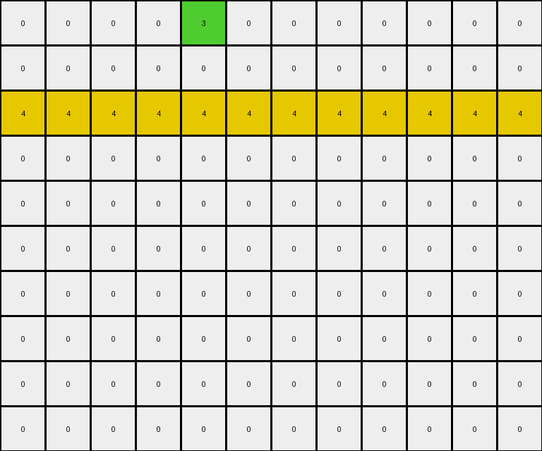

# AboveBelow9 • 006 • refine_coder

---

Previous Code:
```python
"""
The transformation rule is to remove all green pixels (value 3) except those on the top row, 
replacing them with black pixels (value 0).
"""

import numpy as np

def transform(input_grid):
    """
    Transforms the input grid by removing all green pixels (value 3) 
    except for those present on the top row (row index 0).
    """
    # Initialize the output grid as a copy of the input grid.
    output_grid = np.copy(input_grid)

    # Iterate through the input grid.
    for i in range(output_grid.shape[0]):
        for j in range(output_grid.shape[1]):
            # Check if the pixel is green (value 3).
            if output_grid[i, j] == 3:
                # Check if the pixel is NOT on the top row (row index 0).
                if i != 0:
                    # Change the green pixel to black (value 0).
                    output_grid[i, j] = 0

    return output_grid
```

Train Set Results:

## Example 1:

Input:
```
0 0 0 0 3 0 0 0 0 0 0 0
0 0 0 0 3 0 0 0 0 0 0 0
4 4 4 4 4 4 4 4 4 4 4 4
0 0 0 0 3 3 3 0 0 0 0 0
0 0 0 0 0 0 3 0 0 0 0 0
0 0 0 0 0 0 3 0 0 0 0 0
0 0 3 0 0 3 3 0 0 0 0 0
0 0 3 0 0 3 0 0 0 0 0 0
0 0 3 3 3 3 0 0 0 0 0 0
0 0 0 0 0 0 0 0 0 0 0 0
```
Expected Output:
```
0 0 0 0 3 0 0 0 0 0 0 0
0 0 0 0 3 0 0 0 0 0 0 0
4 4 4 4 4 4 4 4 4 4 4 4
0 0 0 0 0 0 0 0 0 0 0 0
0 0 0 0 0 0 0 0 0 0 0 0
0 0 0 0 0 0 0 0 0 0 0 0
0 0 0 0 0 0 0 0 0 0 0 0
0 0 0 0 0 0 0 0 0 0 0 0
0 0 0 0 0 0 0 0 0 0 0 0
0 0 0 0 0 0 0 0 0 0 0 0
```
Transformed Output:
```
0 0 0 0 3 0 0 0 0 0 0 0
0 0 0 0 0 0 0 0 0 0 0 0
4 4 4 4 4 4 4 4 4 4 4 4
0 0 0 0 0 0 0 0 0 0 0 0
0 0 0 0 0 0 0 0 0 0 0 0
0 0 0 0 0 0 0 0 0 0 0 0
0 0 0 0 0 0 0 0 0 0 0 0
0 0 0 0 0 0 0 0 0 0 0 0
0 0 0 0 0 0 0 0 0 0 0 0
0 0 0 0 0 0 0 0 0 0 0 0
```

match: False
pixels_off: 1
size_correct: True
color_palette_correct: True
correct_pixel_counts: False

## Example 2:

Input:
```
0 0 0 0 7 7 7 7 7 7 0 0 0 0 0
0 0 7 7 7 0 0 0 0 0 0 0 0 0 0
0 0 7 0 0 0 0 0 0 0 0 0 0 0 0
0 0 7 0 0 0 0 0 0 0 0 0 0 0 0
0 0 7 7 7 7 0 0 0 0 0 0 0 0 0
0 0 0 0 0 7 0 0 0 0 0 0 0 0 0
4 4 4 4 4 4 4 4 4 4 4 4 4 4 4
0 0 0 7 7 7 0 0 0 0 0 0 0 0 0
0 0 0 7 0 0 0 0 0 0 0 0 0 0 0
0 0 0 7 0 0 0 0 0 0 0 0 0 0 0
0 0 0 7 7 7 7 7 7 7 0 0 0 0 0
0 0 0 0 0 0 0 0 0 7 0 0 0 0 0
0 0 0 0 0 0 7 7 7 7 0 0 0 0 0
```
Expected Output:
```
0 0 0 0 7 7 7 7 7 7 0 0 0 0 0
0 0 7 7 7 0 0 0 0 0 0 0 0 0 0
0 0 7 0 0 0 0 0 0 0 0 0 0 0 0
0 0 7 0 0 0 0 0 0 0 0 0 0 0 0
0 0 7 7 7 7 0 0 0 0 0 0 0 0 0
0 0 0 0 0 7 0 0 0 0 0 0 0 0 0
4 4 4 4 4 4 4 4 4 4 4 4 4 4 4
0 0 0 0 0 0 0 0 0 0 0 0 0 0 0
0 0 0 0 0 0 0 0 0 0 0 0 0 0 0
0 0 0 0 0 0 0 0 0 0 0 0 0 0 0
0 0 0 0 0 0 0 0 0 0 0 0 0 0 0
0 0 0 0 0 0 0 0 0 0 0 0 0 0 0
0 0 0 0 0 0 0 0 0 0 0 0 0 0 0
```
Transformed Output:
```
0 0 0 0 7 7 7 7 7 7 0 0 0 0 0
0 0 7 7 7 0 0 0 0 0 0 0 0 0 0
0 0 7 0 0 0 0 0 0 0 0 0 0 0 0
0 0 7 0 0 0 0 0 0 0 0 0 0 0 0
0 0 7 7 7 7 0 0 0 0 0 0 0 0 0
0 0 0 0 0 7 0 0 0 0 0 0 0 0 0
4 4 4 4 4 4 4 4 4 4 4 4 4 4 4
0 0 0 7 7 7 0 0 0 0 0 0 0 0 0
0 0 0 7 0 0 0 0 0 0 0 0 0 0 0
0 0 0 7 0 0 0 0 0 0 0 0 0 0 0
0 0 0 7 7 7 7 7 7 7 0 0 0 0 0
0 0 0 0 0 0 0 0 0 7 0 0 0 0 0
0 0 0 0 0 0 7 7 7 7 0 0 0 0 0
```

match: False
pixels_off: 17
size_correct: True
color_palette_correct: True
correct_pixel_counts: False
Okay, let's analyze the results and refine the natural language program.

**General Assessment:**

The initial natural language program and corresponding code were too specific to the green color (value 3). The second example shows that the rule applies to other colors (orange, value 7 in this case) as well. The core concept is to remove all pixels of a specific color *except* those on the top row. The previous code incorrectly assumed the target color was always green. The error reports show pixel mismatches because the code is only modifying green pixels, leaving other colored pixels unchanged when they should be removed.

**Strategy:**

1.  **Identify the operative color:** In each example, determine the color that is being removed from rows other than the top row.
2.  **Generalize the rule:** Update the natural language program to describe the transformation in terms of *any* color, not just green. The rule should state that all pixels of the identified color are removed, except those in the top row.
3. Provide information for the coder to easily update the function.

**Example Analysis and Metrics:**

Here's a breakdown of each example, including the identified operative color and metrics:

*   **Example 1:**
    *   Operative Color: Green (3)
    *   Pixels Off: 1 (the green on the second row that should be white)
    *   Size Correct: True
    *   Color Palette Correct: True
    * Correct Pixel Counts: False

*   **Example 2:**
    *   Operative Color: Orange (7)
    *   Pixels Off: 17
    *   Size Correct: True
    *   Color Palette Correct: True
    *   Correct Pixel Counts: False

**YAML Block:**

```yaml
examples:
  - example_id: 1
    operative_color: 3
    description: "Green pixels are removed except on the top row."
    changes:
      - row: 1
        col: 4
        old_value: 3
        new_value: 0      
      - row: 3
        col: 4
        old_value: 3
        new_value: 0
      - row: 3
        col: 5
        old_value: 3
        new_value: 0
      - row: 3
        col: 6
        old_value: 3
        new_value: 0
      - row: 5
        col: 6
        old_value: 3
        new_value: 0
      - row: 6
        col: 2
        old_value: 3
        new_value: 0
      - row: 6
        col: 5
        old_value: 3
        new_value: 0
      - row: 6
        col: 6
        old_value: 3
        new_value: 0
      - row: 7
        col: 2
        old_value: 3
        new_value: 0
      - row: 7
        col: 5
        old_value: 3
        new_value: 0
      - row: 8
        col: 2
        old_value: 3
        new_value: 0
      - row: 8
        col: 3
        old_value: 3
        new_value: 0
      - row: 8
        col: 4
        old_value: 3
        new_value: 0
      - row: 8
        col: 5
        old_value: 3
        new_value: 0

  - example_id: 2
    operative_color: 7
    description: "Orange pixels are removed except on the top row."
    changes:
      - row: 7
        col: 3
        old_value: 7
        new_value: 0
      - row: 7
        col: 4
        old_value: 7
        new_value: 0
      - row: 7
        col: 5
        old_value: 7
        new_value: 0
      - row: 8
        col: 3
        old_value: 7
        new_value: 0
      - row: 9
        col: 3
        old_value: 7
        new_value: 0
      - row: 10
        col: 3
        old_value: 7
        new_value: 0
      - row: 10
        col: 4
        old_value: 7
        new_value: 0
      - row: 10
        col: 5
        old_value: 7
        new_value: 0
      - row: 10
        col: 6
        old_value: 7
        new_value: 0
      - row: 10
        col: 7
        old_value: 7
        new_value: 0
      - row: 10
        col: 8
        old_value: 7
        new_value: 0
      - row: 10
        col: 9
        old_value: 7
        new_value: 0
      - row: 11
        col: 9
        old_value: 7
        new_value: 0
      - row: 12
        col: 6
        old_value: 7
        new_value: 0
      - row: 12
        col: 7
        old_value: 7
        new_value: 0
      - row: 12
        col: 8
        old_value: 7
        new_value: 0
      - row: 12
        col: 9
        old_value: 7
        new_value: 0

```

**Natural Language Program:**

1.  **Identify the operative color:** For each input grid, find the color that appears in the top row and also in other rows. This is the "operative color".
2.  **Remove operative color except on top row:** Iterate through the entire grid. If a pixel's color matches the operative color *and* the pixel is *not* in the top row (row index 0), change the pixel's color to black (0).
3.  **Leave other pixels unchanged:** Pixels that do not match the operative color, or that *are* on the top row, should remain their original color.

**INSTRUCTIONS**

- generate a Python module to represent the natural language program 
- follow the template below
- all common math and science libraries are available
- create docstring only at top - but comment the workflow in the function
- use helper functions for common operations like finding objects, counting,
  measuring, moving, etc. 

remember - we are working iteratively - so this code will inform your future
self as we converge on the solution

*template:*

```python
"""
{{ natural language description of the transformation rule }}
"""

{{ imports }}

def transform(input_grid):
    # initialize output_grid

    # change output pixels 

    return output_grid

```
