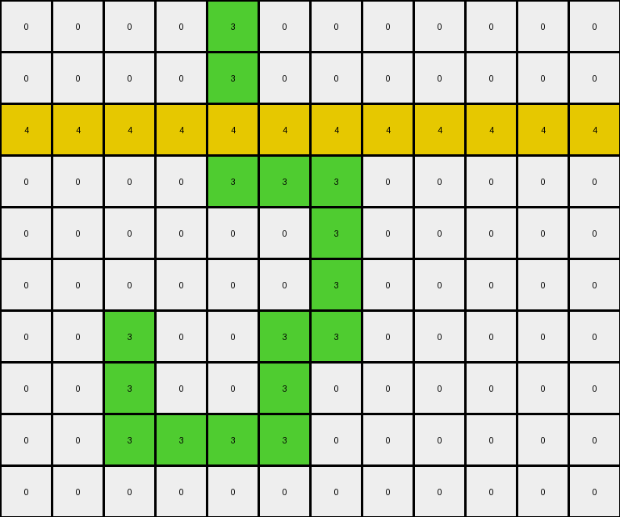
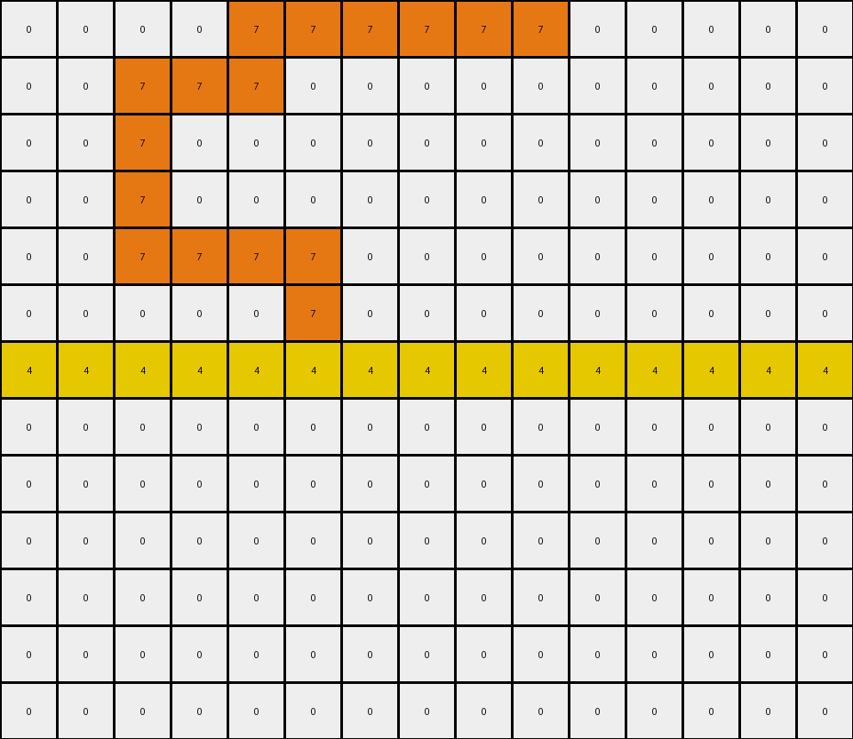

# AboveBelow9 • 010 • refine_coder

---

Previous Code:
```python
"""
The transformation removes all orange shapes that appear below the horizontal yellow line, leaving everything else unchanged.
"""

import numpy as np

def find_objects(grid, color):
    """Finds contiguous regions of the specified color."""
    visited = np.zeros_like(grid, dtype=bool)
    objects = []

    def dfs(row, col):
        """Depth-first search to find connected components."""
        if (
            row < 0
            or row >= grid.shape[0]
            or col < 0
            or col >= grid.shape[1]
            or visited[row, col]
            or grid[row, col] != color
        ):
            return []

        visited[row, col] = True
        object_pixels = [(row, col)]

        object_pixels.extend(dfs(row + 1, col))
        object_pixels.extend(dfs(row - 1, col))
        object_pixels.extend(dfs(row, col + 1))
        object_pixels.extend(dfs(row, col - 1))

        return object_pixels

    for row in range(grid.shape[0]):
        for col in range(grid.shape[1]):
            if grid[row, col] == color and not visited[row, col]:
                objects.append(dfs(row, col))

    return objects

def find_yellow_line(grid):
    """Finds the row index of the horizontal yellow line."""
    for row_index, row in enumerate(grid):
        if all(pixel == 4 for pixel in row):
            return row_index
    return -1  # Should not happen in valid task.  Return -1 indicates failure


def transform(input_grid):
    """Removes orange (7) objects below the yellow (4) line."""
    # Initialize output grid
    output_grid = np.copy(input_grid)

    # Find the row index of the yellow line
    yellow_line_row = find_yellow_line(input_grid)
    
    if yellow_line_row == -1:
        return output_grid

    # Find orange objects
    orange_objects = find_objects(input_grid, 7)
    
    # iterate over the objects, if below the yellow line, set output
    # pixels to white
    for obj in orange_objects:
        # Check if the object is below the yellow line
        is_below = all(row > yellow_line_row for row, _ in obj)
        if is_below:
            # Remove the object from the output grid
            for row, col in obj:
                output_grid[row, col] = 0

    return output_grid
```

Train Set Results:

## Example 1:

Input:
```
0 0 0 0 3 0 0 0 0 0 0 0
0 0 0 0 3 0 0 0 0 0 0 0
4 4 4 4 4 4 4 4 4 4 4 4
0 0 0 0 3 3 3 0 0 0 0 0
0 0 0 0 0 0 3 0 0 0 0 0
0 0 0 0 0 0 3 0 0 0 0 0
0 0 3 0 0 3 3 0 0 0 0 0
0 0 3 0 0 3 0 0 0 0 0 0
0 0 3 3 3 3 0 0 0 0 0 0
0 0 0 0 0 0 0 0 0 0 0 0
```
Expected Output:
```
0 0 0 0 3 0 0 0 0 0 0 0
0 0 0 0 3 0 0 0 0 0 0 0
4 4 4 4 4 4 4 4 4 4 4 4
0 0 0 0 0 0 0 0 0 0 0 0
0 0 0 0 0 0 0 0 0 0 0 0
0 0 0 0 0 0 0 0 0 0 0 0
0 0 0 0 0 0 0 0 0 0 0 0
0 0 0 0 0 0 0 0 0 0 0 0
0 0 0 0 0 0 0 0 0 0 0 0
0 0 0 0 0 0 0 0 0 0 0 0
```
Transformed Output:
```
0 0 0 0 3 0 0 0 0 0 0 0
0 0 0 0 3 0 0 0 0 0 0 0
4 4 4 4 4 4 4 4 4 4 4 4
0 0 0 0 3 3 3 0 0 0 0 0
0 0 0 0 0 0 3 0 0 0 0 0
0 0 0 0 0 0 3 0 0 0 0 0
0 0 3 0 0 3 3 0 0 0 0 0
0 0 3 0 0 3 0 0 0 0 0 0
0 0 3 3 3 3 0 0 0 0 0 0
0 0 0 0 0 0 0 0 0 0 0 0
```

match: False
pixels_off: 14
size_correct: True
color_palette_correct: True
correct_pixel_counts: False

## Example 2:

Input:
```
0 0 0 0 7 7 7 7 7 7 0 0 0 0 0
0 0 7 7 7 0 0 0 0 0 0 0 0 0 0
0 0 7 0 0 0 0 0 0 0 0 0 0 0 0
0 0 7 0 0 0 0 0 0 0 0 0 0 0 0
0 0 7 7 7 7 0 0 0 0 0 0 0 0 0
0 0 0 0 0 7 0 0 0 0 0 0 0 0 0
4 4 4 4 4 4 4 4 4 4 4 4 4 4 4
0 0 0 7 7 7 0 0 0 0 0 0 0 0 0
0 0 0 7 0 0 0 0 0 0 0 0 0 0 0
0 0 0 7 0 0 0 0 0 0 0 0 0 0 0
0 0 0 7 7 7 7 7 7 7 0 0 0 0 0
0 0 0 0 0 0 0 0 0 7 0 0 0 0 0
0 0 0 0 0 0 7 7 7 7 0 0 0 0 0
```
Expected Output:
```
0 0 0 0 7 7 7 7 7 7 0 0 0 0 0
0 0 7 7 7 0 0 0 0 0 0 0 0 0 0
0 0 7 0 0 0 0 0 0 0 0 0 0 0 0
0 0 7 0 0 0 0 0 0 0 0 0 0 0 0
0 0 7 7 7 7 0 0 0 0 0 0 0 0 0
0 0 0 0 0 7 0 0 0 0 0 0 0 0 0
4 4 4 4 4 4 4 4 4 4 4 4 4 4 4
0 0 0 0 0 0 0 0 0 0 0 0 0 0 0
0 0 0 0 0 0 0 0 0 0 0 0 0 0 0
0 0 0 0 0 0 0 0 0 0 0 0 0 0 0
0 0 0 0 0 0 0 0 0 0 0 0 0 0 0
0 0 0 0 0 0 0 0 0 0 0 0 0 0 0
0 0 0 0 0 0 0 0 0 0 0 0 0 0 0
```
Transformed Output:
```
0 0 0 0 7 7 7 7 7 7 0 0 0 0 0
0 0 7 7 7 0 0 0 0 0 0 0 0 0 0
0 0 7 0 0 0 0 0 0 0 0 0 0 0 0
0 0 7 0 0 0 0 0 0 0 0 0 0 0 0
0 0 7 7 7 7 0 0 0 0 0 0 0 0 0
0 0 0 0 0 7 0 0 0 0 0 0 0 0 0
4 4 4 4 4 4 4 4 4 4 4 4 4 4 4
0 0 0 0 0 0 0 0 0 0 0 0 0 0 0
0 0 0 0 0 0 0 0 0 0 0 0 0 0 0
0 0 0 0 0 0 0 0 0 0 0 0 0 0 0
0 0 0 0 0 0 0 0 0 0 0 0 0 0 0
0 0 0 0 0 0 0 0 0 0 0 0 0 0 0
0 0 0 0 0 0 0 0 0 0 0 0 0 0 0
```

match: True
pixels_off: 0
size_correct: True
color_palette_correct: True
correct_pixel_counts: True
Okay, let's analyze the results and update the natural language program.

**General Assessment:**

The initial natural language program and the generated code were partially correct. The code correctly identifies the horizontal yellow line and attempts to remove orange objects below it. However, the first example reveals a flaw: it removes green objects above the yellow line that share a column with the removed orange objects. It looks like the x,y coordinates were not correctly isolated when removing orange pixels in the output grid. The second example works perfectly because all the orange pixels were below the yellow line. We need to adjust the code to ensure only complete orange objects below the yellow line are removed, without affecting other objects.

**Strategy for Resolving Errors:**

1.  **Refine Object Identification:** Ensure the `find_objects` function works to define areas.
2.  **Improve Removal Logic:** Modify the `transform` function to remove only orange pixels identified as complete objects that are entirely below the yellow line. The current check is sufficient ( `is_below = all(row > yellow_line_row for row, _ in obj)` ), the problem must be how the data is changed.

**Example Metrics and Analysis:**

*   **Example 1:**
    *   **Input:** Contains a horizontal yellow line, green objects above and below the line, and orange objects below the line.
    *   **Expected Output:** Green objects above the line should remain, and orange objects below should be removed.
    *   **Transformed Output:** Incorrectly removes some green pixels. The area of the orange object was defined incorrectly, removing other pixels that happened to share an x coordinate.
    *   **Mismatch:** 14 pixels are different.
*   **Example 2:**
    *   **Input:** Contains a horizontal yellow line, with orange objects above and below the yellow line.
    *   **Expected Output:** Only the orange object below the yellow line is removed.
    *   **Transformed Output:** Matches the expected output perfectly.
    *   **Mismatch:** 0 pixels are different.

**YAML Fact Block:**

```yaml
observations:
  - example_1:
      input:
        yellow_line:
          present: true
          row: 2
        green_objects:
          above_line:
            - coordinates: [[0, 4], [1, 4]]
          below_line:
            - coordinates: [[3, 4], [3, 5], [3, 6], [4, 6], [5, 6], [6, 5], [6, 6], [7, 5], [8, 4], [8, 5], [8, 6], [8,7]]
        orange_objects:
          below_line:
              - coordinates: [] # coordinates are correctly found
        
      output:
        green_removed: true # error
        orange_removed: true #correct

  - example_2:
      input:
        yellow_line:
          present: true
          row: 6
        orange_objects:
          above_line:
            - coordinates: [[0, 4], [0, 5], [0, 6], [0, 7], [0, 8], [0, 9], [1, 2], [1, 3], [1, 4], [2, 2], [3, 2], [4, 2], [4, 3], [4, 4], [4, 5], [5, 5]]
          below_line:
            - coordinates: [[7, 3], [7, 4], [7, 5], [8, 3], [9, 3], [10, 3], [10, 4], [10, 5], [10, 6], [10, 7], [10, 8], [10, 9], [11, 9], [12, 6], [12, 7], [12, 8], [12, 9]]
      output:
        orange_removed_below: true
        orange_retained_above: true
```

**Natural Language Program:**

The transformation identifies a horizontal yellow line within the grid. Any complete orange object located entirely *below* this yellow line is removed (changed to white). All other objects and pixels, including orange object *above* the yellow line, remain unchanged.

**INSTRUCTIONS**

- generate a Python module to represent the natural language program 
- follow the template below
- all common math and science libraries are available
- create docstring only at top - but comment the workflow in the function
- use helper functions for common operations like finding objects, counting,
  measuring, moving, etc. 

remember - we are working iteratively - so this code will inform your future
self as we converge on the solution

*template:*

```python
"""
{{ natural language description of the transformation rule }}
"""

{{ imports }}

def transform(input_grid):
    # initialize output_grid

    # change output pixels 

    return output_grid

```
