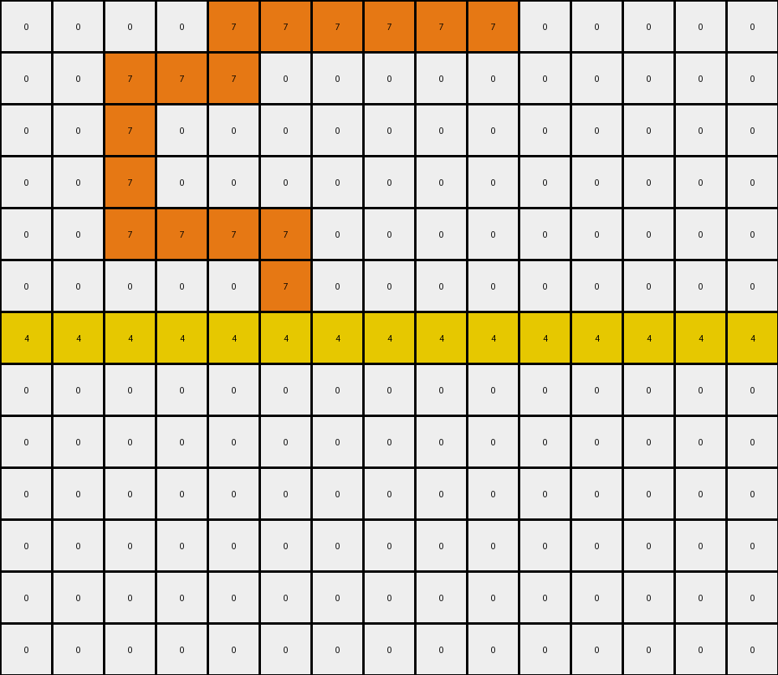

# AboveBelow9 • 011 • refine_dreamer

---

Previous Code:
```python
"""
The transformation identifies a horizontal yellow line within the grid. Any complete orange object located entirely *below* this yellow line is removed (changed to white). All other objects and pixels, including orange object *above* the yellow line, remain unchanged.
"""

import numpy as np

def find_objects(grid, color):
    """Finds contiguous regions of the specified color."""
    visited = np.zeros_like(grid, dtype=bool)
    objects = []

    def dfs(row, col):
        """Depth-first search to find connected components."""
        if (
            row < 0
            or row >= grid.shape[0]
            or col < 0
            or col >= grid.shape[1]
            or visited[row, col]
            or grid[row, col] != color
        ):
            return []

        visited[row, col] = True
        object_pixels = [(row, col)]

        object_pixels.extend(dfs(row + 1, col))
        object_pixels.extend(dfs(row - 1, col))
        object_pixels.extend(dfs(row, col + 1))
        object_pixels.extend(dfs(row, col - 1))

        return object_pixels

    for row in range(grid.shape[0]):
        for col in range(grid.shape[1]):
            if grid[row, col] == color and not visited[row, col]:
                objects.append(dfs(row, col))

    return objects

def find_yellow_line(grid):
    """Finds the row index of the horizontal yellow line."""
    for row_index, row in enumerate(grid):
        if all(pixel == 4 for pixel in row):
            return row_index
    return -1  # Should not happen in valid task.  Return -1 indicates failure


def transform(input_grid):
    """Removes orange (7) objects below the yellow (4) line."""
    # Initialize output grid
    output_grid = np.copy(input_grid)

    # Find the row index of the yellow line
    yellow_line_row = find_yellow_line(input_grid)
    
    if yellow_line_row == -1:
        return output_grid

    # Find orange objects
    orange_objects = find_objects(input_grid, 7)
    
    # iterate over the objects, if below the yellow line, set output
    # pixels to white
    for obj in orange_objects:
        # Check if the object is below the yellow line
        is_below = all(row > yellow_line_row for row, _ in obj)
        if is_below:
            # Remove the object from the output grid
            for row, col in obj:
                output_grid[row, col] = 0

    return output_grid
```

Train Set Results:

## Example 1:

Input:
```
0 0 0 0 3 0 0 0 0 0 0 0
0 0 0 0 3 0 0 0 0 0 0 0
4 4 4 4 4 4 4 4 4 4 4 4
0 0 0 0 3 3 3 0 0 0 0 0
0 0 0 0 0 0 3 0 0 0 0 0
0 0 0 0 0 0 3 0 0 0 0 0
0 0 3 0 0 3 3 0 0 0 0 0
0 0 3 0 0 3 0 0 0 0 0 0
0 0 3 3 3 3 0 0 0 0 0 0
0 0 0 0 0 0 0 0 0 0 0 0
```
Expected Output:
```
0 0 0 0 3 0 0 0 0 0 0 0
0 0 0 0 3 0 0 0 0 0 0 0
4 4 4 4 4 4 4 4 4 4 4 4
0 0 0 0 0 0 0 0 0 0 0 0
0 0 0 0 0 0 0 0 0 0 0 0
0 0 0 0 0 0 0 0 0 0 0 0
0 0 0 0 0 0 0 0 0 0 0 0
0 0 0 0 0 0 0 0 0 0 0 0
0 0 0 0 0 0 0 0 0 0 0 0
0 0 0 0 0 0 0 0 0 0 0 0
```
Transformed Output:
```
0 0 0 0 3 0 0 0 0 0 0 0
0 0 0 0 3 0 0 0 0 0 0 0
4 4 4 4 4 4 4 4 4 4 4 4
0 0 0 0 3 3 3 0 0 0 0 0
0 0 0 0 0 0 3 0 0 0 0 0
0 0 0 0 0 0 3 0 0 0 0 0
0 0 3 0 0 3 3 0 0 0 0 0
0 0 3 0 0 3 0 0 0 0 0 0
0 0 3 3 3 3 0 0 0 0 0 0
0 0 0 0 0 0 0 0 0 0 0 0
```

match: False
pixels_off: 14
size_correct: True
color_palette_correct: True
correct_pixel_counts: False

## Example 2:

Input:
```
0 0 0 0 7 7 7 7 7 7 0 0 0 0 0
0 0 7 7 7 0 0 0 0 0 0 0 0 0 0
0 0 7 0 0 0 0 0 0 0 0 0 0 0 0
0 0 7 0 0 0 0 0 0 0 0 0 0 0 0
0 0 7 7 7 7 0 0 0 0 0 0 0 0 0
0 0 0 0 0 7 0 0 0 0 0 0 0 0 0
4 4 4 4 4 4 4 4 4 4 4 4 4 4 4
0 0 0 7 7 7 0 0 0 0 0 0 0 0 0
0 0 0 7 0 0 0 0 0 0 0 0 0 0 0
0 0 0 7 0 0 0 0 0 0 0 0 0 0 0
0 0 0 7 7 7 7 7 7 7 0 0 0 0 0
0 0 0 0 0 0 0 0 0 7 0 0 0 0 0
0 0 0 0 0 0 7 7 7 7 0 0 0 0 0
```
Expected Output:
```
0 0 0 0 7 7 7 7 7 7 0 0 0 0 0
0 0 7 7 7 0 0 0 0 0 0 0 0 0 0
0 0 7 0 0 0 0 0 0 0 0 0 0 0 0
0 0 7 0 0 0 0 0 0 0 0 0 0 0 0
0 0 7 7 7 7 0 0 0 0 0 0 0 0 0
0 0 0 0 0 7 0 0 0 0 0 0 0 0 0
4 4 4 4 4 4 4 4 4 4 4 4 4 4 4
0 0 0 0 0 0 0 0 0 0 0 0 0 0 0
0 0 0 0 0 0 0 0 0 0 0 0 0 0 0
0 0 0 0 0 0 0 0 0 0 0 0 0 0 0
0 0 0 0 0 0 0 0 0 0 0 0 0 0 0
0 0 0 0 0 0 0 0 0 0 0 0 0 0 0
0 0 0 0 0 0 0 0 0 0 0 0 0 0 0
```
Transformed Output:
```
0 0 0 0 7 7 7 7 7 7 0 0 0 0 0
0 0 7 7 7 0 0 0 0 0 0 0 0 0 0
0 0 7 0 0 0 0 0 0 0 0 0 0 0 0
0 0 7 0 0 0 0 0 0 0 0 0 0 0 0
0 0 7 7 7 7 0 0 0 0 0 0 0 0 0
0 0 0 0 0 7 0 0 0 0 0 0 0 0 0
4 4 4 4 4 4 4 4 4 4 4 4 4 4 4
0 0 0 0 0 0 0 0 0 0 0 0 0 0 0
0 0 0 0 0 0 0 0 0 0 0 0 0 0 0
0 0 0 0 0 0 0 0 0 0 0 0 0 0 0
0 0 0 0 0 0 0 0 0 0 0 0 0 0 0
0 0 0 0 0 0 0 0 0 0 0 0 0 0 0
0 0 0 0 0 0 0 0 0 0 0 0 0 0 0
```

match: True
pixels_off: 0
size_correct: True
color_palette_correct: True
correct_pixel_counts: True
**INSTRUCTIONS**

The code above was generated based on observations from the first training
example

we have tested the transform function on each of the task example inputs and
compared with the expected output

review each of the examples provided and the results and consider how the
natural language program should be updated to accommodate this new knowledge

respond with the following deliverables:

- general assessment of the information provided and strategy for resolving the
  errors
- gather metrics about each of the examples and results - use code_execution to
  develop accurate reports on your assumptions
- a YAML block documenting facts - Focus on identifying objects, their properties, and the actions performed on them.
- a natural language program - Be as clear and concise as possible, providing a complete description of the transformation rule.


your responses should be considered as information in a report - not a
conversation
