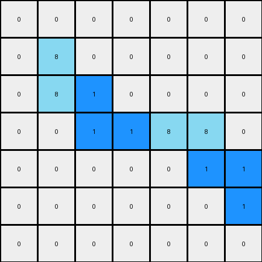
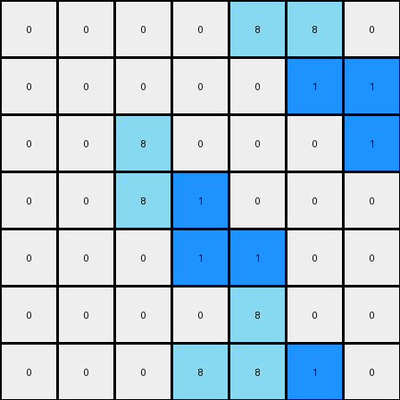

# validation:*

*example 1:*
  Input:
```
0 0 0 0 0 0 0
0 8 0 0 0 0 0
0 8 8 0 0 0 0
0 0 0 0 8 8 0
0 0 0 0 0 8 0
0 0 0 0 0 0 0
0 0 0 0 0 0 0
```
  Expected Output:
```
0 0 0 0 0 0 0
0 8 1 0 0 0 0
0 8 8 0 0 0 0
0 0 0 0 8 8 0
0 0 0 0 1 8 0
0 0 0 0 0 0 0
0 0 0 0 0 0 0
```
  Transformed Output:
```
0 0 0 0 0 0 0
0 8 0 0 0 0 0
0 8 1 0 0 0 0
0 0 1 1 8 8 0
0 0 0 0 0 1 1
0 0 0 0 0 0 1
0 0 0 0 0 0 0
```
  Transformed Output Image: 
**FAILED!**

*example 2:*
  Input:
```
0 0 0 0 8 8 0
0 0 0 0 0 8 0
0 0 8 0 0 0 0
0 0 8 8 0 0 0
0 0 0 0 0 0 0
0 0 0 0 8 0 0
0 0 0 8 8 0 0
```
  Expected Output:
```
0 0 0 0 8 8 0
0 0 0 0 1 8 0
0 0 8 1 0 0 0
0 0 8 8 0 0 0
0 0 0 0 0 0 0
0 0 0 1 8 0 0
0 0 0 8 8 0 0
```
  Transformed Output:
```
0 0 0 0 8 8 0
0 0 0 0 0 1 1
0 0 8 0 0 0 1
0 0 8 1 0 0 0
0 0 0 1 1 0 0
0 0 0 0 8 0 0
0 0 0 8 8 1 0
```
  Transformed Output Image: 
**FAILED!**
