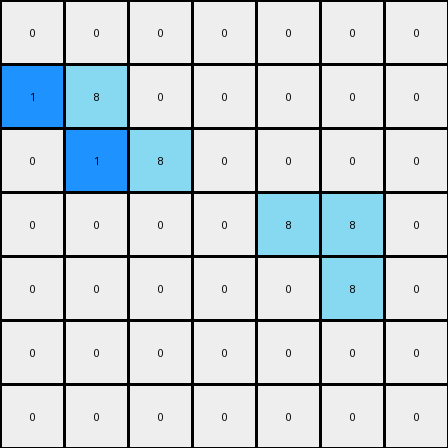
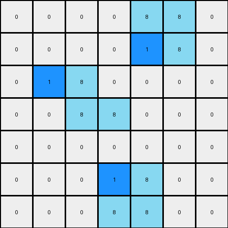

# validation:*

## example 1
*input:*
```
0 0 0 0 0 0 0
0 8 0 0 0 0 0
0 8 8 0 0 0 0
0 0 0 0 8 8 0
0 0 0 0 0 8 0
0 0 0 0 0 0 0
0 0 0 0 0 0 0
```
*expected output:*
```
0 0 0 0 0 0 0
0 8 1 0 0 0 0
0 8 8 0 0 0 0
0 0 0 0 8 8 0
0 0 0 0 1 8 0
0 0 0 0 0 0 0
0 0 0 0 0 0 0
```
*transformed output:*
```
0 0 0 0 0 0 0
1 8 0 0 0 0 0
0 1 8 0 0 0 0
0 0 0 0 8 8 0
0 0 0 0 0 8 0
0 0 0 0 0 0 0
0 0 0 0 0 0 0
```
  Transformed Output Image: 
**FAILED!**

## example 2
*input:*
```
0 0 0 0 8 8 0
0 0 0 0 0 8 0
0 0 8 0 0 0 0
0 0 8 8 0 0 0
0 0 0 0 0 0 0
0 0 0 0 8 0 0
0 0 0 8 8 0 0
```
*expected output:*
```
0 0 0 0 8 8 0
0 0 0 0 1 8 0
0 0 8 1 0 0 0
0 0 8 8 0 0 0
0 0 0 0 0 0 0
0 0 0 1 8 0 0
0 0 0 8 8 0 0
```
*transformed output:*
```
0 0 0 0 8 8 0
0 0 0 0 1 8 0
0 1 8 0 0 0 0
0 0 8 8 0 0 0
0 0 0 0 0 0 0
0 0 0 1 8 0 0
0 0 0 8 8 0 0
```
  Transformed Output Image: 
**FAILED!**
