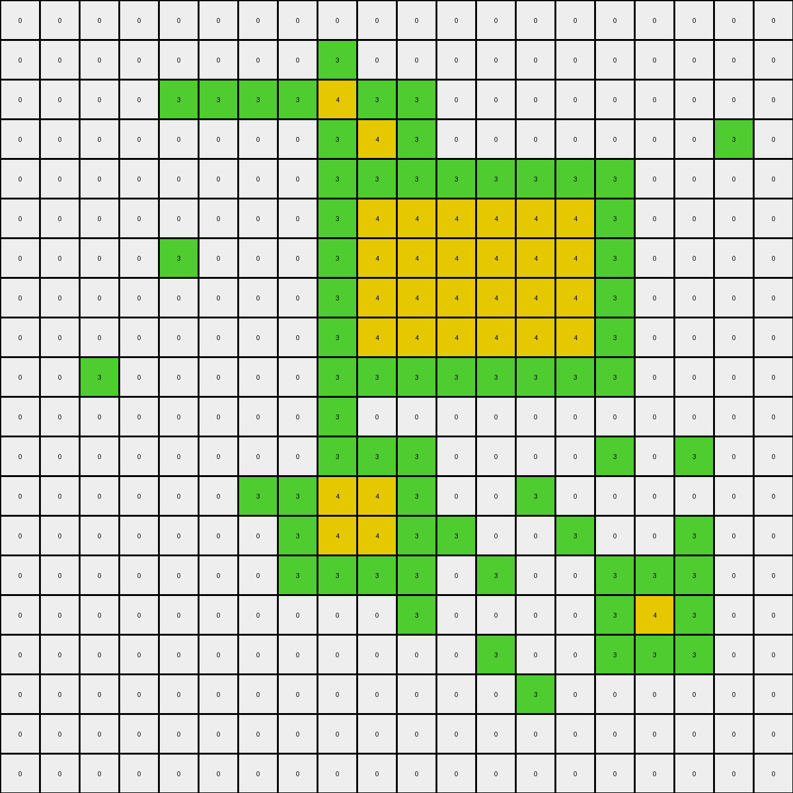

# 00d62c1b • 009 • example_5 - NLP

---


**input**
```
0 0 0 0 0 0 0 0 0 0 0 0 0 0 0 0 0 0 0 0
0 0 0 0 0 0 0 0 3 0 0 0 0 0 0 0 0 0 0 0
0 0 0 0 3 3 3 3 0 3 3 0 0 0 0 0 0 0 0 0
0 0 0 0 0 0 0 0 3 0 3 0 0 0 0 0 0 0 3 0
0 0 0 0 0 0 0 0 3 3 3 3 3 3 3 3 0 0 0 0
0 0 0 0 0 0 0 0 3 0 0 0 0 0 0 3 0 0 0 0
0 0 0 0 3 0 0 0 3 0 0 0 0 0 0 3 0 0 0 0
0 0 0 0 0 0 0 0 3 0 0 0 0 0 0 3 0 0 0 0
0 0 0 0 0 0 0 0 3 0 0 0 0 0 0 3 0 0 0 0
0 0 3 0 0 0 0 0 3 3 3 3 3 3 3 3 0 0 0 0
0 0 0 0 0 0 0 0 3 0 0 0 0 0 0 0 0 0 0 0
0 0 0 0 0 0 0 0 3 3 3 0 0 0 0 3 0 3 0 0
0 0 0 0 0 0 3 3 0 0 3 0 0 3 0 0 0 0 0 0
0 0 0 0 0 0 0 3 0 0 3 3 0 0 3 0 0 3 0 0
0 0 0 0 0 0 0 3 3 3 3 0 3 0 0 3 3 3 0 0
0 0 0 0 0 0 0 0 0 0 3 0 0 0 0 3 0 3 0 0
0 0 0 0 0 0 0 0 0 0 0 0 3 0 0 3 3 3 0 0
0 0 0 0 0 0 0 0 0 0 0 0 0 3 0 0 0 0 0 0
0 0 0 0 0 0 0 0 0 0 0 0 0 0 0 0 0 0 0 0
0 0 0 0 0 0 0 0 0 0 0 0 0 0 0 0 0 0 0 0
```


**output**
```
0 0 0 0 0 0 0 0 0 0 0 0 0 0 0 0 0 0 0 0
0 0 0 0 0 0 0 0 3 0 0 0 0 0 0 0 0 0 0 0
0 0 0 0 3 3 3 3 4 3 3 0 0 0 0 0 0 0 0 0
0 0 0 0 0 0 0 0 3 4 3 0 0 0 0 0 0 0 3 0
0 0 0 0 0 0 0 0 3 3 3 3 3 3 3 3 0 0 0 0
0 0 0 0 0 0 0 0 3 4 4 4 4 4 4 3 0 0 0 0
0 0 0 0 3 0 0 0 3 4 4 4 4 4 4 3 0 0 0 0
0 0 0 0 0 0 0 0 3 4 4 4 4 4 4 3 0 0 0 0
0 0 0 0 0 0 0 0 3 4 4 4 4 4 4 3 0 0 0 0
0 0 3 0 0 0 0 0 3 3 3 3 3 3 3 3 0 0 0 0
0 0 0 0 0 0 0 0 3 0 0 0 0 0 0 0 0 0 0 0
0 0 0 0 0 0 0 0 3 3 3 0 0 0 0 3 0 3 0 0
0 0 0 0 0 0 3 3 4 4 3 0 0 3 0 0 0 0 0 0
0 0 0 0 0 0 0 3 4 4 3 3 0 0 3 0 0 3 0 0
0 0 0 0 0 0 0 3 3 3 3 0 3 0 0 3 3 3 0 0
0 0 0 0 0 0 0 0 0 0 3 0 0 0 0 3 4 3 0 0
0 0 0 0 0 0 0 0 0 0 0 0 3 0 0 3 3 3 0 0
0 0 0 0 0 0 0 0 0 0 0 0 0 3 0 0 0 0 0 0
0 0 0 0 0 0 0 0 0 0 0 0 0 0 0 0 0 0 0 0
0 0 0 0 0 0 0 0 0 0 0 0 0 0 0 0 0 0 0 0
```




**Instructions**

- Describe in natural language the step-by-step transformation observed between the input and output grids.
- Focus on identifying objects, their properties (predicates), and the actions performed on them.
- Be as clear and concise as possible, providing a complete description of the transformation rule.
