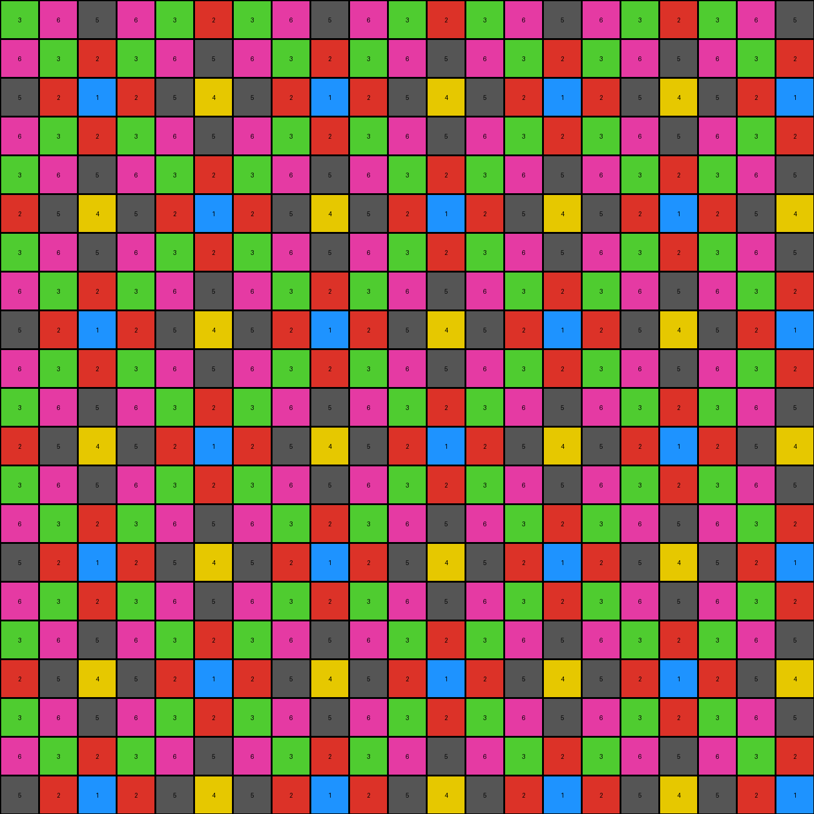

# 0dfd9992 • 001 • example_1 - NLP

---


**input**
```
3 6 5 6 3 2 3 6 5 6 3 2 3 6 5 6 3 2 3 6 5
6 3 2 3 6 5 6 3 2 3 6 5 6 3 2 3 6 5 6 3 2
5 2 1 2 5 4 5 2 1 2 5 4 5 2 1 2 5 4 5 2 1
6 3 2 3 6 5 6 3 2 3 6 5 6 3 2 3 6 5 6 3 2
3 6 5 6 3 2 3 6 5 6 3 2 3 6 5 0 0 0 0 0 5
2 5 4 5 2 1 2 5 0 0 2 1 2 5 4 0 0 0 0 0 4
3 6 5 6 3 2 3 0 0 0 0 2 3 6 5 0 0 0 0 0 5
6 3 2 3 6 5 6 0 0 0 0 5 6 3 2 3 6 5 6 3 2
5 2 1 2 5 4 5 0 0 0 0 4 5 2 1 2 5 4 5 2 1
6 3 2 3 6 5 6 3 0 0 6 5 6 3 2 3 6 5 6 3 2
3 6 5 6 3 2 3 6 5 6 3 2 3 6 5 6 3 2 3 6 5
2 5 4 0 0 1 2 5 4 5 2 1 2 5 4 5 2 1 2 5 4
3 6 5 0 0 2 3 6 5 6 3 2 3 6 5 6 3 2 3 6 5
6 3 2 0 0 5 6 3 2 3 6 5 6 3 2 3 6 5 6 3 2
5 2 1 2 5 4 5 2 1 2 5 4 5 2 1 2 5 4 5 2 1
6 3 2 3 6 5 6 3 2 3 6 5 6 3 2 3 6 5 6 3 2
3 6 5 6 0 0 0 6 5 6 3 2 3 6 5 6 3 2 3 6 5
2 5 4 5 0 0 0 5 4 5 2 1 2 5 4 5 2 1 2 5 4
3 6 5 6 0 0 0 6 5 6 3 2 3 6 5 6 3 2 3 6 5
6 3 2 3 6 5 6 3 2 3 6 5 6 3 2 3 6 5 6 3 2
5 2 1 2 5 4 5 2 1 2 5 4 5 2 1 2 5 4 5 2 1
```


**output**
```
3 6 5 6 3 2 3 6 5 6 3 2 3 6 5 6 3 2 3 6 5
6 3 2 3 6 5 6 3 2 3 6 5 6 3 2 3 6 5 6 3 2
5 2 1 2 5 4 5 2 1 2 5 4 5 2 1 2 5 4 5 2 1
6 3 2 3 6 5 6 3 2 3 6 5 6 3 2 3 6 5 6 3 2
3 6 5 6 3 2 3 6 5 6 3 2 3 6 5 6 3 2 3 6 5
2 5 4 5 2 1 2 5 4 5 2 1 2 5 4 5 2 1 2 5 4
3 6 5 6 3 2 3 6 5 6 3 2 3 6 5 6 3 2 3 6 5
6 3 2 3 6 5 6 3 2 3 6 5 6 3 2 3 6 5 6 3 2
5 2 1 2 5 4 5 2 1 2 5 4 5 2 1 2 5 4 5 2 1
6 3 2 3 6 5 6 3 2 3 6 5 6 3 2 3 6 5 6 3 2
3 6 5 6 3 2 3 6 5 6 3 2 3 6 5 6 3 2 3 6 5
2 5 4 5 2 1 2 5 4 5 2 1 2 5 4 5 2 1 2 5 4
3 6 5 6 3 2 3 6 5 6 3 2 3 6 5 6 3 2 3 6 5
6 3 2 3 6 5 6 3 2 3 6 5 6 3 2 3 6 5 6 3 2
5 2 1 2 5 4 5 2 1 2 5 4 5 2 1 2 5 4 5 2 1
6 3 2 3 6 5 6 3 2 3 6 5 6 3 2 3 6 5 6 3 2
3 6 5 6 3 2 3 6 5 6 3 2 3 6 5 6 3 2 3 6 5
2 5 4 5 2 1 2 5 4 5 2 1 2 5 4 5 2 1 2 5 4
3 6 5 6 3 2 3 6 5 6 3 2 3 6 5 6 3 2 3 6 5
6 3 2 3 6 5 6 3 2 3 6 5 6 3 2 3 6 5 6 3 2
5 2 1 2 5 4 5 2 1 2 5 4 5 2 1 2 5 4 5 2 1
```




**Instructions**

- Describe in natural language the step-by-step transformation observed between the input and output grids.
- Focus on identifying objects, their properties (predicates), and the actions performed on them.
- Be as clear and concise as possible, providing a complete description of the transformation rule.
