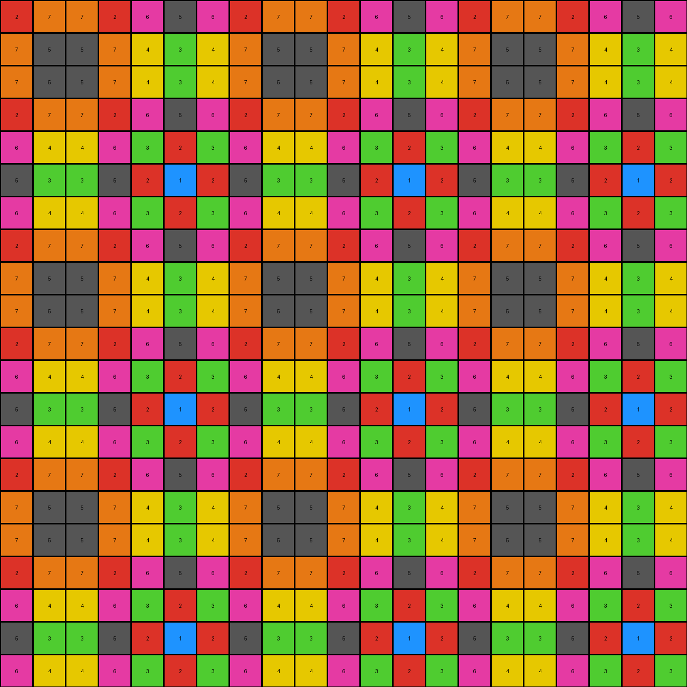

# 0dfd9992 • 003 • example_2 - NLP

---


**input**
```
2 7 7 2 6 5 6 2 7 7 2 6 5 6 2 7 7 2 6 5 6
7 5 5 7 4 3 4 7 5 5 7 4 3 4 7 5 5 7 4 3 4
7 5 5 7 4 3 4 7 5 5 7 4 3 4 7 5 5 7 4 3 4
2 7 7 2 0 0 0 0 0 7 2 6 5 6 2 7 0 0 6 5 6
6 4 4 6 0 0 0 0 0 4 6 3 2 3 6 4 0 0 3 2 3
5 3 3 5 0 0 0 0 0 3 5 2 1 2 5 3 0 0 2 1 2
6 4 4 6 0 0 0 0 0 4 6 3 2 3 6 4 0 0 0 0 3
2 7 7 2 6 5 6 2 7 7 2 6 5 6 2 7 7 0 0 0 6
0 0 0 0 0 3 4 7 5 5 7 4 3 4 7 5 5 0 0 0 4
0 0 0 0 0 3 4 7 5 5 7 4 3 4 7 5 5 0 0 0 4
0 0 0 0 0 5 6 2 7 7 2 6 5 6 2 7 7 2 6 5 6
6 4 4 6 3 2 3 6 4 4 6 3 2 3 6 4 4 6 3 2 3
5 3 3 5 2 1 2 5 3 3 5 2 1 2 5 3 3 5 2 1 2
6 4 4 6 3 2 3 6 4 4 6 3 2 3 6 4 0 0 3 2 3
2 7 7 2 6 5 6 2 7 7 2 6 5 6 2 7 0 0 6 5 6
7 5 5 7 4 3 4 7 5 5 7 4 3 4 7 5 0 0 4 3 4
7 5 5 7 4 3 4 7 5 5 7 4 3 4 7 5 5 7 4 3 4
2 7 7 2 6 5 6 2 7 7 2 6 5 6 2 7 7 2 6 5 6
6 4 4 6 3 2 3 6 4 4 6 3 2 3 6 4 4 6 3 2 3
5 3 3 5 2 1 2 5 3 3 5 2 1 2 5 3 3 5 2 1 2
6 4 4 6 3 2 3 6 4 4 6 3 2 3 6 4 4 6 3 2 3
```


**output**
```
2 7 7 2 6 5 6 2 7 7 2 6 5 6 2 7 7 2 6 5 6
7 5 5 7 4 3 4 7 5 5 7 4 3 4 7 5 5 7 4 3 4
7 5 5 7 4 3 4 7 5 5 7 4 3 4 7 5 5 7 4 3 4
2 7 7 2 6 5 6 2 7 7 2 6 5 6 2 7 7 2 6 5 6
6 4 4 6 3 2 3 6 4 4 6 3 2 3 6 4 4 6 3 2 3
5 3 3 5 2 1 2 5 3 3 5 2 1 2 5 3 3 5 2 1 2
6 4 4 6 3 2 3 6 4 4 6 3 2 3 6 4 4 6 3 2 3
2 7 7 2 6 5 6 2 7 7 2 6 5 6 2 7 7 2 6 5 6
7 5 5 7 4 3 4 7 5 5 7 4 3 4 7 5 5 7 4 3 4
7 5 5 7 4 3 4 7 5 5 7 4 3 4 7 5 5 7 4 3 4
2 7 7 2 6 5 6 2 7 7 2 6 5 6 2 7 7 2 6 5 6
6 4 4 6 3 2 3 6 4 4 6 3 2 3 6 4 4 6 3 2 3
5 3 3 5 2 1 2 5 3 3 5 2 1 2 5 3 3 5 2 1 2
6 4 4 6 3 2 3 6 4 4 6 3 2 3 6 4 4 6 3 2 3
2 7 7 2 6 5 6 2 7 7 2 6 5 6 2 7 7 2 6 5 6
7 5 5 7 4 3 4 7 5 5 7 4 3 4 7 5 5 7 4 3 4
7 5 5 7 4 3 4 7 5 5 7 4 3 4 7 5 5 7 4 3 4
2 7 7 2 6 5 6 2 7 7 2 6 5 6 2 7 7 2 6 5 6
6 4 4 6 3 2 3 6 4 4 6 3 2 3 6 4 4 6 3 2 3
5 3 3 5 2 1 2 5 3 3 5 2 1 2 5 3 3 5 2 1 2
6 4 4 6 3 2 3 6 4 4 6 3 2 3 6 4 4 6 3 2 3
```




**Instructions**

- Describe in natural language the step-by-step transformation observed between the input and output grids.
- Focus on identifying objects, their properties (predicates), and the actions performed on them.
- Be as clear and concise as possible, providing a complete description of the transformation rule.
