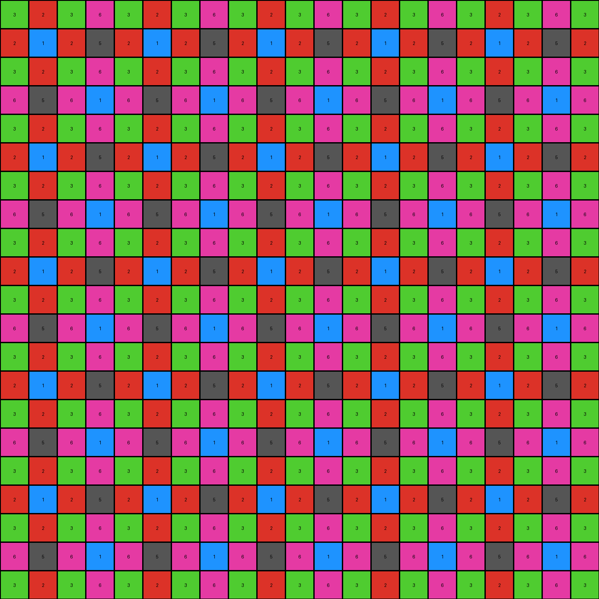

# 0dfd9992 • 005 • example_3 - NLP

---


**input**
```
3 2 3 6 3 2 3 6 3 2 3 6 3 2 3 6 3 2 3 6 3
2 1 2 5 2 1 2 5 2 1 2 5 2 1 2 5 2 1 2 5 2
0 0 0 0 0 2 3 6 3 2 3 6 3 2 3 6 3 2 3 6 3
0 0 0 0 0 5 6 1 6 5 6 1 6 5 6 1 6 5 6 1 6
3 2 3 6 3 2 3 6 3 2 3 6 3 2 0 0 0 2 3 6 3
2 1 2 5 0 0 0 0 2 0 0 0 2 1 0 0 0 1 2 5 2
3 2 3 6 0 0 0 0 3 0 0 0 3 2 3 6 3 2 3 6 3
6 5 6 1 0 0 0 0 6 0 0 0 6 5 6 1 6 5 6 1 6
3 2 3 6 0 0 0 0 3 0 0 0 3 2 3 6 3 2 3 6 3
2 1 2 5 0 0 0 0 2 1 2 5 2 1 2 5 2 1 2 5 2
3 2 3 6 3 2 3 6 3 2 3 6 3 2 3 6 3 2 3 6 3
6 5 6 1 6 5 6 1 6 5 6 1 6 5 6 1 6 5 6 1 6
3 2 3 6 3 2 3 6 3 2 3 6 3 2 3 6 3 2 3 6 3
2 1 2 5 2 1 2 5 2 1 2 5 2 1 2 5 2 1 2 5 2
3 0 0 0 0 0 3 6 3 2 3 6 3 2 3 6 3 2 3 6 3
6 0 0 0 0 0 6 1 6 5 6 1 6 5 6 1 6 5 6 1 6
3 0 0 0 0 0 3 6 3 2 3 6 3 2 3 6 3 2 3 6 3
2 0 0 0 0 0 2 5 2 1 2 5 2 1 2 5 2 1 2 5 2
3 0 0 0 0 0 3 6 3 2 3 6 3 2 3 6 3 2 3 6 3
6 5 6 1 6 5 6 1 6 5 6 1 6 5 6 1 6 5 6 1 6
3 2 3 6 3 2 3 6 3 2 3 6 3 2 3 6 3 2 3 6 3
```


**output**
```
3 2 3 6 3 2 3 6 3 2 3 6 3 2 3 6 3 2 3 6 3
2 1 2 5 2 1 2 5 2 1 2 5 2 1 2 5 2 1 2 5 2
3 2 3 6 3 2 3 6 3 2 3 6 3 2 3 6 3 2 3 6 3
6 5 6 1 6 5 6 1 6 5 6 1 6 5 6 1 6 5 6 1 6
3 2 3 6 3 2 3 6 3 2 3 6 3 2 3 6 3 2 3 6 3
2 1 2 5 2 1 2 5 2 1 2 5 2 1 2 5 2 1 2 5 2
3 2 3 6 3 2 3 6 3 2 3 6 3 2 3 6 3 2 3 6 3
6 5 6 1 6 5 6 1 6 5 6 1 6 5 6 1 6 5 6 1 6
3 2 3 6 3 2 3 6 3 2 3 6 3 2 3 6 3 2 3 6 3
2 1 2 5 2 1 2 5 2 1 2 5 2 1 2 5 2 1 2 5 2
3 2 3 6 3 2 3 6 3 2 3 6 3 2 3 6 3 2 3 6 3
6 5 6 1 6 5 6 1 6 5 6 1 6 5 6 1 6 5 6 1 6
3 2 3 6 3 2 3 6 3 2 3 6 3 2 3 6 3 2 3 6 3
2 1 2 5 2 1 2 5 2 1 2 5 2 1 2 5 2 1 2 5 2
3 2 3 6 3 2 3 6 3 2 3 6 3 2 3 6 3 2 3 6 3
6 5 6 1 6 5 6 1 6 5 6 1 6 5 6 1 6 5 6 1 6
3 2 3 6 3 2 3 6 3 2 3 6 3 2 3 6 3 2 3 6 3
2 1 2 5 2 1 2 5 2 1 2 5 2 1 2 5 2 1 2 5 2
3 2 3 6 3 2 3 6 3 2 3 6 3 2 3 6 3 2 3 6 3
6 5 6 1 6 5 6 1 6 5 6 1 6 5 6 1 6 5 6 1 6
3 2 3 6 3 2 3 6 3 2 3 6 3 2 3 6 3 2 3 6 3
```




**Instructions**

- Describe in natural language the step-by-step transformation observed between the input and output grids.
- Focus on identifying objects, their properties (predicates), and the actions performed on them.
- Be as clear and concise as possible, providing a complete description of the transformation rule.
