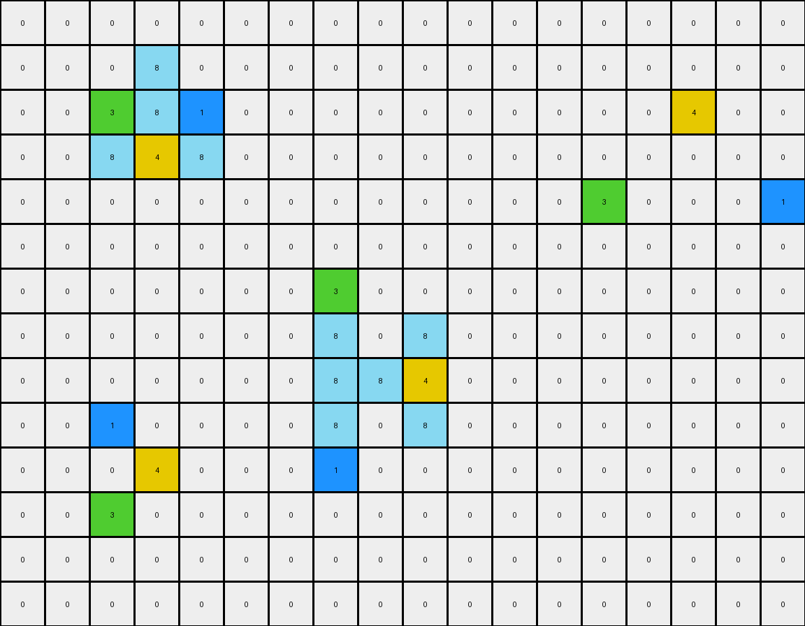
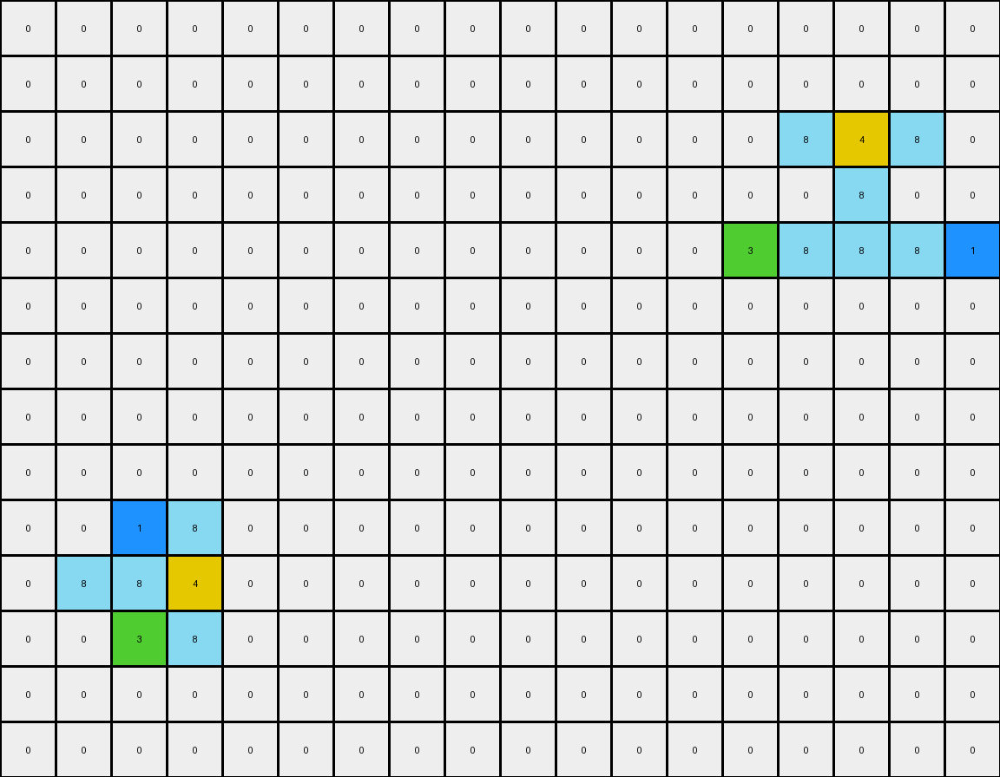

# 0e206a2e • 001 • example_1 - NLP

---


**input**
```
0 0 0 0 0 0 0 0 0 0 0 0 0 0 0 0 0 0
0 0 0 8 0 0 0 0 0 0 0 0 0 0 0 0 0 0
0 0 3 8 1 0 0 0 0 0 0 0 0 0 0 4 0 0
0 0 8 4 8 0 0 0 0 0 0 0 0 0 0 0 0 0
0 0 0 0 0 0 0 0 0 0 0 0 0 3 0 0 0 1
0 0 0 0 0 0 0 0 0 0 0 0 0 0 0 0 0 0
0 0 0 0 0 0 0 3 0 0 0 0 0 0 0 0 0 0
0 0 0 0 0 0 0 8 0 8 0 0 0 0 0 0 0 0
0 0 0 0 0 0 0 8 8 4 0 0 0 0 0 0 0 0
0 0 1 0 0 0 0 8 0 8 0 0 0 0 0 0 0 0
0 0 0 4 0 0 0 1 0 0 0 0 0 0 0 0 0 0
0 0 3 0 0 0 0 0 0 0 0 0 0 0 0 0 0 0
0 0 0 0 0 0 0 0 0 0 0 0 0 0 0 0 0 0
0 0 0 0 0 0 0 0 0 0 0 0 0 0 0 0 0 0
```




**output**
```
0 0 0 0 0 0 0 0 0 0 0 0 0 0 0 0 0 0
0 0 0 0 0 0 0 0 0 0 0 0 0 0 0 0 0 0
0 0 0 0 0 0 0 0 0 0 0 0 0 0 8 4 8 0
0 0 0 0 0 0 0 0 0 0 0 0 0 0 0 8 0 0
0 0 0 0 0 0 0 0 0 0 0 0 0 3 8 8 8 1
0 0 0 0 0 0 0 0 0 0 0 0 0 0 0 0 0 0
0 0 0 0 0 0 0 0 0 0 0 0 0 0 0 0 0 0
0 0 0 0 0 0 0 0 0 0 0 0 0 0 0 0 0 0
0 0 0 0 0 0 0 0 0 0 0 0 0 0 0 0 0 0
0 0 1 8 0 0 0 0 0 0 0 0 0 0 0 0 0 0
0 8 8 4 0 0 0 0 0 0 0 0 0 0 0 0 0 0
0 0 3 8 0 0 0 0 0 0 0 0 0 0 0 0 0 0
0 0 0 0 0 0 0 0 0 0 0 0 0 0 0 0 0 0
0 0 0 0 0 0 0 0 0 0 0 0 0 0 0 0 0 0
```




**Instructions**

- Describe in natural language the step-by-step transformation observed between the input and output grids.
- Focus on identifying objects, their properties (predicates), and the actions performed on them.
- Be as clear and concise as possible, providing a complete description of the transformation rule.
