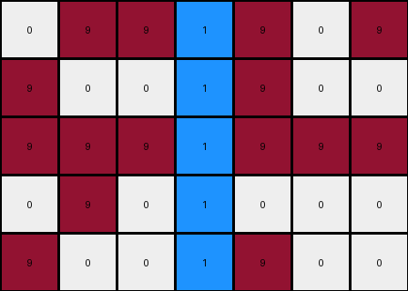
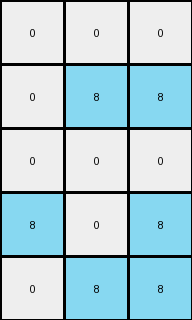

# 1b2d62fb • 007 • example_4 - NLP

---


**input**
```
0 9 9 1 9 0 9
9 0 0 1 9 0 0
9 9 9 1 9 9 9
0 9 0 1 0 0 0
9 0 0 1 9 0 0
```




**output**
```
0 0 0
0 8 8
0 0 0
8 0 8
0 8 8
```




**Instructions**

- Describe in natural language the step-by-step transformation observed between the input and output grids.
- Focus on identifying objects, their properties (predicates), and the actions performed on them.
- Be as clear and concise as possible, providing a complete description of the transformation rule.
