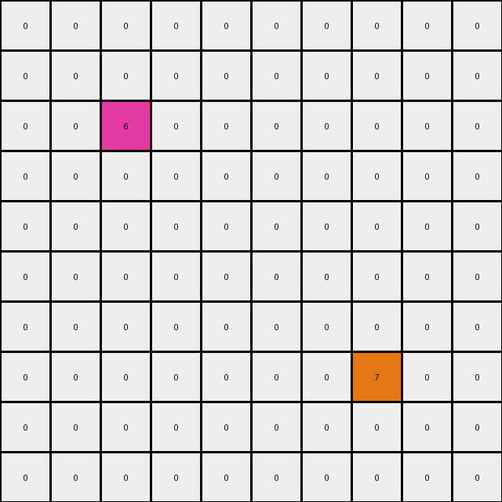
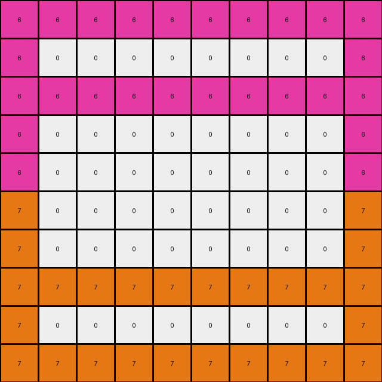

# 1bfc4729 • 001 • example_1 - NLP

---


**input**
```
0 0 0 0 0 0 0 0 0 0
0 0 0 0 0 0 0 0 0 0
0 0 6 0 0 0 0 0 0 0
0 0 0 0 0 0 0 0 0 0
0 0 0 0 0 0 0 0 0 0
0 0 0 0 0 0 0 0 0 0
0 0 0 0 0 0 0 0 0 0
0 0 0 0 0 0 0 7 0 0
0 0 0 0 0 0 0 0 0 0
0 0 0 0 0 0 0 0 0 0
```




**output**
```
6 6 6 6 6 6 6 6 6 6
6 0 0 0 0 0 0 0 0 6
6 6 6 6 6 6 6 6 6 6
6 0 0 0 0 0 0 0 0 6
6 0 0 0 0 0 0 0 0 6
7 0 0 0 0 0 0 0 0 7
7 0 0 0 0 0 0 0 0 7
7 7 7 7 7 7 7 7 7 7
7 0 0 0 0 0 0 0 0 7
7 7 7 7 7 7 7 7 7 7
```




**Instructions**

- Describe in natural language the step-by-step transformation observed between the input and output grids.
- Focus on identifying objects, their properties (predicates), and the actions performed on them.
- Be as clear and concise as possible, providing a complete description of the transformation rule.
