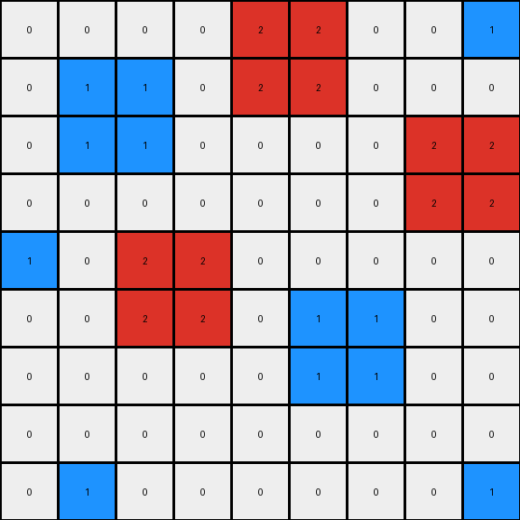
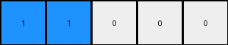

# 1fad071e • 001 • example_1 - NLP

---


**input**
```
0 0 0 0 2 2 0 0 1
0 1 1 0 2 2 0 0 0
0 1 1 0 0 0 0 2 2
0 0 0 0 0 0 0 2 2
1 0 2 2 0 0 0 0 0
0 0 2 2 0 1 1 0 0
0 0 0 0 0 1 1 0 0
0 0 0 0 0 0 0 0 0
0 1 0 0 0 0 0 0 1
```




**output**
```
1 1 0 0 0
```




**Instructions**

- Describe in natural language the step-by-step transformation observed between the input and output grids.
- Focus on identifying objects, their properties (predicates), and the actions performed on them.
- Be as clear and concise as possible, providing a complete description of the transformation rule.
