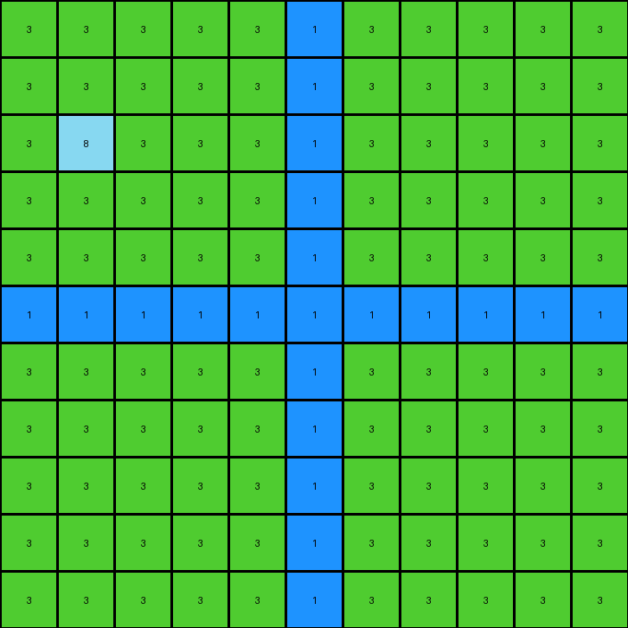

# 2dc579da • 005 • example_3 - NLP

---


**input**
```
3 3 3 3 3 1 3 3 3 3 3
3 3 3 3 3 1 3 3 3 3 3
3 8 3 3 3 1 3 3 3 3 3
3 3 3 3 3 1 3 3 3 3 3
3 3 3 3 3 1 3 3 3 3 3
1 1 1 1 1 1 1 1 1 1 1
3 3 3 3 3 1 3 3 3 3 3
3 3 3 3 3 1 3 3 3 3 3
3 3 3 3 3 1 3 3 3 3 3
3 3 3 3 3 1 3 3 3 3 3
3 3 3 3 3 1 3 3 3 3 3
```




**output**
```
3 3 3 3 3
3 3 3 3 3
3 8 3 3 3
3 3 3 3 3
3 3 3 3 3
```


**Instructions**

- Describe in natural language the step-by-step transformation observed between the input and output grids.
- Focus on identifying objects, their properties (predicates), and the actions performed on them.
- Be as clear and concise as possible, providing a complete description of the transformation rule.
