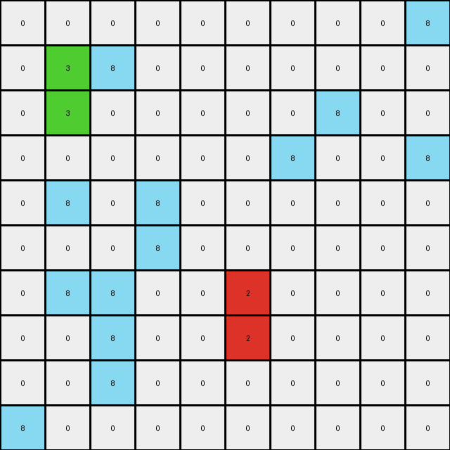

# 2dd70a9a • 003 • example_2 - NLP

---


**input**
```
0 0 0 0 0 0 0 0 0 8
0 3 8 0 0 0 0 0 0 0
0 3 0 0 0 0 0 8 0 0
0 0 0 0 0 0 8 0 0 8
0 8 0 8 0 0 0 0 0 0
0 0 0 8 0 0 0 0 0 0
0 8 8 0 0 2 0 0 0 0
0 0 8 0 0 2 0 0 0 0
0 0 8 0 0 0 0 0 0 0
8 0 0 0 0 0 0 0 0 0
```




**output**
```
0 0 0 0 0 0 0 0 0 8
0 3 8 0 0 0 0 0 0 0
0 3 0 0 0 0 0 8 0 0
0 3 3 3 3 3 8 0 0 8
0 8 0 8 0 3 0 0 0 0
0 0 0 8 0 3 0 0 0 0
0 8 8 0 0 2 0 0 0 0
0 0 8 0 0 2 0 0 0 0
0 0 8 0 0 0 0 0 0 0
8 0 0 0 0 0 0 0 0 0
```


**Instructions**

- Describe in natural language the step-by-step transformation observed between the input and output grids.
- Focus on identifying objects, their properties (predicates), and the actions performed on them.
- Be as clear and concise as possible, providing a complete description of the transformation rule.
