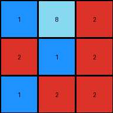

# 3c9b0459 • 001 • example_1 - NLP

---


**input**
```
2 2 1
2 1 2
2 8 1
```


**output**
```
1 8 2
2 1 2
1 2 2
```




**Instructions**

- Describe in natural language the step-by-step transformation observed between the input and output grids.
- Focus on identifying objects, their properties (predicates), and the actions performed on them.
- Be as clear and concise as possible, providing a complete description of the transformation rule.
