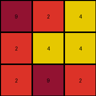
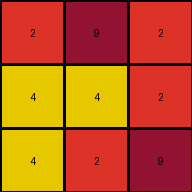

# 3c9b0459 • 003 • example_2 - NLP

---


**input**
```
9 2 4
2 4 4
2 9 2
```




**output**
```
2 9 2
4 4 2
4 2 9
```




**Instructions**

- Describe in natural language the step-by-step transformation observed between the input and output grids.
- Focus on identifying objects, their properties (predicates), and the actions performed on them.
- Be as clear and concise as possible, providing a complete description of the transformation rule.
