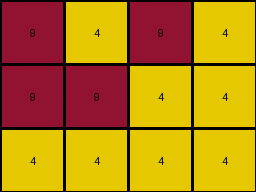
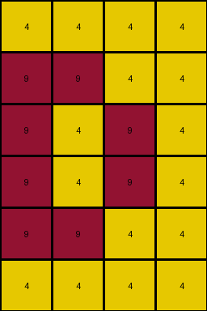

# 4c4377d9 • 005 • example_3 - NLP

---


**input**
```
9 4 9 4
9 9 4 4
4 4 4 4
```




**output**
```
4 4 4 4
9 9 4 4
9 4 9 4
9 4 9 4
9 9 4 4
4 4 4 4
```




**Instructions**

- Describe in natural language the step-by-step transformation observed between the input and output grids.
- Focus on identifying objects, their properties (predicates), and the actions performed on them.
- Be as clear and concise as possible, providing a complete description of the transformation rule.
