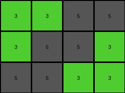
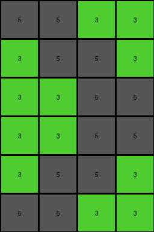

# 4c4377d9 • 007 • example_4 - NLP

---


**input**
```
3 3 5 5
3 5 5 3
5 5 3 3
```




**output**
```
5 5 3 3
3 5 5 3
3 3 5 5
3 3 5 5
3 5 5 3
5 5 3 3
```




**Instructions**

- Describe in natural language the step-by-step transformation observed between the input and output grids.
- Focus on identifying objects, their properties (predicates), and the actions performed on them.
- Be as clear and concise as possible, providing a complete description of the transformation rule.
