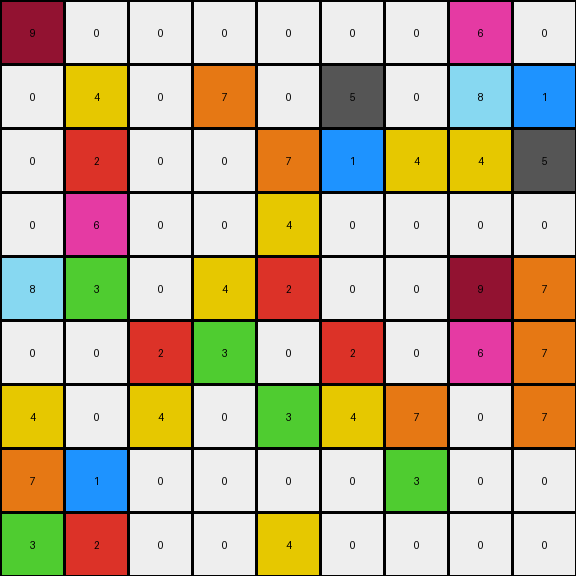
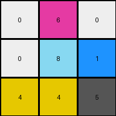

# 5bd6f4ac • 003 • example_2 - NLP

---


**input**
```
9 0 0 0 0 0 0 6 0
0 4 0 7 0 5 0 8 1
0 2 0 0 7 1 4 4 5
0 6 0 0 4 0 0 0 0
8 3 0 4 2 0 0 9 7
0 0 2 3 0 2 0 6 7
4 0 4 0 3 4 7 0 7
7 1 0 0 0 0 3 0 0
3 2 0 0 4 0 0 0 0
```




**output**
```
0 6 0
0 8 1
4 4 5
```




**Instructions**

- Describe in natural language the step-by-step transformation observed between the input and output grids.
- Focus on identifying objects, their properties (predicates), and the actions performed on them.
- Be as clear and concise as possible, providing a complete description of the transformation rule.
