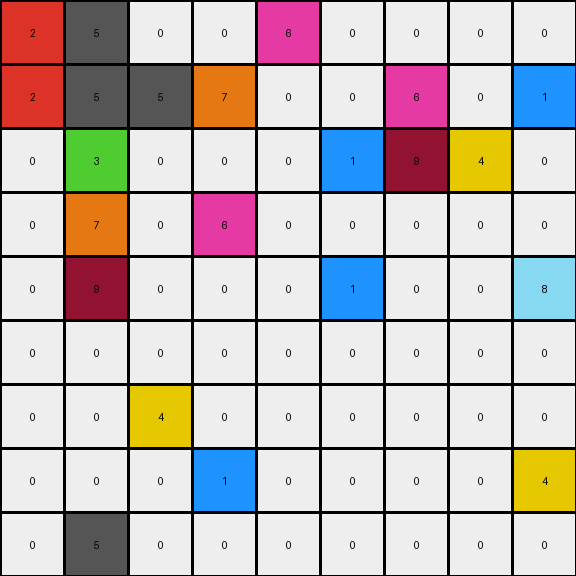
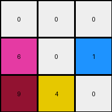

# 5bd6f4ac • 005 • example_3 - NLP

---


**input**
```
2 5 0 0 6 0 0 0 0
2 5 5 7 0 0 6 0 1
0 3 0 0 0 1 9 4 0
0 7 0 6 0 0 0 0 0
0 9 0 0 0 1 0 0 8
0 0 0 0 0 0 0 0 0
0 0 4 0 0 0 0 0 0
0 0 0 1 0 0 0 0 4
0 5 0 0 0 0 0 0 0
```




**output**
```
0 0 0
6 0 1
9 4 0
```




**Instructions**

- Describe in natural language the step-by-step transformation observed between the input and output grids.
- Focus on identifying objects, their properties (predicates), and the actions performed on them.
- Be as clear and concise as possible, providing a complete description of the transformation rule.
