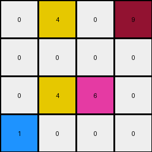

# 3-1e0a9b12 • 002 • example_1 - CODE

---

**input**
```
0 4 0 9
0 0 0 0
0 4 6 0
1 0 0 0
```




**output**
```
0 0 0 0
0 0 0 0
0 4 0 0
1 4 6 9
```


**Natural Language Program:**

The transformation operates column by column. For each column in the input grid, identify all the non-zero color values.  Then, in the output grid, populate the same column from bottom to top with these identified non-zero color values in the same order they appeared in the input column. Fill the remaining cells in the top rows of the output column with the color white (0). This effectively pushes all colored blocks in each column to the bottom.
**INSTRUCTIONS**

- generate a Python module to represent the natural language program 
- follow the template below
- all common math and science libraries are available
- create docstring only at top - but comment the workflow in the function
- use helper functions for common operations like finding objects, counting,
  measuring, moving, etc. 

remember - we are working iteratively - so this code will inform your future
self as we converge on the solution

*template:*

```python
"""
{ natural language description of the transformation rule }
"""

{ imports }

def transform(input_grid):
    # initialize output_grid

    # change output pixels 

    return output_grid

```
