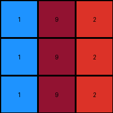

# 4-0d3d703e • 005 • example_3 - NLP

---

**input**
```
3 1 2
3 1 2
3 1 2
```


**output**
```
4 5 6
4 5 6
4 5 6
```


**Natural Language Program:**

The transformation rule is a direct color substitution.  Each color in the input grid is replaced with a new color according to a fixed mapping. Specifically:

- Color 3 (green) is transformed to color 4 (yellow).
- Color 1 (blue) is transformed to color 5 (gray).
- Color 2 (red) is transformed to color 6 (magenta).

The positions and arrangement of the colors are preserved; only the color values themselves are changed. The dimensions of the grid remain the same.
```python
"""
The transformation rule is a direct color substitution. Each color in the input grid is replaced with a new color according to a fixed mapping. Specifically:

- Color 3 (green) is transformed to color 4 (yellow).
- Color 1 (blue) is transformed to color 5 (gray).
- Color 2 (red) is transformed to color 6 (magenta).

The positions and arrangement of the colors are preserved; only the color values themselves are changed. The dimensions of the grid remain the same.
"""

import numpy as np

def transform(input_grid):
    """
    Transforms the input grid by replacing colors based on a predefined mapping.
    
    Args:
        input_grid (numpy.ndarray): The input grid with integer color values.
    
    Returns:
        numpy.ndarray: The transformed grid with updated color values.
    """
    # Initialize the output grid as a copy of the input grid to preserve dimensions.
    output_grid = np.copy(input_grid)
    
    # Define the color mapping.
    color_map = {
        3: 4,  # Green to Yellow
        1: 5,  # Blue to Gray
        2: 6   # Red to Magenta
    }
    
    # Iterate through the color map and replace colors in the output grid.
    for old_color, new_color in color_map.items():
        output_grid[input_grid == old_color] = new_color
        
    return output_grid
```


**input**
```
2 3 8
2 3 8
2 3 8
```


**output**
```
6 4 9
6 4 9
6 4 9
```


**Natural Language Program:**

The transformation rule is a direct color substitution, where each color in the input grid is replaced by a new color according to a specific mapping.  The positions and arrangement of colors are maintained, and only the color values are altered. The grid dimensions remain unchanged. The color mapping is as follows:

- Color 2 (red) is transformed to color 6 (magenta).
- Color 3 (green) is transformed to color 4 (yellow).
- Color 8 (azure) is transformed to color 9 (maroon).
```python
"""
The transformation rule is a direct color substitution, where each color in the input grid is replaced by a new color according to a specific mapping. The positions and arrangement of colors are maintained, and only the color values are altered. The grid dimensions remain unchanged. The color mapping is as follows:

- Color 2 (red) is transformed to color 6 (magenta).
- Color 3 (green) is transformed to color 4 (yellow).
- Color 8 (azure) is transformed to color 9 (maroon).
"""

import numpy as np

def transform(input_grid):
    """
    Transforms the input grid by replacing colors based on a predefined mapping.
    
    Args:
        input_grid (numpy.ndarray): The input grid with integer color values.
    
    Returns:
        numpy.ndarray: The transformed grid with updated color values.
    """
    # Initialize the output grid as a copy of the input grid to preserve dimensions.
    output_grid = np.copy(input_grid)
    
    # Define the color mapping.
    color_map = {
        2: 6,  # Red to Magenta
        3: 4,  # Green to Yellow
        8: 9   # Azure to Maroon
    }
    
    # Iterate through the color map and replace colors in the output grid.
    for old_color, new_color in color_map.items():
        output_grid[input_grid == old_color] = new_color
        
    return output_grid
```


**input**
```
5 8 6
5 8 6
5 8 6
```


**output**
```
1 9 2
1 9 2
1 9 2
```



**Instructions**

- Describe in natural language the step-by-step transformation observed between the input and output grids.
- Focus on identifying objects, their properties (predicates), and the actions performed on them.
- Be as clear and concise as possible, providing a complete description of the transformation rule.
