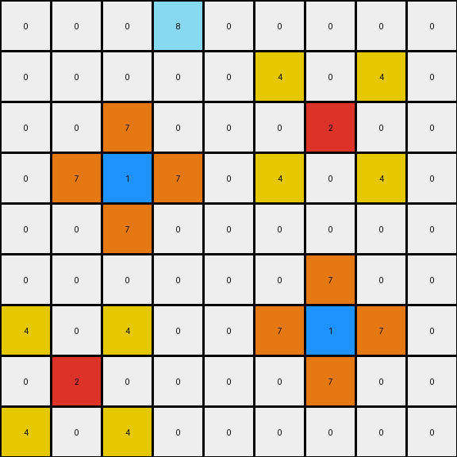
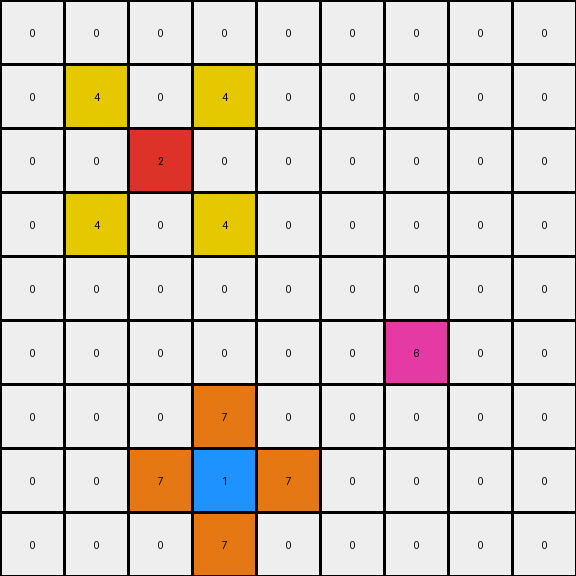

# 2-0ca9ddb6 • 006 • example_3 - CODE

---

**input**
```
0 0 0 0 0 0 0 0 0
0 0 0 0 0 0 0 0 0
0 0 0 0 0 0 0 0 0
0 0 2 0 0 0 0 0 0
0 0 0 0 0 0 0 0 0
0 0 0 0 0 0 0 0 0
0 0 0 0 0 0 1 0 0
0 0 0 0 0 0 0 0 0
0 0 0 0 0 0 0 0 0
```


**output**
```
0 0 0 0 0 0 0 0 0
0 0 0 0 0 0 0 0 0
0 4 0 4 0 0 0 0 0
0 0 2 0 0 0 0 0 0
0 4 0 4 0 0 0 0 0
0 0 0 0 0 0 7 0 0
0 0 0 0 0 7 1 7 0
0 0 0 0 0 0 7 0 0
0 0 0 0 0 0 0 0 0
```


```yaml
task_context: "The task is to transform an input grid into an output grid based on the colors of non-zero cells. Specific colors trigger different types of neighbor modifications."
natural_language_program: |
  1. Initialize the output grid as a direct copy of the input grid.
  2. Iterate through each cell of the input grid, identifying each cell by its row and column index.
  3. For each cell, check if its value is non-zero (greater than 0).
  4. If the cell's value is non-zero, determine its color.
  5. If the color of the cell is red (color code 2), then for each of the four diagonal neighbor positions (top-left, top-right, bottom-left, bottom-right) relative to the current cell, set the value of the cell at that position in the output grid to yellow (color code 4).
  6. If the color of the cell is blue (color code 1), then for each of the four orthogonal neighbor positions (up, down, left, right) relative to the current cell, set the value of the cell at that position in the output grid to orange (color code 7).
  7. After checking and potentially modifying neighbors for all non-zero cells, the output grid is considered complete.
  8. Note that the original non-zero cells in the input grid remain in their positions and with their original colors in the output grid.
  9. Cells that were zero in the input grid remain zero in the output grid unless they are modified by being neighbors of a non-zero cell according to steps 5 and 6.
```
```python
"""
Transforms an input grid into an output grid based on the colors of non-zero cells. 
Red (2) cells cause their diagonal neighbors to become yellow (4).
Blue (1) cells cause their orthogonal neighbors to become orange (7).
"""

import numpy as np

def transform(input_grid):
    # Initialize output_grid as a copy of input_grid
    output_grid = np.copy(input_grid)
    rows, cols = input_grid.shape

    # Iterate through each cell of the input grid
    for i in range(rows):
        for j in range(cols):
            # Check if the cell's value is non-zero
            if input_grid[i, j] > 0:
                # If the cell is red (2)
                if input_grid[i, j] == 2:
                    # Set diagonal neighbors to yellow (4)
                    for x, y in [(-1, -1), (-1, 1), (1, -1), (1, 1)]:
                        if 0 <= i + x < rows and 0 <= j + y < cols:
                            output_grid[i + x, j + y] = 4
                # If the cell is blue (1)
                elif input_grid[i, j] == 1:
                    # Set orthogonal neighbors to orange (7)
                    for x, y in [(-1, 0), (1, 0), (0, -1), (0, 1)]:
                        if 0 <= i + x < rows and 0 <= j + y < cols:
                            output_grid[i + x, j + y] = 7

    return output_grid
```


**input**
```
0 0 0 8 0 0 0 0 0
0 0 0 0 0 0 0 0 0
0 0 0 0 0 0 2 0 0
0 0 1 0 0 0 0 0 0
0 0 0 0 0 0 0 0 0
0 0 0 0 0 0 0 0 0
0 0 0 0 0 0 1 0 0
0 2 0 0 0 0 0 0 0
0 0 0 0 0 0 0 0 0
```


**output**
```
0 0 0 8 0 0 0 0 0
0 0 0 0 0 4 0 4 0
0 0 7 0 0 0 2 0 0
0 7 1 7 0 4 0 4 0
0 0 7 0 0 0 0 0 0
0 0 0 0 0 0 7 0 0
4 0 4 0 0 7 1 7 0
0 2 0 0 0 0 7 0 0
4 0 4 0 0 0 0 0 0
```



```yaml
task_context: "The task is to transform an input grid into an output grid by modifying the neighbors of non-zero colored cells based on their color. Red cells affect diagonal neighbors and blue cells affect orthogonal neighbors."
natural_language_program: |
  1. Initialize the output grid as an exact copy of the input grid.
  2. Iterate through each cell in the input grid, considering both its row and column index.
  3. Check if the value of the current cell is greater than zero.
  4. If the cell's value is non-zero, identify its color.
  5. If the color of the cell is red (color code 2), then for each of its four diagonal neighbors (top-left, top-right, bottom-left, bottom-right), change the color of the corresponding cell in the output grid to yellow (color code 4). Ensure these neighbors are within the grid boundaries.
  6. If the color of the cell is blue (color code 1), then for each of its four orthogonal neighbors (up, down, left, right), change the color of the corresponding cell in the output grid to orange (color code 7). Ensure these neighbors are within the grid boundaries.
  7. After processing all cells in the input grid, the resulting output grid is the final transformed grid.
  8. Note that the cells in the output grid that correspond to the original non-zero cells in the input grid retain their original colors.
  9. Cells that were zero in the input grid remain zero in the output grid unless they are modified because they are neighbors of a red or blue cell as described in steps 5 and 6.
```
```python
"""
Transforms an input grid into an output grid by modifying the neighbors of non-zero colored cells based on their color. 
Red (2) cells change their diagonal neighbors to yellow (4).
Blue (1) cells change their orthogonal neighbors to orange (7).
Azure (8) cells do not have any effect on their neighbors.
"""

import numpy as np

def transform(input_grid):
    # Initialize output_grid as a copy of input_grid
    output_grid = np.copy(input_grid)
    rows, cols = input_grid.shape

    # Iterate through each cell of the input grid
    for i in range(rows):
        for j in range(cols):
            # Check if the cell's value is non-zero
            if input_grid[i, j] > 0:
                # If the cell is red (2)
                if input_grid[i, j] == 2:
                    # Set diagonal neighbors to yellow (4)
                    for x, y in [(-1, -1), (-1, 1), (1, -1), (1, 1)]:
                        if 0 <= i + x < rows and 0 <= j + y < cols:
                            output_grid[i + x, j + y] = 4
                # If the cell is blue (1)
                elif input_grid[i, j] == 1:
                    # Set orthogonal neighbors to orange (7)
                    for x, y in [(-1, 0), (1, 0), (0, -1), (0, 1)]:
                        if 0 <= i + x < rows and 0 <= j + y < cols:
                            output_grid[i + x, j + y] = 7

    return output_grid
```


**input**
```
0 0 0 0 0 0 0 0 0
0 0 0 0 0 0 0 0 0
0 0 2 0 0 0 0 0 0
0 0 0 0 0 0 0 0 0
0 0 0 0 0 0 0 0 0
0 0 0 0 0 0 6 0 0
0 0 0 0 0 0 0 0 0
0 0 0 1 0 0 0 0 0
0 0 0 0 0 0 0 0 0
```


**output**
```
0 0 0 0 0 0 0 0 0
0 4 0 4 0 0 0 0 0
0 0 2 0 0 0 0 0 0
0 4 0 4 0 0 0 0 0
0 0 0 0 0 0 0 0 0
0 0 0 0 0 0 6 0 0
0 0 0 7 0 0 0 0 0
0 0 7 1 7 0 0 0 0
0 0 0 7 0 0 0 0 0
```



```yaml
task_context: "The task is to transform an input grid to an output grid by altering the neighboring cells of specific colored cells. Red cells affect diagonal neighbors and blue cells affect orthogonal neighbors."
natural_language_program: |
  1. Initialize the output grid as a direct copy of the input grid.
  2. Iterate through each cell of the input grid, identifying each cell by its row and column index.
  3. For each cell, check if its value is non-zero (greater than 0).
  4. If the cell's value is non-zero, determine its color.
  5. If the color of the cell is red (color code 2), then for each of the four diagonal neighbor positions (top-left, top-right, bottom-left, bottom-right) relative to the current cell, set the value of the cell at that position in the output grid to yellow (color code 4). Ensure that these neighbor positions are within the grid boundaries.
  6. If the color of the cell is blue (color code 1), then for each of the four orthogonal neighbor positions (up, down, left, right) relative to the current cell, set the value of the cell at that position in the output grid to orange (color code 7). Ensure that these neighbor positions are within the grid boundaries.
  7. After iterating through all cells and applying the neighbor modifications based on cell colors, the resulting output grid is the final transformed grid.
  8. It is important to note that the original non-zero cells in the input grid retain their original colors and positions in the output grid.
  9. Cells that were initially zero in the input grid will remain zero in the output grid unless they are modified by becoming neighbors of a red or blue cell as per steps 5 and 6.
```
**INSTRUCTIONS**

- generate a Python module to represent the natural language program 
- follow the template below
- all common math and science libraries are available
- create docstring only at top - but comment the workflow in the function
- use helper functions for common operations like finding objects, counting,
  measuring, moving, etc. 

remember - we are working iteratively - so this code will inform your future
self as we converge on the solution

*template:*

```python
"""
{ natural language description of the transformation rule }
"""

{ imports }

def transform(input_grid):
    # initialize output_grid

    # change output pixels 

    return output_grid

```
