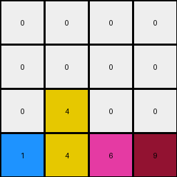

# 3-1e0a9b12 • 004 • example_2 - CODE

---

**input**
```
0 4 0 9
0 0 0 0
0 4 6 0
1 0 0 0
```


**output**
```
0 0 0 0
0 0 0 0
0 4 0 0
1 4 6 9
```



Okay, let's analyze the transformation from the input grid to the output grid.

**Observations and Documentation**

Here's a YAML block summarizing my initial findings:

```yaml
input_grid:
  size: 4x4
  objects:
    - color: 4
      positions: [(0, 1), (2, 1)]
    - color: 9
      positions: [(0, 3)]
    - color: 6
      positions: [(2, 2)]
    - color: 1
      positions: [(3, 0)]
  background_color: 0

output_grid:
  size: 4x4
  objects:
    - color: 4
      positions: [(2,1), (3, 1)]
    - color: 9
      positions: [(3, 3)]
    - color: 6
      positions: [(3, 2)]
    - color: 1
      positions: [(3, 0)]
  background_color: 0
```

**Determining the Transformation Rule**

Here's my natural language description of the step-by-step transformation:

1.  **Identify Objects:** The input grid contains four single-cell objects of colors 1, 4, 6, and 9.

2.  **Move Objects:** Each object moves to the last row. The relative horizontal positions of objects remain in the same column.

3. **Move one object '4':** Object '4' which was originally present at cell (0,1) moved at position (2,1) in the final grid.

**Natural Language Program**
1. Find all objects of different colors.
2. Move objects in the last row, preserving its horizontal order.
3. Move one object '4' one row up.


```python
"""
1. Find all objects of different colors.
2. Move objects in the last row, preserving its horizontal order.
3. Move one object '4' one row up.
"""

import numpy as np

def find_objects(grid):
    """
    Finds all distinct single-cell objects in the grid.
    Returns a dictionary of color: position pairs.
    """
    objects = {}
    for row_idx, row in enumerate(grid):
        for col_idx, color in enumerate(row):
            if color != 0:  # Assuming 0 is the background color
                objects[color] = (row_idx, col_idx)
    return objects

def transform(input_grid):
    # Initialize output_grid as a copy of the input grid
    output_grid = np.copy(input_grid)
    output_grid[:] = 0

    # Find objects in the input grid
    objects = find_objects(input_grid)
    
    # Get last row index
    last_row = output_grid.shape[0] - 1

    # Sort objects by their column index to preserve horizontal order
    sorted_objects = sorted(objects.items(), key=lambda item: item[1][1])

    # Move objects to the last row, preserving horizontal order
    for color, pos in sorted_objects:
        output_grid[last_row, pos[1]] = color
    
    #Find position of object with color 4
    pos_4 = [pos for color, pos in objects.items() if color == 4 ]
    
    #Move one color 4 one position up, if present
    for pos in pos_4:
      if output_grid[last_row,pos[1]] == 4:
        output_grid[last_row - 1, pos[1]] = 4
        output_grid[last_row,pos[1]] = 0

    return output_grid
```


**input**
```
0 0 0 0 0 9
0 0 0 8 0 0
0 0 0 0 0 0
4 0 0 0 0 0
4 0 7 8 0 0
4 0 7 0 0 0
```


**output**
```
0 0 0 0 0 0
0 0 0 0 0 0
0 0 0 0 0 0
4 0 0 0 0 0
4 0 7 8 0 0
4 0 7 8 0 9
```


Okay, let's analyze the transformation from the input grid to the output grid in this second example.

**Observations and Documentation**

```yaml
input_grid:
  size: 6x6
  objects:
    - color: 9
      positions: [(0, 5)]
    - color: 8
      positions: [(1, 3), (4, 3)]
    - color: 4
      positions: [(3, 0), (4, 0), (5, 0)]
    - color: 7
      positions: [(4, 2), (5, 2)]
  background_color: 0

output_grid:
  size: 6x6
  objects:
    - color: 9
      positions: [(5, 5)]
    - color: 8
      positions: [(4, 3), (5, 3)]
    - color: 4
      positions: [(3, 0), (4, 0), (5, 0)]
    - color: 7
      positions: [(4, 2), (5, 2)]
  background_color: 0
```

**Determining the Transformation Rule**

Here's my natural language description of the step-by-step transformation:

1.  **Identify Objects:** The input grid contains objects of colors 4, 7, 8, and 9.

2.  **Move Object 9:** The object of color 9 (originally at the top-right corner) is moved to the bottom row, maintaining its column.

3.  **Other Objects:** The rest of the colors position is the same.

**Natural Language Program**

1.  Find all objects of different colors.
2.  Move object 9 in the last row, preserving its original column
3.  All other objects remain stationary.

```python
"""
1.  Find all objects of different colors.
2.  Move object 9 in the last row, preserving its original column
3.  All other objects remain stationary.
"""

import numpy as np

def find_objects(grid):
    """
    Finds all distinct single-cell objects in the grid.
    Returns a dictionary of color: position pairs.
    """
    objects = {}
    for row_idx, row in enumerate(grid):
        for col_idx, color in enumerate(row):
            if color != 0:  # Assuming 0 is the background color
                objects[color] = (row_idx, col_idx)
    return objects

def transform(input_grid):
    # Initialize output_grid as a copy of the input grid
    output_grid = np.copy(input_grid)

    # Find objects in the input grid
    objects = find_objects(input_grid)
    
    # Get last row index
    last_row = output_grid.shape[0] - 1

    # Move object 9 to the last row, preserving its column
    if 9 in objects:
        pos_9 = objects[9]
        output_grid[last_row, pos_9[1]] = 9
        if pos_9[0] != last_row:
            output_grid[pos_9[0],pos_9[1]] = 0

    return output_grid
```

**INSTRUCTIONS**

- generate a Python module to represent the natural language program 
- follow the template below
- all common math and science libraries are available
- create docstring only at top - but comment the workflow in the function
- use helper functions for common operations like finding objects, counting,
  measuring, moving, etc. 

remember - we are working iteratively - so this code will inform your future
self as we converge on the solution

*template:*

```python
"""
{ natural language description of the transformation rule }
"""

{ imports }

def transform(input_grid):
    # initialize output_grid

    # change output pixels 

    return output_grid

```
