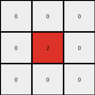

# 6-0520fde7 • 003 • example_2 - NLP

---

**input**
```
1 0 0 5 0 1 0
0 1 0 5 1 1 1
1 0 0 5 0 0 0
```


**output**
```
0 0 0
0 2 0
0 0 0
```



Okay, let's analyze the transformation from the input grid to the output grid.

**YAML Block: Observations**

```yaml
input_grid:
  size: 3x7
  objects:
    - color: 1
      positions: [(0, 0), (1, 1), (1, 5), (1, 6), (2, 0)]
      shape: irregular
    - color: 5
      positions: [(0, 3), (1, 3), (2, 3)]
      shape: vertical line
    - color: 0
      positions: background, filling the rest
      shape: background

output_grid:
  size: 3x3
  objects:
    - color: 2
      positions: [(1,1)]
      shape: single cell
    - color: 0
      positions: background
      shape: Background
```

**Natural Language Program: Transformation Rule**

1.  **Identify Objects:** In the input grid, we have three types of objects based on color: blue (1), gray (5), and the background white (0).

2.  **Focus on a Specific Object:** The key object of transformation seems to be where color 5 (gray) is.

3.  **Detect the Gray object position:** Gray appears in a vertical line shape. The transformation will replace the gray color with a new color, 2 (red).

4.  **Define the output size:** The new color 2 (red) appears in the new output grid that has a size of 3x3.

5. **Output:** Output a 3x3 grid of the same height of the input, all zeros except the center cell which has color 2 (red).

**Transformation Summary**

The transformation takes specific object from the input, detects its size, and replaces it by a new object color. The output grid is all zeros (background color) except for a single red (color 2) cell in the center.

```python
"""
The transformation takes specific object from the input, detects its size, and replaces it by a new object color. The output grid is all zeros (background color) except for a single red (color 2) cell in the center.
"""

import numpy as np

def transform(input_grid):
    # Initialize output_grid as a 3x3 numpy array filled with zeros.
    output_grid = np.zeros((3, 3), dtype=int)
    
    # Place the color 2 (red) in the center cell of the output grid.
    output_grid[1, 1] = 2
    
    return output_grid
```


**input**
```
1 1 0 5 0 1 0
0 0 1 5 1 1 1
1 1 0 5 0 1 0
```


**output**
```
0 2 0
0 0 2
0 2 0
```


**Instructions**

- Describe in natural language the step-by-step transformation observed between the input and output grids.
- Focus on identifying objects, their properties (predicates), and the actions performed on them.
- Be as clear and concise as possible, providing a complete description of the transformation rule.
