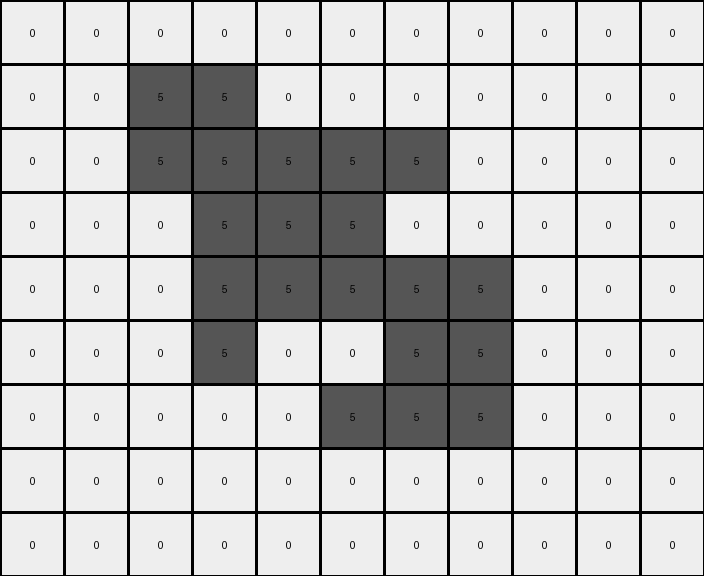

# 5-150deff5 • 002 • example_1 - CODE

---

**input**
```
0 0 0 0 0 0 0 0 0 0 0
0 0 5 5 0 0 0 0 0 0 0
0 0 5 5 5 5 5 0 0 0 0
0 0 0 5 5 5 0 0 0 0 0
0 0 0 5 5 5 5 5 0 0 0
0 0 0 5 0 0 5 5 0 0 0
0 0 0 0 0 5 5 5 0 0 0
0 0 0 0 0 0 0 0 0 0 0
0 0 0 0 0 0 0 0 0 0 0
```




**output**
```
0 0 0 0 0 0 0 0 0 0 0
0 0 8 8 0 0 0 0 0 0 0
0 0 8 8 2 2 2 0 0 0 0
0 0 0 2 8 8 0 0 0 0 0
0 0 0 2 8 8 8 8 0 0 0
0 0 0 2 0 0 8 8 0 0 0
0 0 0 0 0 2 2 2 0 0 0
0 0 0 0 0 0 0 0 0 0 0
0 0 0 0 0 0 0 0 0 0 0
```


Okay, let's analyze the transformation from the input grid to the output grid.

**Observations and Documentation**

```yaml
observations:
  input_grid:
    - object_1:
        color: 5 (gray)
        shape: Irregular, but roughly a mirrored 'L' shape
        position: Centered, spanning multiple rows and columns
        size: 16 cells
  output_grid:
    - object_1:
        color: 8 (azure)
        shape: Similar to input, but with some cells replaced
        position: Same as input
        size: 8
    - object_2:
      color: 2 (red)
      shape: Replaces cells of gray object
      size: 8
```

**Determining the Transformation Rule**

Here's a step-by-step natural language description of the transformation:

1.  **Identify the Object:** Locate the contiguous gray (5) object in the input grid.

2.  **Split and Replace:**
    *   The gray object is recolored with azure.
    *   When possible, cells in the gray object are replaced. When a gray pixel has up, down, left and right gray neighbors, it's replaced with a red pixel.

**Natural Language Program**
```
1. Find every gray (color 5) pixel.
2. Recolor them to azure.
3. Check the neighbors of each gray pixel before recoloring.
4. If the neighbors are all gray, replace the center with red.
```

**INSTRUCTIONS**

- generate a Python module to represent the natural language program 
- follow the template below
- all common math and science libraries are available
- create docstring only at top - but comment the workflow in the function
- use helper functions for common operations like finding objects, counting,
  measuring, moving, etc. 

remember - we are working iteratively - so this code will inform your future
self as we converge on the solution

*template:*

```python
"""
{ natural language description of the transformation rule }
"""

{ imports }

def transform(input_grid):
    # initialize output_grid

    # change output pixels 

    return output_grid

```
