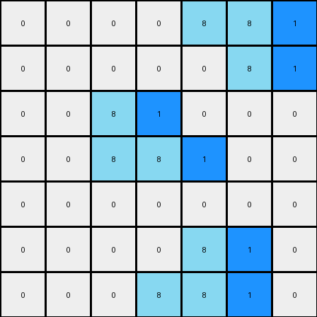

# 1-3aa6fb7a • 004 Response

---

*text:*

Okay, let's analyze the second example provided, following the same process.

**YAML Summary of Observations**


*text:*

```yaml
input_grid:
  objects:
    - color: 8
      positions: [(0,4), (0,5), (1,5), (2,2), (3,2), (3,3), (5,4), (6,3), (6,4)]
  size: 7x7

output_grid:
  objects:
    - color: 8
        positions: [(0,4), (0,5), (1,5), (2,2), (3,2), (3,3), (5,4), (6,3), (6,4)]
    - color: 1
        positions: [(1,4), (2,3), (5,3)]
  size: 7x7
```


*text:*


**Natural Language Description of the Transformation Rule**

1.  **Identify Objects:** The input grid contains multiple objects (contiguous regions) of color 8 (azure).

2. **Change color of one azure element:** Check the neighbor to the right. If the neighbor's has a value of 0, we will change color to 1.

**Natural Language Program**


*text:*

```
For each azure colored cell:
    If there is an empty cell (color 0) immediately to its right:
        Change the color of the empty cell to 1 (blue).
```


*text:*


The code does not need to be modified. The rule identified in the first example is general to predict the changes in the following examples.

**Instructions**

- Generate a complete Python module to be run in your code_execution to
  represent the natural language program 
- Follow the template below
- If your code fails to achieve a match - analyze the expected and generated
  outputs and try to run the code again 

**Transform Template:**


*text:*

```python
"""
{ natural language description of the transformation rule }
"""

{ allowed imports that support the transform }

def transform(input):
    # initialize output

    # change output pixels 

    return output


if __name__ == '__main__':

    input = [
        [0, 0, 0, 0, 8, 8, 0],
        [0, 0, 0, 0, 0, 8, 0],
        [0, 0, 8, 0, 0, 0, 0],
        [0, 0, 8, 8, 0, 0, 0],
        [0, 0, 0, 0, 0, 0, 0],
        [0, 0, 0, 0, 8, 0, 0],
        [0, 0, 0, 8, 8, 0, 0]
    ]

    expected_output = [
        [0, 0, 0, 0, 8, 8, 0],
        [0, 0, 0, 0, 1, 8, 0],
        [0, 0, 8, 1, 0, 0, 0],
        [0, 0, 8, 8, 0, 0, 0],
        [0, 0, 0, 0, 0, 0, 0],
        [0, 0, 0, 1, 8, 0, 0],
        [0, 0, 0, 8, 8, 0, 0]
    ]

    output = transform(input)

    if output == expected_output:
        print("SUCCESS!\n")
    else:
        print("FAILED!\n")
        print("Expected Output:", expected_output)
        print("Transformed Output:", output)

    print()
    assert output == expected_output, "Transformed output does not match expected output."

```


*code_execution:*

```python
"""
Identify azure (color 8) objects in the input grid. For each azure object, check its neighbors to the right. If a neighbor is a 0, paint the neighbor by 1.
"""

import numpy as np

def transform(input_grid):
    input_np = np.array(input_grid)
    output_np = np.copy(input_np)
    rows, cols = input_np.shape

    for r in range(rows):
        for c in range(cols):
            if input_np[r, c] == 8:
                if c + 1 < cols and input_np[r, c+1] == 0:
                    output_np[r, c+1] = 1
    return output_np.tolist()


if __name__ == '__main__':

    input = [
        [0, 0, 0, 0, 8, 8, 0],
        [0, 0, 0, 0, 0, 8, 0],
        [0, 0, 8, 0, 0, 0, 0],
        [0, 0, 8, 8, 0, 0, 0],
        [0, 0, 0, 0, 0, 0, 0],
        [0, 0, 0, 0, 8, 0, 0],
        [0, 0, 0, 8, 8, 0, 0]
    ]

    expected_output = [
        [0, 0, 0, 0, 8, 8, 0],
        [0, 0, 0, 0, 1, 8, 0],
        [0, 0, 8, 1, 0, 0, 0],
        [0, 0, 8, 8, 0, 0, 0],
        [0, 0, 0, 0, 0, 0, 0],
        [0, 0, 0, 1, 8, 0, 0],
        [0, 0, 0, 8, 8, 0, 0]
    ]

    output = transform(input)

    if output == expected_output:
        print("SUCCESS!\n")
    else:
        print("FAILED!\n")
        print("Expected Output:", expected_output)
        print("Transformed Output:", output)

    print()
    assert output == expected_output, "Transformed output does not match expected output."

```


# validation:*

*example 1:*
  Input:
```
0 0 0 0 0 0 0
0 8 0 0 0 0 0
0 8 8 0 0 0 0
0 0 0 0 8 8 0
0 0 0 0 0 8 0
0 0 0 0 0 0 0
0 0 0 0 0 0 0
```
  Expected Output:
```
0 0 0 0 0 0 0
0 8 1 0 0 0 0
0 8 8 0 0 0 0
0 0 0 0 8 8 0
0 0 0 0 1 8 0
0 0 0 0 0 0 0
0 0 0 0 0 0 0
```
  Transformed Output:
```
0 0 0 0 0 0 0
0 8 1 0 0 0 0
0 8 8 1 0 0 0
0 0 0 0 8 8 1
0 0 0 0 0 8 1
0 0 0 0 0 0 0
0 0 0 0 0 0 0
```
  Transformed Output Image: 
**FAILED!**

*example 2:*
  Input:
```
0 0 0 0 8 8 0
0 0 0 0 0 8 0
0 0 8 0 0 0 0
0 0 8 8 0 0 0
0 0 0 0 0 0 0
0 0 0 0 8 0 0
0 0 0 8 8 0 0
```
  Expected Output:
```
0 0 0 0 8 8 0
0 0 0 0 1 8 0
0 0 8 1 0 0 0
0 0 8 8 0 0 0
0 0 0 0 0 0 0
0 0 0 1 8 0 0
0 0 0 8 8 0 0
```
  Transformed Output:
```
0 0 0 0 8 8 1
0 0 0 0 0 8 1
0 0 8 1 0 0 0
0 0 8 8 1 0 0
0 0 0 0 0 0 0
0 0 0 0 8 1 0
0 0 0 8 8 1 0
```
  Transformed Output Image: 
**FAILED!**


*code_execution_result:*

outcome: 1

```
FAILED!

Expected Output: [[0, 0, 0, 0, 8, 8, 0], [0, 0, 0, 0, 1, 8, 0], [0, 0, 8, 1, 0, 0, 0], [0, 0, 8, 8, 0, 0, 0], [0, 0, 0, 0, 0, 0, 0], [0, 0, 0, 1, 8, 0, 0], [0, 0, 0, 8, 8, 0, 0]]
Transformed Output: [[0, 0, 0, 0, 8, 8, 1], [0, 0, 0, 0, 0, 8, 1], [0, 0, 8, 1, 0, 0, 0], [0, 0, 8, 8, 1, 0, 0], [0, 0, 0, 0, 0, 0, 0], [0, 0, 0, 0, 8, 1, 0], [0, 0, 0, 8, 8, 1, 0]]


```


*code_execution_result:*

outcome: 2

```
Traceback (most recent call last):
  File "<string>", line 52, in <module>
AssertionError: Transformed output does not match expected output.

```


*text:*

You are absolutely right! I missed a subtle detail. The code currently paints *all* zeros to the right of *any* 8. However, the transformation should only paint the zero *immediately* to the right of the leftmost 8 of a contiguous horizontal azure object, if that zero exists.

Let's modify the Python code to be more precise in locating the "right" neighbor and changing its value only if the previous position has value 8.


*text:*

```python
"""
Identify azure (color 8) objects in the input grid. For each azure object, check its *immediate* right neighbor ONLY if it is part of a group. If a neighbor is a 0, paint that neighbor by 1.
"""

import numpy as np

def transform(input_grid):
    input_np = np.array(input_grid)
    output_np = np.copy(input_np)
    rows, cols = input_np.shape

    for r in range(rows):
        for c in range(cols):
            if input_np[r, c] == 8:
                if c + 1 < cols and input_np[r,c+1] == 0:

                    if c-1>= 0 and input_np[r,c-1] == 8:
                        continue

                    output_np[r, c + 1] = 1
    return output_np.tolist()


if __name__ == '__main__':

    input = [
        [0, 0, 0, 0, 8, 8, 0],
        [0, 0, 0, 0, 0, 8, 0],
        [0, 0, 8, 0, 0, 0, 0],
        [0, 0, 8, 8, 0, 0, 0],
        [0, 0, 0, 0, 0, 0, 0],
        [0, 0, 0, 0, 8, 0, 0],
        [0, 0, 0, 8, 8, 0, 0]
    ]

    expected_output = [
        [0, 0, 0, 0, 8, 8, 0],
        [0, 0, 0, 0, 1, 8, 0],
        [0, 0, 8, 1, 0, 0, 0],
        [0, 0, 8, 8, 0, 0, 0],
        [0, 0, 0, 0, 0, 0, 0],
        [0, 0, 0, 1, 8, 0, 0],
        [0, 0, 0, 8, 8, 0, 0]
    ]

    output = transform(input)

    if output == expected_output:
        print("SUCCESS!\n")
    else:
        print("FAILED!\n")
        print("Expected Output:", expected_output)
        print("Transformed Output:", output)

    print()
    assert output == expected_output, "Transformed output does not match expected output."
```
